# CODEJOB — Full System Architecture

> **Purpose:** Single source of truth for understanding the entire CODEJOB platform. A new engineer, architect, investor, or maintainer can open this file and immediately understand what the system does, how data flows through it, and how every subsystem interacts.

---

## Table of Contents

1. [What CODEJOB Does](#1-what-codejob-does)
2. [High-Level System Architecture](#2-high-level-system-architecture)
3. [Frontend Architecture](#3-frontend-architecture)
4. [Backend Architecture](#4-backend-architecture)
5. [Candidate Processing Flow](#5-candidate-processing-flow)
6. [Gmail Sync + Queue Flow](#6-gmail-sync--queue-flow)
7. [Nvoids Sync + Queue Flow](#7-nvoids-sync--queue-flow)
8. [ATS Scoring Architecture](#8-ats-scoring-architecture)
9. [Resume Matching Architecture](#9-resume-matching-architecture)
10. [AI Architecture](#10-ai-architecture)
11. [Telegram Architecture](#11-telegram-architecture)
12. [Database Architecture (ER Diagram)](#12-database-architecture)
13. [End-to-End System Flow](#13-end-to-end-system-flow)
14. [Architecture Inventory](#14-architecture-inventory)

---

## 1. What CODEJOB Does

CODEJOB is an **AI-powered job application automation platform** for job seekers. It:

- **Syncs recruiter emails** from Gmail (or manually ingested) and job postings from the Nvoids external feed
- **Scores each opportunity** using a blended ATS algorithm (keyword matching + semantic embeddings)
- **Filters out unqualified leads** automatically (location, visa, role, salary thresholds)
- **Generates personalized draft replies** using AI (DeepSeek) or rules-based templates, attaching the most relevant resume
- **Routes replies** to the correct recruiter `To:` and employer `CC:` addresses
- **Queues qualified candidates** for human review via the React dashboard or Telegram bot
- **Sends approved emails** via Gmail with resume attachment
- **Tracks recruiter phone numbers** and identifies premium leads (cold-call opportunities)
- **Provides productivity analytics** across all actions

---

## 2. High-Level System Architecture

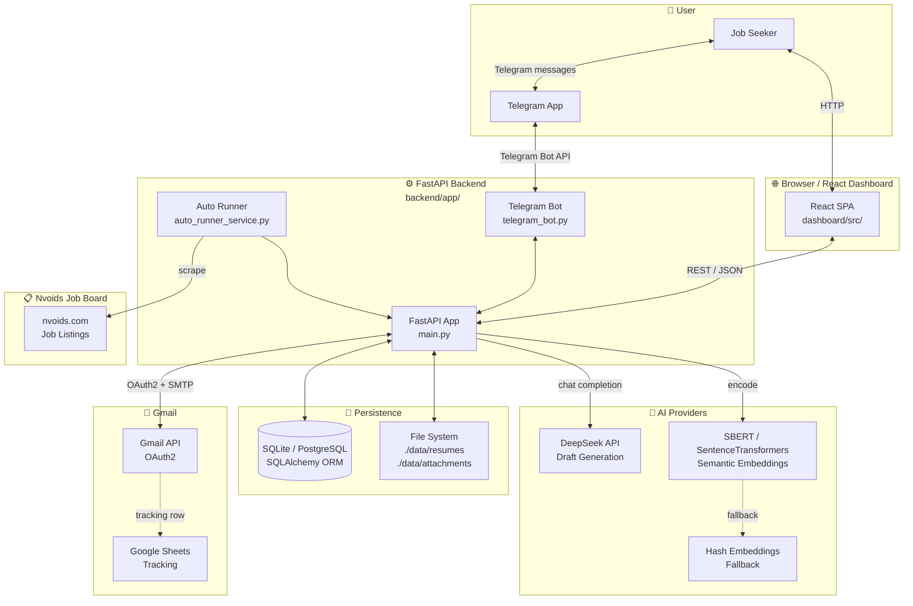

### Purpose
Shows every major system boundary and how they connect. The React dashboard and Telegram bot are the two human-facing surfaces. The FastAPI backend is the single integration hub for Gmail, Nvoids, AI providers, and persistence.

### Key Files
- `backend/app/main.py` — FastAPI application, all routes
- `backend/app/config.py` — All environment-variable configuration
- `dashboard/src/App.tsx` — React SPA entry point
- `backend/app/telegram_bot.py` — Telegram polling and dispatch

---

## 3. Frontend Architecture

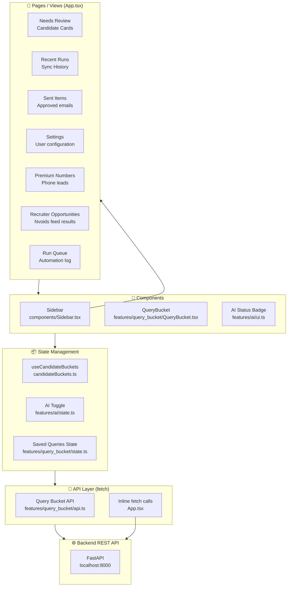

### Purpose
Shows how the React SPA is organized. All state lives in React hooks (`useState`, `useEffect`). There is no Redux or Zustand — state is managed locally in `App.tsx` and specialized hooks. The API layer calls the FastAPI backend via native `fetch`.

### Components and Responsibilities

| File | Responsibility |
|------|---------------|
| `src/App.tsx` | Root component; all page views, tabs, all API calls, main state |
| `src/components/Sidebar.tsx` | Navigation sidebar with tab selection and status indicators |
| `src/features/ai/state.ts` | AI toggle state management helper (`withAiToggle`) |
| `src/features/ai/ui.ts` | Draft source label formatting (`getDraftSourceLabel`) |
| `src/features/query_bucket/QueryBucket.tsx` | Saved Gmail query management UI |
| `src/features/query_bucket/api.ts` | API calls for saved query CRUD (`withSavedQueries`) |
| `src/features/query_bucket/state.ts` | Query bucket local state |
| `src/candidateBuckets.ts` | `useCandidateBuckets` hook — filters candidates into state buckets |
| `src/employerDomains.ts` | `addEmployerDomain` / `removeEmployerDomain` helpers |
| `src/premiumNumbers.ts` | `buildPremiumScopeUrl`, page meta for premium phone leads |

### Data Flow
1. User navigates tab → `App.tsx` sets active tab
2. `useEffect` fires → `fetch` call to FastAPI endpoint
3. Response stored in `useState` variable
4. Component re-renders showing data

---

## 4. Backend Architecture

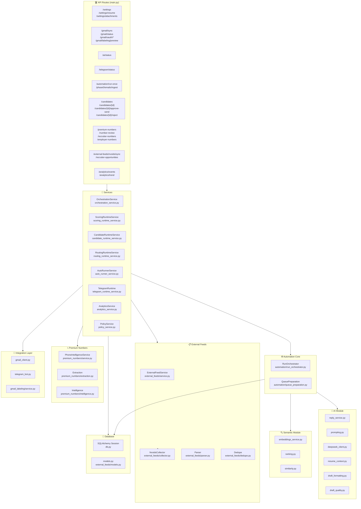

### Key Files

| File | Responsibility |
|------|---------------|
| `backend/app/main.py` | All FastAPI routes, lifespan startup/shutdown, global state |
| `backend/app/config.py` | Pydantic settings from env vars |
| `backend/app/db.py` | SQLAlchemy engine, session factory, Base |
| `backend/app/models.py` | All SQLAlchemy ORM models |
| `backend/app/phase0.py` | Email parsing, hard-filter checks, scoring helpers, draft template builder |
| `backend/app/routing/policy.py` | Recipient routing logic |
| `backend/app/skill_taxonomy.py` | Skill extraction, role family detection, intent-weighted matching |
| `backend/app/runtime_state.py` | Shared mutable global state (locks, threads) |
| `backend/app/schemas.py` | Pydantic request/response schemas |

---

## 5. Candidate Processing Flow

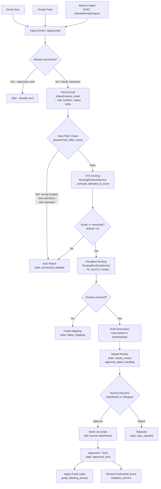

### Purpose
This is the core processing pipeline. Every candidate — regardless of source — flows through this exact sequence: parse → filter → score → route → draft → review → send.

### States

| State | Description |
|-------|-------------|
| `processed_skipped` | Failed hard filter or ATS score below threshold |
| `failed_mapping` | Could not resolve To/CC recipient emails |
| `needs_review` | Qualified and waiting for human approval |
| `approved_sent` | Human approved, reply sent via Gmail |
| `auto_rejected` | Human manually rejected |

### Key Files
- `backend/app/automation/queue_preparation.py` — `prepare_candidate_for_queue()` — the main pipeline function
- `backend/app/automation/run_orchestrator.py` — `RunOrchestrator.execute()` — loops over email items
- `backend/app/phase0.py` — `parse_email()`, `hard_filter_check()`, `draft_reply()`
- `backend/app/services/scoring_runtime_service.py` — `ScoringRuntimeService`
- `backend/app/services/routing_runtime_service.py` — `RoutingRuntimeService`

---

## 6. Gmail Sync + Queue Flow

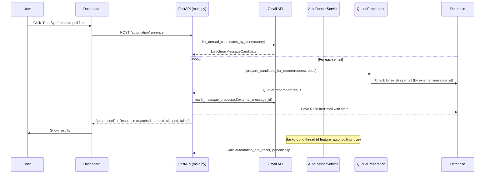

### Purpose
Shows the Gmail sync lifecycle. The frontend can trigger a sync manually, or the auto-runner background thread can trigger it at the configured interval (`feature_auto_poll_interval_minutes`).

### Important Notes
- Gmail OAuth tokens stored at `./data/google_token.json`
- Emails identified by `external_message_id` (Gmail message ID) for deduplication
- Thread ID (`external_thread_id`) used for thread snapshot enrichment in scoring
- Gmail labels applied after processing via `GmailLabelingService`
- Optional Google Sheets row appended per sent email (`google_sheets_tracking_enabled`)

### Key Files
- `backend/app/gmail_client.py` — `list_unread_candidates_by_query()`, `send_reply_with_attachment()`, `mark_message_processed()`
- `backend/app/services/auto_runner_service.py` — `AutoRunnerService.run_loop()`
- `backend/app/gmail_labeling/service.py` — `GmailLabelingService`
- `backend/app/services/gmail_labeling_runtime_service.py` — `GmailLabelingRuntimeService`

---

## 7. Nvoids Sync + Queue Flow

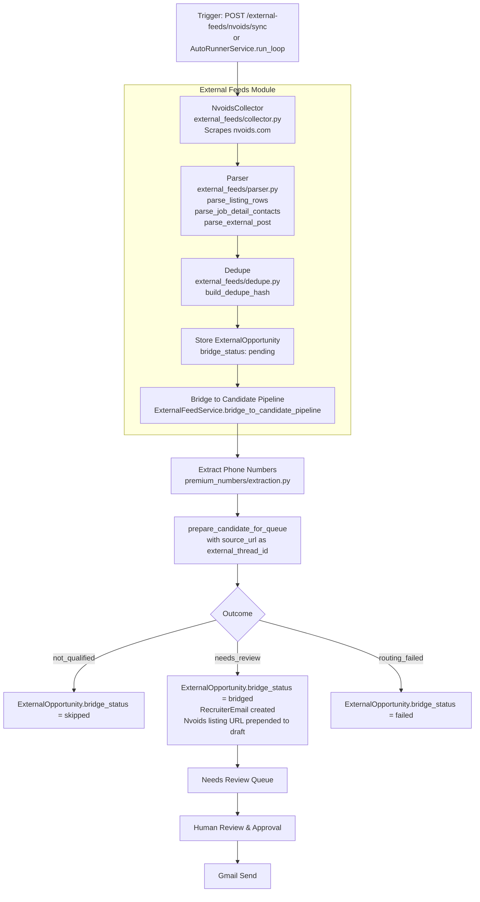

### Purpose
Shows how Nvoids job postings are scraped, deduplicated, and fed into the same candidate pipeline as Gmail emails. The source URL is stored as `external_thread_id` and prepended as `Nvoids Listing: <url>` in the draft reply.

### Important Notes
- Nvoids query built from user settings `nvoids_locations` (e.g., `"(tx or texas) and java and spring* not(*js)"`)
- Deduplication via SHA-256 hash of key fields (`build_dedupe_hash`)
- `ExternalOpportunity.bridge_status` tracks whether the opportunity has been converted: `pending → bridged | skipped | failed`
- `RecruiterOpportunity` is a separate model tracking recruiter phone-centric opportunities (from premium numbers pipeline)

### Key Files
- `backend/app/external_feeds/collector.py` — `NvoidsCollector` — HTTP scraping
- `backend/app/external_feeds/parser.py` — `parse_listing_rows()`, `parse_external_post()`
- `backend/app/external_feeds/dedupe.py` — `build_dedupe_hash()`
- `backend/app/external_feeds/service.py` — `ExternalFeedService` — orchestrates all Nvoids logic
- `backend/app/external_feeds/models.py` — `ExternalFeedSource`, `ExternalOpportunity`, `ExternalScrapeRun`

---

## 8. ATS Scoring Architecture

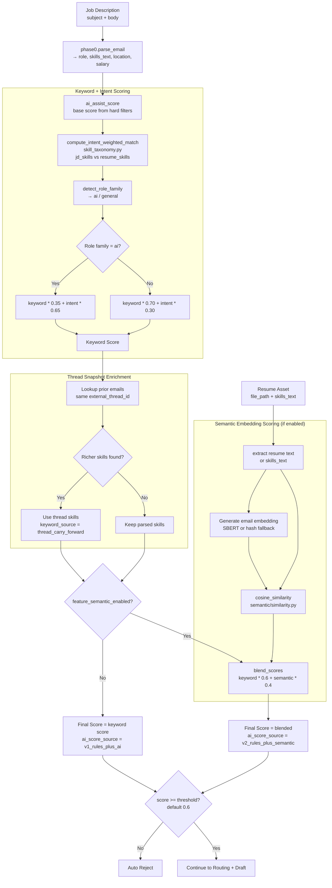

### Purpose
The ATS scoring engine determines whether a recruiter email qualifies for a reply. It combines rule-based keyword matching with optional semantic similarity between job description embeddings and resume embeddings.

### Scoring Layers

| Layer | Weight | Source |
|-------|--------|--------|
| Base keyword score | 45% baseline | `phase0.ai_assist_score()` |
| Role keyword hits | up to +24% | `user_settings.role_keywords` |
| Taxonomy skill score | variable | `skill_taxonomy.score_taxonomy_skills()` |
| Intent-weighted match | blended | `skill_taxonomy.compute_intent_weighted_match()` |
| Semantic cosine similarity | 40% (if enabled) | `semantic/similarity.py` |

### Key Files
- `backend/app/services/scoring_runtime_service.py` — `ScoringRuntimeService.compute_blended_ai_score()`
- `backend/app/phase0.py` — `ai_assist_score()`
- `backend/app/skill_taxonomy.py` — `compute_intent_weighted_match()`, `detect_role_family()`, `score_taxonomy_skills()`
- `backend/app/semantic/ranking.py` — `blend_scores()`, `clamp01()`
- `backend/app/semantic/similarity.py` — `semantic_similarity()` (cosine)

---

## 9. Resume Matching Architecture

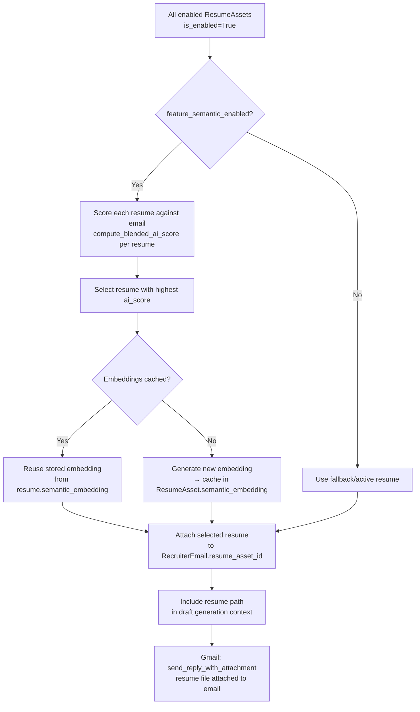

### Purpose
When multiple resumes are uploaded, the system selects the best-matching resume for each recruiter email by scoring all enabled resumes against the job description. The resume with the highest ATS score is attached to both the draft context (for AI personalization) and the outgoing Gmail reply.

### Important Notes
- Resume files stored in `./data/resumes/` directory
- `ResumeAsset.semantic_embedding` caches the embedding JSON to avoid re-computing on every run
- `ResumeAsset.skills_text` is a pre-extracted skill summary used as embedding input
- `draft_resume_context_status` field on `RecruiterEmail` tracks whether resume text was successfully extracted for AI prompting

### Key Files
- `backend/app/services/scoring_runtime_service.py` — `select_best_resume_match()`
- `backend/app/ai/resume_context.py` — `extract_resume_context()` — reads PDF/text resume file
- `backend/app/ai/resume_context_attribution.py` — `classify_extracted_resume_context()` — classifies quality of resume extraction

---

## 10. AI Architecture

```mermaid
flowchart TD
    subgraph DraftGeneration["Draft Generation Pipeline"]
        DG_INPUT[Inputs:<br/>sender, subject, body,<br/>role, location, salary, skills,<br/>resume text, greeting] --> BUILD_PROMPTS

        BUILD_PROMPTS[build_reply_prompts<br/>ai/prompting.py<br/>System + User prompt] --> DEEPSEEK_CALL

        DEEPSEEK_CALL[deepseek_chat_completion<br/>ai/deepseek_client.py<br/>via OpenAI SDK] --> AI_OK

        AI_OK{DeepSeek response OK?}
        AI_OK -- Yes --> SANITIZE[_sanitize_plain_text_reply<br/>_compose_reply_with_fixed_wrapper]
        AI_OK -- No / timeout / empty --> FALLBACK_DRAFT[Fallback to rules-based template<br/>phase0.draft_reply<br/>source = rules_only]

        SANITIZE --> VALID{Draft valid?}
        VALID -- Yes --> AI_DRAFT[source = deepseek]
        VALID -- No --> FALLBACK_DRAFT

        FALLBACK_DRAFT --> FINAL_DRAFT
        AI_DRAFT --> NVOIDS_PREFIX

        NVOIDS_PREFIX{Nvoids source URL?}
        NVOIDS_PREFIX -- Yes --> ADD_PREFIX[Prepend Nvoids Listing URL<br/>queue_preparation.prepend_nvoids_listing_line]
        NVOIDS_PREFIX -- No --> FINAL_DRAFT
        ADD_PREFIX --> FINAL_DRAFT[Final Draft Reply]
    end

    subgraph EmbeddingGeneration["Embedding Generation Pipeline"]
        EMB_INPUT[Text input<br/>email or resume] --> EMB_NORM

        EMB_NORM[Normalize + chunk<br/>max 900 chars per chunk] --> EMB_PROVIDER

        EMB_PROVIDER{effective_semantic_embedding_provider}
        EMB_PROVIDER -- sbert --> SBERT_CALL[SBERT encode<br/>sentence-transformers/all-MiniLM-L6-v2<br/>normalize_embeddings=True]
        EMB_PROVIDER -- hash --> HASH_CALL[Hash embedding<br/>SHA-256 deterministic]

        SBERT_CALL --> SBERT_OK{SBERT success?}
        SBERT_OK -- Yes --> EMB_OUT[Embedding vector]
        SBERT_OK -- No --> HASH_CALL

        HASH_CALL --> EMB_OUT

        EMB_OUT --> MULTI_CHUNK{Multiple chunks?}
        MULTI_CHUNK -- Yes --> AVG[Average chunk vectors<br/>_average_vectors]
        MULTI_CHUNK -- No --> SINGLE[Single vector]
        AVG --> CACHE_STORE
        SINGLE --> CACHE_STORE
        CACHE_STORE[Store as JSON in<br/>RecruiterEmail.semantic_embedding<br/>or ResumeAsset.semantic_embedding]
    end

    subgraph AIConfig["Configuration"]
        CFG1[DEEPSEEK_API_KEY<br/>deepseek_base_url = api.deepseek.com<br/>deepseek_model_fast = deepseek-chat]
        CFG2[semantic_embedding_provider = sbert<br/>sbert_model = all-MiniLM-L6-v2<br/>sbert_device = cpu]
        CFG3[semantic_keyword_weight = 0.6<br/>semantic_similarity_weight = 0.4]
    end
```

### Purpose
CODEJOB uses AI in two distinct ways:
1. **Draft Generation** — DeepSeek LLM generates personalized reply text; falls back to template if API fails
2. **Semantic Embeddings** — SBERT converts job descriptions and resumes to vectors for similarity scoring; falls back to hash embeddings if SBERT is unavailable

### Provider Selection Logic

| Stage | Primary | Fallback |
|-------|---------|----------|
| Draft generation | DeepSeek API (`deepseek-chat`) | Rules-based template (`phase0.draft_reply`) |
| Embeddings | SBERT (`all-MiniLM-L6-v2`) | Hash embedding (SHA-256) |

### Important Notes
- `feature_ai_enabled` (UserSettings) gates AI draft generation
- `feature_semantic_enabled` (UserSettings) gates semantic scoring
- DeepSeek is called via the OpenAI Python SDK with a custom `base_url`
- `draft_quality.assess_draft_quality()` provides a structured quality score for each draft
- `draft_formatting.normalize_draft_text_size()` adjusts font-size rendering hints

### Key Files
- `backend/app/ai/deepseek_client.py` — DeepSeek API call via OpenAI SDK
- `backend/app/ai/prompting.py` — `build_reply_prompts()` — constructs system + user prompts
- `backend/app/ai/reply_service.py` — `generate_reply_with_ai_or_fallback()` — main AI entry point
- `backend/app/ai/resume_context.py` — `extract_resume_context()` — reads resume file
- `backend/app/ai/draft_quality.py` — `assess_draft_quality()` — quality scoring
- `backend/app/ai/draft_formatting.py` — `normalize_draft_text_size()` — text size normalization
- `backend/app/semantic/embeddings_service.py` — `generate_embedding()` — SBERT or hash

---

## 11. Telegram Architecture

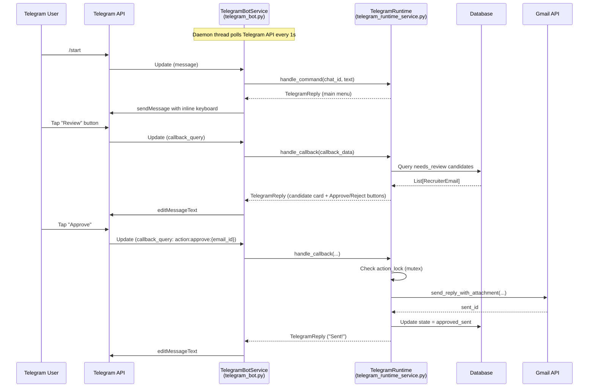

### Purpose
The Telegram bot provides a mobile-friendly interface for reviewing and approving/rejecting candidates without needing the web dashboard. It polls Telegram's Bot API on a daemon thread, dispatches commands to `TelegramRuntime`, and can trigger Gmail sync, automation runs, and candidate approvals.

### Telegram Features

| Command / Action | Description |
|-----------------|-------------|
| `/start` | Show main menu |
| Menu → Review | Page through `needs_review` candidates |
| Menu → Sync | Trigger Gmail sync |
| Menu → Run | Trigger full automation run |
| Approve button | Calls `approve_and_send()` → Gmail |
| Reject button | Calls `reject_candidate()` |
| Menu → Status | Show Gmail + AI status |
| PIN auth | `TELEGRAM_ACTION_PIN` gates approve/reject |

### Important Notes
- `TELEGRAM_ALLOWED_CHAT_IDS` — comma-separated list of authorized Telegram chat IDs
- `TELEGRAM_ACTION_PIN` — PIN required for approve/reject actions (optional)
- `telegram_action_lock` (threading.Lock) prevents concurrent approve/reject races
- Inline keyboard buttons use `callback_data` with format `action:{type}:{id}` or `menu:{section}:{page}`

### Key Files
- `backend/app/telegram_bot.py` — `TelegramBotService` — polling, dispatch
- `backend/app/services/telegram_runtime_service.py` — `TelegramRuntime` — action handlers
- `backend/app/services/telegram_runtime.py` — `TelegramRuntimeState` — shared state
- `backend/app/runtime_state.py` — `telegram_action_lock`, `telegram_pending_inputs`

---

## 12. Database Architecture

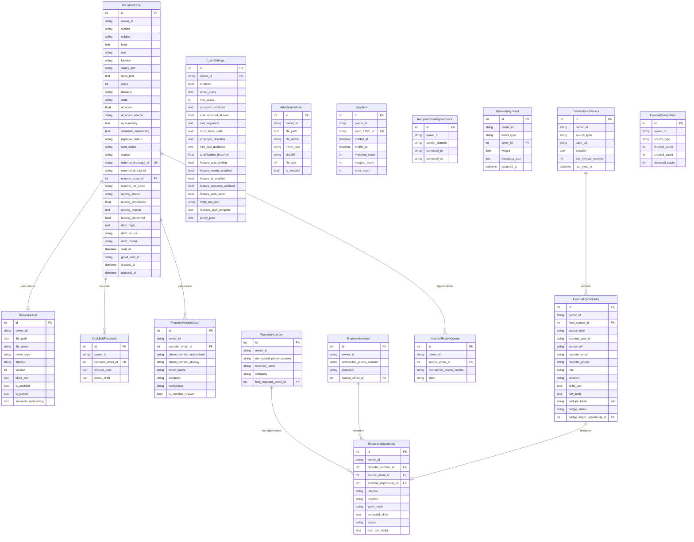

### Purpose
Shows all database tables, their key fields, and relationships. The `RecruiterEmail` table is the central entity — all candidate data, scoring results, drafts, and send status live here.

### Table Responsibilities

| Table | Purpose |
|-------|---------|
| `recruiter_emails` | Core candidate/opportunity record with full lifecycle state |
| `user_settings` | Per-user configuration, feature flags, AI/filter thresholds |
| `resume_assets` | Uploaded resume files with cached embeddings |
| `attachment_assets` | Additional file attachments (e.g., cover letters) |
| `sync_runs` | Audit log of Gmail sync batches |
| `draft_edit_feedback` | Records when users edit AI drafts (training signal) |
| `recipient_routing_feedback` | Corrections to To/CC routing for learning |
| `premium_number_leads` | Extracted phone numbers from recruiter emails |
| `recruiter_numbers` | Verified recruiter phone numbers |
| `employer_numbers` | Verified employer phone numbers |
| `recruiter_opportunities` | Job opportunities linked to recruiter numbers |
| `number_review_queue` | Pending phone number classification decisions |
| `productivity_events` | Analytics events with weighted scoring |
| `external_feed_sources` | Nvoids feed configuration |
| `external_opportunities` | Scraped Nvoids opportunities (before bridging) |
| `external_scrape_runs` | Audit log of Nvoids scrape sessions |

---

## 13. End-to-End System Flow

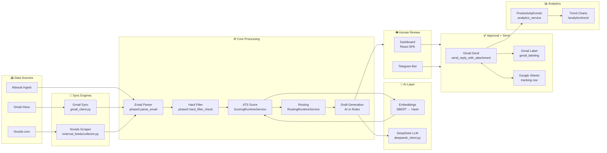

### Purpose
This is the **executive-level diagram** — the single diagram that shows the entire platform from data ingestion to email delivery and analytics. Every major subsystem is present; follow the arrows to trace any candidate from entry to outcome.

### The Critical Path (happy path)
1. Gmail sync fetches unread recruiter emails
2. Each email is parsed → hard-filtered → ATS-scored (keyword + semantic)
3. Qualified emails get routing resolved (To + CC) and a draft reply generated (AI or rules)
4. Candidate enters `needs_review` state → visible in dashboard and Telegram
5. Human approves → reply sent via Gmail with resume attached
6. Gmail label applied, optional Sheets row written, productivity event recorded

---

## 14. Architecture Inventory

### Frontend Files

| File | Responsibility |
|------|---------------|
| `dashboard/src/App.tsx` | Root SPA: all views, state, fetch calls, tab navigation |
| `dashboard/src/main.tsx` | React entry point, mounts App |
| `dashboard/src/App.css` | Global styles |
| `dashboard/src/components/Sidebar.tsx` | Navigation sidebar component |
| `dashboard/src/candidateBuckets.ts` | `CandidateState` type, `useCandidateBuckets` hook |
| `dashboard/src/employerDomains.ts` | Employer domain add/remove helpers |
| `dashboard/src/premiumNumbers.ts` | Premium number URL builder, page meta |
| `dashboard/src/features/ai/state.ts` | `withAiToggle` helper |
| `dashboard/src/features/ai/ui.ts` | `getDraftSourceLabel` display helper |
| `dashboard/src/features/ai/types.ts` | AI feature TypeScript types |
| `dashboard/src/features/query_bucket/QueryBucket.tsx` | Saved Gmail query UI |
| `dashboard/src/features/query_bucket/api.ts` | `withSavedQueries` API call wrapper |
| `dashboard/src/features/query_bucket/state.ts` | Query bucket state management |
| `dashboard/src/features/query_bucket/types.ts` | Query bucket TypeScript types |

### Backend API Routes

| Route | Method | Responsibility |
|-------|--------|---------------|
| `/health` | GET | Health check |
| `/settings` | GET/PUT | Read/update user settings |
| `/settings/resume` | POST | Upload new resume |
| `/settings/resumes` | GET | List all resumes |
| `/settings/resumes/{id}` | PATCH/DELETE | Update/delete resume |
| `/settings/attachments` | GET/POST | List/upload attachments |
| `/settings/attachments/{id}` | PATCH/DELETE | Update/delete attachment |
| `/gmail/status` | GET | Gmail OAuth + auth status |
| `/gmail/sync` | POST | Trigger Gmail sync (fetch emails only) |
| `/gmail/oauth/start` | POST | Start OAuth2 bootstrap flow |
| `/gmail/oauth/url` | GET | Get OAuth2 authorization URL |
| `/gmail/labeling/preview` | POST | Preview Gmail label rules |
| `/ai/status` | GET | AI + embedding status and metrics |
| `/telegram/status` | GET | Telegram bot status |
| `/analytics/events/view` | POST | Record a view event |
| `/analytics/events` | GET | List productivity events |
| `/analytics/trend` | GET | Productivity trend chart data |
| `/automation/run-once` | POST | Run full Gmail sync + queue pipeline |
| `/phase0/emails/ingest` | POST | Manually ingest a single email |
| `/candidates` | GET | List candidates (filterable by state) |
| `/candidates/{id}` | GET | Get single candidate detail |
| `/candidates/{id}/approve-send` | POST | Approve and send reply via Gmail |
| `/candidates/{id}/reject` | POST | Reject candidate |
| `/candidates/{id}/send-to-failed-mapping` | POST | Move to failed mapping state |
| `/candidates/{id}/resolve-recipients` | POST | Fix routing To/CC |
| `/candidates/reject-bulk` | POST | Bulk reject candidates |
| `/premium-numbers` | GET | List premium phone leads |
| `/premium-numbers/{id}` | GET | Get single lead |
| `/premium-numbers/reextract/{email_id}` | POST | Re-extract phone numbers from email |
| `/number-review` | GET | List pending phone review queue |
| `/number-review/{id}/mark-recruiter` | POST | Classify number as recruiter |
| `/number-review/{id}/mark-employer` | POST | Classify number as employer |
| `/number-review/{id}` | DELETE | Dismiss review item |
| `/recruiter-numbers` | GET | List known recruiter numbers |
| `/recruiter-numbers/{id}/swap-to-employer` | POST | Reclassify recruiter → employer |
| `/employer-numbers` | GET | List known employer numbers |
| `/employer-numbers/{id}/swap-to-recruiter` | POST | Reclassify employer → recruiter |
| `/recruiter-opportunities` | GET | List recruiter opportunities (from premium numbers) |
| `/recruiter-opportunities/{id}` | PATCH/DELETE | Update/delete opportunity |
| `/recruiter-opportunities/{id}/generate-cold-call-script` | POST | AI-generate cold call script |
| `/external-feeds/nvoids/sync` | POST | Trigger Nvoids scrape + bridge |
| `/external-feeds/nvoids/backfill-phones` | POST | Backfill phone extraction |
| `/external-feeds/runs` | GET | List Nvoids scrape runs |

### Backend Services

| Service | File | Responsibility |
|---------|------|---------------|
| `OrchestrationService` | `services/orchestration_service.py` | Candidate CRUD, approve-send, reject, routing ops |
| `ScoringRuntimeService` | `services/scoring_runtime_service.py` | ATS scoring, resume matching, embedding caching |
| `CandidateRuntimeService` | `services/candidate_runtime_service.py` | Candidate query, status helpers |
| `RoutingRuntimeService` | `services/routing_runtime_service.py` | Recipient routing decision engine |
| `AutoRunnerService` | `services/auto_runner_service.py` | Background polling loop (Gmail + Nvoids) |
| `TelegramRuntime` | `services/telegram_runtime_service.py` | Telegram command + callback handlers |
| `GmailLabelingRuntimeService` | `services/gmail_labeling_runtime_service.py` | Gmail label rule management |
| `SettingsBootstrapService` | `services/settings_bootstrap_service.py` | Ensure default user settings on startup |
| `StartupService` | `services/startup_service.py` | App lifespan startup/shutdown coordination |
| `AnalyticsService` | `services/analytics_service.py` | Productivity event recording, trend computation |
| `PolicyService` | `services/policy_service.py` | Policy JSON parsing, query composition, dry-run |
| `PhoneIntelligenceWorkflowService` | `services/phone_intelligence_workflow_service.py` | Premium number extraction workflow |
| `ExternalFeedService` | `external_feeds/service.py` | Nvoids scrape, parse, dedupe, bridge to pipeline |

### Database Models

| Model | Table | Responsibility |
|-------|-------|---------------|
| `RecruiterEmail` | `recruiter_emails` | Core candidate record — full lifecycle from ingest to sent |
| `UserSettings` | `user_settings` | User preferences, feature flags, filter thresholds |
| `ResumeAsset` | `resume_assets` | Resume files with extracted skills and cached embeddings |
| `AttachmentAsset` | `attachment_assets` | Supplemental file attachments |
| `SyncRun` | `sync_runs` | Gmail sync batch audit log |
| `DraftEditFeedback` | `draft_edit_feedback` | Tracks when users edit AI-generated drafts |
| `RecipientRoutingFeedback` | `recipient_routing_feedback` | Routing correction feedback for learning |
| `PremiumNumberLead` | `premium_number_leads` | Raw phone number extractions from emails |
| `RecruiterNumber` | `recruiter_numbers` | Verified recruiter contacts with phone |
| `EmployerNumber` | `employer_numbers` | Verified employer contacts with phone |
| `RecruiterOpportunity` | `recruiter_opportunities` | Job opportunities linked to recruiter numbers |
| `NumberReviewQueue` | `number_review_queue` | Phone numbers pending classification |
| `ProductivityEvent` | `productivity_events` | Weighted analytics events for productivity tracking |
| `ExternalFeedSource` | `external_feed_sources` | Nvoids feed configuration and poll schedule |
| `ExternalOpportunity` | `external_opportunities` | Scraped Nvoids postings before pipeline bridging |
| `ExternalScrapeRun` | `external_scrape_runs` | Nvoids scrape session audit log |

### Integrations

| Integration | Module | Responsibility |
|-------------|--------|---------------|
| **Gmail OAuth2** | `app/gmail_client.py` | OAuth token management, email fetch, reply send, label apply, Sheets tracking |
| **Gmail Labeling** | `app/gmail_labeling/` | Rule-based Gmail label classification and application |
| **Nvoids Job Board** | `app/external_feeds/` | HTTP scraping, HTML parsing, deduplication, bridging to pipeline |
| **DeepSeek LLM** | `app/ai/deepseek_client.py` | Chat completion via OpenAI SDK with custom base URL |
| **SBERT Embeddings** | `app/semantic/embeddings_service.py` | Sentence-transformers local model for semantic scoring |
| **Telegram Bot API** | `app/telegram_bot.py` | Long-polling bot for mobile review/approval workflow |
| **Google Sheets** | `app/gmail_client.py` | Optional tracking spreadsheet row append on send |

---

*Generated from codebase analysis of `chaitanyadheeraj98/CODEJOB`. Last updated: 2026-06-15.*
