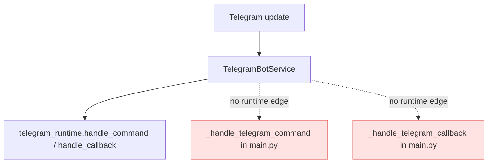
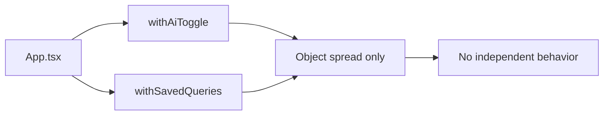

# CODEJOB AI Slop Audit (Evidence-Backed)

## 1) Executive Summary

AI slop concentration is highest in:

1. **Backend composition root (`backend/app/main.py`)**: dead proxy helpers and legacy Telegram fallback handlers retained for tests, not runtime wiring.
2. **Frontend micro-modules**: one-line wrappers that add indirection without ownership (`features/ai/state.ts`, `features/query_bucket/api.ts`).
3. **Contract drift surfaces**: stale tests and docs statements that no longer match runtime execution.
4. **Schema ownership overlap**: startup schema patching + Alembic checks + no-op baseline migration create high-risk operational ambiguity.

---

## 2) Confirmed Dead Code

| Status | Source | Function/Module | Why slop | Proof of deadness/redundancy | Runtime impact | Deletion risk |
|---|---|---|---|---|---|---|
| Confirmed Dead | `/backend/app/main.py` | `_handle_telegram_command` | Legacy fallback handler kept after Telegram runtime extraction | Bot wiring uses `telegram_runtime.handle_command` directly in `_init_telegram_service` (`main.py:592`), not `_handle_telegram_command`; helper only appears in tests (`backend/tests/test_telegram_interactive.py`). | Extra branch surface and misleading entrypoint for Telegram command flow. | Low |
| Confirmed Dead | `/backend/app/main.py` | `_handle_telegram_callback` | Legacy callback fallback retained but not connected | Bot wiring uses `telegram_runtime.handle_callback` (`main.py:593`); helper appears only in tests (`backend/tests/test_telegram_interactive.py`). | Maintains unreachable callback flow in production path. | Low |
| Confirmed Dead | `/backend/app/main.py` | `_telegram_paginate_buttons` | Legacy pagination utility detached from runtime callback path | Defined in `main.py:423`; callback/menu handling now lives in `TelegramRuntime` class (`backend/app/services/telegram_runtime_service.py`), and remaining use is in tests. | Dead utility increases maintenance/search noise. | Low |
| Confirmed Dead | `/backend/app/main.py` | `_semantic_text_for_email` | Proxy wrapper with no runtime caller | Defined (`main.py:748`) but no runtime reference; scoring uses `ScoringRuntimeService.compute_blended_ai_score` path. | Dead indirection in composition root. | Low |
| Confirmed Dead | `/backend/app/main.py` | `_ensure_embedding_cached` | Proxy wrapper with no runtime caller | Defined (`main.py:756`) with no callsites; embedding cache logic is consumed inside `ScoringRuntimeService` (`scoring_runtime_service.py:38-44`). | Unused helper increases false API surface. | Low |
| Confirmed Dead | `/backend/app/main.py` | `_learned_recipient_pairs` | Proxy wrapper not used by active routing orchestration | Defined (`main.py:791`) and unused; routing runtime path uses service methods directly (`routing_runtime_service.py`). | Dead branch of routing API surface in main. | Low |
| Confirmed Dead | `/backend/app/main.py` | `_routing_is_sendable` | Wrapper retained but not called in active send path | Defined (`main.py:807`) and unused; active checks run in orchestration service (`orchestration_service.py`, approve flow). | Misleading dead helper around sendability checks. | Low |
| Confirmed Dead | `/backend/app/main.py` | `_apply_draft_learning` | No-op proxy retained only as vestigial abstraction | Wrapper (`main.py:840`) delegates to no-op service method (`candidate_runtime_service.py:38-41`) and has no runtime callsites. | Fake extension point with no behavior. | Low |
| Confirmed Dead | `/backend/app/main.py` | `_build_label_rule_input_from_email` | Wrapper not used by active labeling flow | Defined (`main.py:1599`) but runtime applies labels via `gmail_labeling_runtime_service.apply_for_email` (`main.py:1603-1608`). | Dead helper in already-large integration file. | Low |

---

## 3) Fake Abstractions

| Status | Source | Function/Module | Why slop | Proof of redundancy | Runtime impact | Deletion risk |
|---|---|---|---|---|---|---|
| Redundant | `/dashboard/src/features/ai/state.ts` | `withAiToggle` | Single-field object spread wrapper adds module boundary without domain logic | Function is only `{...settings, feature_ai_enabled: enabled}` (`state.ts:3-6`) and used as a one-off setter in `App.tsx:1744`. | Extra indirection for no behavior gain. | Low |
| Redundant | `/dashboard/src/features/query_bucket/api.ts` | `withSavedQueries` | “API” module proxies one object spread only | Function only returns `{ ...settingsPayload, saved_gmail_queries: savedQueries }` (`api.ts:1-6`), called once in `App.tsx:1456`. | Unnecessary file/module surface. | Low |
| Redundant | `/backend/app/main.py` | `_compose_gmail_query` | Wrapper around service call retained in composition root | Implementation strips token then calls `policy_service.compose_gmail_query` (`main.py:440-443`); runtime path uses `policy_service.effective_run_inputs` (`main.py:446-455`, orchestration deps). External usage is test import (`tests/test_run_once_hotfix.py`). | Keeps duplicate policy entrypoint mostly for tests. | Low |

---

## 4) Duplicate Logic

| Status | Source | Function/Module | Why slop | Proof of duplication | Runtime impact | Deletion risk |
|---|---|---|---|---|---|---|
| Redundant | `/backend/app/main.py`, `/backend/app/services/settings_bootstrap_service.py`, `/backend/app/services/auto_runner_service.py` | Poll interval + nvoids clamp helpers | Same clamp formulas repeated across 3 modules | Same logic in `main.py:467-476`, `settings_bootstrap_service.py:21-30`, `auto_runner_service.py:36-45`. | Multi-point edits for same invariant; drift risk. | Medium |
| Redundant | `/dashboard/src/App.tsx`, `/backend/app/ai/draft_formatting.py` | Draft plain-text → HTML transformation | Two parallel implementations of the same formatting contract | Frontend preview path `draftToPreviewHtml` (`App.tsx:41-64`), backend send path `draft_text_to_html` (`draft_formatting.py:15-44`) with matching bullet/paragraph/bold rules. | Divergence risk between preview and sent email rendering. | Medium |
| Redundant | `/backend/app/main.py`, `/backend/app/services/policy_service.py` | Policy TypedDict contracts | Same policy schema types declared twice | `PolicyQuery/PolicyRun/PolicyQualification/PolicyConfig` exist in both files (`main.py:194-217`, `policy_service.py:10-33`). | Type/schema drift risk for policy interfaces. | Medium |

---

## 5) Stale Contracts

| Status | Source | Function/Module | Why slop | Proof | Runtime impact | Deletion risk |
|---|---|---|---|---|---|---|
| Confirmed Dead | `/backend/tests/test_phone_attribution.py` | whole test module | Test targets removed module contract | Imports `app.phone_attribution` (`test_phone_attribution.py:3`), module does not exist in current app tree; backend suite fails at collection. | Blocks full backend validation signal. | Low |
| Placeholder | `/docs/architecture.md` vs runtime | feature flag claim | Doc contract says runtime executors missing, but runtime executes them | Doc says `feature_auto_send` and `feature_retry_queue` lack full executors (`architecture.md:107`), but runtime executes both in `orchestration_service.py:342-349,457-498`. | Misleads maintainers; causes wrong operational assumptions. | Low |
| Placeholder | `/docs/problem-fix-log.md` vs runtime | feature flag claim | Historical claim persisted after behavior shipped | Log claims flags persisted “without runtime workers” (`problem-fix-log.md:71-73`), but code has implemented workers in orchestration service. | Reviewers may treat live behavior as missing. | Low |
| Needs Human Verification | `/backend/app/main.py` API surface | `/phase0/emails/ingest`, `/candidates/reject-bulk`, `/external-feeds/runs` | No frontend coupling observed; may be external/manual-only routes | Routes defined (`main.py:1466,2258,2075`), but no dashboard references found; observed references are docs/tests. | Possible dead external API surface or hidden ops endpoints. | Medium |

---

## 6) Placeholder / Illusion Features

| Status | Source | Function/Module | Why slop | Proof | Runtime impact | Deletion risk |
|---|---|---|---|---|---|---|
| Placeholder | `/dashboard/src/components/Sidebar.tsx` | `New Campaign`, `Settings`, `Help Center` buttons | UI implies workflows that have no event flow | Buttons have no `onClick` handlers (`Sidebar.tsx:46-48,64-65`); they are not wired to routing/state transitions. | False feature surface for operators. | Low |

---

## 7) High-Risk Slop

| Status | Source | Function/Module | Why slop | Proof | Runtime impact | Deletion risk |
|---|---|---|---|---|---|---|
| Needs Human Verification | `/backend/app/services/startup_service.py`, `/backend/app/db.py`, `/backend/alembic/versions/20260518_0001_schema_baseline.py` | Mixed schema ownership layer | Startup runs runtime patching + Alembic readiness checks while baseline migration is no-op | Startup calls `ensure_sqlite_phase0_columns()` and `MigrationRuntimeService().ensure_schema_ready()` (`startup_service.py:31-33`); runtime patch function contains large column-creation surface (`db.py:254+`); baseline migration is `pass` (`20260518_0001_schema_baseline.py:19-23`). | High operational ambiguity for migration ownership and rollback strategy. | High |

---

## 8) Safe Deletion Candidates

| Candidate | Status | Dependent imports | Runtime references | Risk level | Deletion confidence |
|---|---|---|---|---|---|
| `main.py::_handle_telegram_command` | Confirmed Dead | Test import/calls (`backend/tests/test_telegram_interactive.py`) | None in bot wiring (`main.py:592-593`) | Low | High |
| `main.py::_handle_telegram_callback` | Confirmed Dead | Test import/calls (`backend/tests/test_telegram_interactive.py`) | None in bot wiring (`main.py:592-593`) | Low | High |
| `main.py::_telegram_paginate_buttons` | Confirmed Dead | Test call (`backend/tests/test_telegram_interactive.py`) | None in runtime Telegram service flow | Low | High |
| `main.py::_semantic_text_for_email` | Confirmed Dead | None found | None found in runtime call graph | Low | High |
| `main.py::_ensure_embedding_cached` | Confirmed Dead | None found | None found in runtime call graph | Low | High |
| `main.py::_learned_recipient_pairs` | Confirmed Dead | None found | None found in runtime call graph | Low | High |
| `main.py::_routing_is_sendable` | Confirmed Dead | None found | None found in runtime call graph | Low | High |
| `main.py::_apply_draft_learning` | Confirmed Dead | None found | None found in runtime call graph | Low | High |
| `main.py::_build_label_rule_input_from_email` | Confirmed Dead | None found | None found in runtime labeling path | Low | High |
| `backend/tests/test_phone_attribution.py` | Confirmed Dead | Depends on removed `app.phone_attribution` | Fails before runtime test execution | Low | High |

---

## 9) Human Validation Required

| Area | Status | Why static audit is insufficient | What to validate before deletion |
|---|---|---|---|
| `/phase0/emails/ingest`, `/candidates/reject-bulk`, `/external-feeds/runs` endpoints | Needs Human Verification | No frontend references, but could be used by scripts/ops integrations outside repository | Check API gateway logs / external clients before pruning routes |
| Mixed migration ownership (`ensure_sqlite_phase0_columns` + Alembic checks + no-op baseline) | Needs Human Verification | Requires deployment history and existing DB state to confirm safe ownership cleanup | Validate upgrade path on real DB snapshots and rollback plans |
| Draft formatting duplication frontend/backend | Needs Human Verification | Could be intentionally duplicated for separate runtime contexts | Confirm whether shared contract generation is acceptable before consolidation |

---

## Runtime Cross-Check Notes

- Active orchestration path is service-driven (`OrchestrationService` + `RunOrchestrator`) and not dependent on most dead helpers identified above.
- Telegram runtime path is now class-driven (`TelegramRuntime`) and bypasses legacy helper handlers in `main.py`.
- Feature flags `feature_auto_send` and `feature_retry_queue` are runtime-active in current code.
