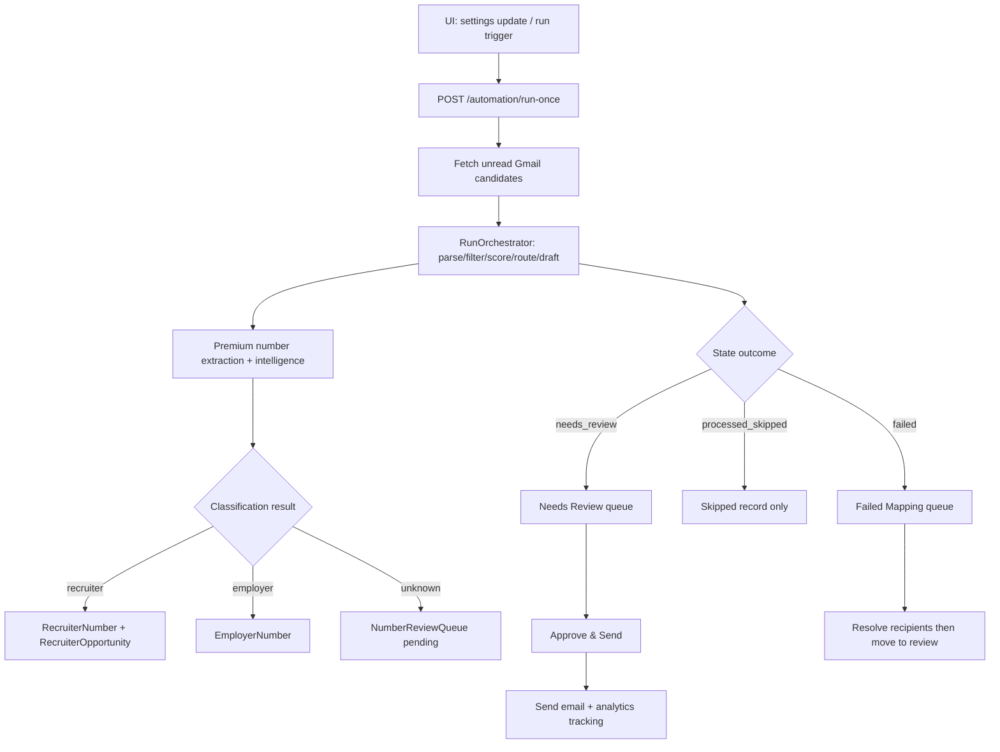

# CODEJOB Architecture (Current Branch)

Audit snapshot: current working branch and codebase state

## 1) System shape

CODEJOB is a **single FastAPI backend + single React dashboard** system.

- Backend: `backend/app/main.py` + domain modules
- Frontend: `dashboard/src/App.tsx` + helper modules
- Storage: SQLite (`recruiter_emails`, `user_settings`, `resume_assets`, productivity and phone-intelligence tables)
- Integrations: Gmail API, optional Google Sheets, DeepSeek/OpenAI-compatible API, Telegram Bot API

## 2) Runtime architecture

### Backend

- `backend/app/main.py`
  - Application lifecycle and endpoint surface
  - Policy handling, queue orchestration, approval/rejection flows
  - Productivity analytics APIs
  - Number intelligence APIs (review queue, recruiter/employer buckets, opportunities)
  - Gmail labeling preview/apply flows
  - Recruiter-opportunity cold-call script generation endpoint
- `backend/app/automation/run_orchestrator.py`
  - Main run loop logic for `POST /automation/run-once`
  - Handles duplicate message checks, scoring, routing decisions, queue transitions
- `backend/app/phase0.py`
  - Parsing, recruiter heuristics, routing evidence extraction, hard filters, fallback draft rendering
- `backend/app/premium_numbers/*`
  - Phone extraction, dedupe, relevance scoring
  - Unknown-number queue handling and recruiter opportunity snapshots
- `backend/app/routing/policy.py`
  - Routing policy and sendability decision object

### Frontend

- `dashboard/src/App.tsx`
  - Single-page dashboard with all sections:
    - Run Queue
    - Needs Review
    - Failed Mapping
    - Premium Numbers
    - Sent Items
    - Recent Runs
- `dashboard/src/components/Sidebar.tsx`
  - Navigation and counters
- `dashboard/src/candidateBuckets.ts`
  - State-specific candidate pagination and refresh behavior
- `dashboard/src/employerDomains.ts`
  - Employer domain normalization and validation
- `dashboard/src/features/query_bucket/*`
  - Saved Gmail query bucket UI/state helpers
- `dashboard/src/features/ai/*`
  - AI-related UI state and display helpers

## 3) Primary execution paths

1. User updates settings/profile in UI (`PUT /settings`)
2. User runs sync (`POST /automation/run-once`) or OAuth bootstrap (`POST /gmail/oauth/start`)
3. Backend fetches unread Gmail candidates by effective query/policy
4. For each email, backend performs parse/filter/score/routing/draft
5. Candidate becomes:
   - `needs_review` (qualified)
   - `failed` (routing unresolved)
   - `processed_skipped` (not qualified)
6. Number intelligence is captured per processed email:
   - premium lead store
   - recruiter/employer/unknown classification path
   - recruiter opportunity creation (deduped per recruiter number + Gmail message)
7. User manually approves/rejects/re-routes from UI

## 4) Safety and control architecture

- Manual approval is required before sending (`approve-send` endpoint enforces routing safety + resume + draft + metadata)
- Routing sendability logic is centralized (`_evaluate_routing_policy`, `_routing_is_sendable`)
- Duplicate suppression exists at DB/index and logic levels:
  - unique external message IDs
  - unique recruiter/employer number indexes per owner
  - unique recruiter opportunity per owner+recruiter number+message
  - unique number-review card per owner+phone+source email

## 5) Persistence architecture

Main entities:

- Core workflow: `RecruiterEmail`, `UserSettings`, `ResumeAsset`, `SyncRun`
- Learning/feedback: `DraftEditFeedback`, `RecipientRoutingFeedback`
- Analytics: `ProductivityEvent`
- Phone intelligence: `PremiumNumberLead`, `NumberReviewQueue`, `RecruiterNumber`, `EmployerNumber`, `RecruiterOpportunity`

SQLite schema bootstrapping and additive migration logic are handled in `backend/app/db.py::ensure_sqlite_phase0_columns`.

## 6) Notable architectural constraints

- Backend orchestration is intentionally concentrated in `main.py`; many endpoint behaviors share helper state
- Frontend is still primarily centralized in `App.tsx`, with partial feature extraction under `dashboard/src/features/*`
- Telegram command flows call the same core run/approve/reject paths as UI
- The app currently assumes one logical owner (`settings.owner_id`) with owner-scoped queries
