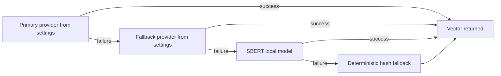

<!-- markdownlint-configure-file {"MD013": false} -->

# CODEJOB Architecture (Current Branch)

## System Shape

- Backend: FastAPI app centered in `backend/app/main.py`, with orchestration and runtime helpers extracted into `backend/app/services/*`.
- Frontend: React + TypeScript app centered in `dashboard/src/App.tsx`.
- Persistence: SQLite models in `backend/app/models.py` with startup schema patching through startup service wiring.
- Integrations: Gmail API, optional Google Sheets append, optional AI providers, Telegram polling bot, optional Nvoids feed sync.

## Runtime Ownership

| Area | Current runtime owner | Evidence |
| --- | --- | --- |
| API composition root | `backend/app/main.py` | Route declarations and dependency wiring in `main.py` |
| Startup lifecycle | `app/services/startup_service.py` via lifespan | `lifespan()` in `main.py` delegates startup actions |
| Run orchestration | `app/services/orchestration_service.py` + `app/automation/run_orchestrator.py` | `/automation/run-once` and Gmail sync flows |
| Routing decision path | `app/routing/policy.py` + runtime service | approve-send and queue routing checks |
| Premium numbers path | `app/premium_numbers/extraction.py` + candidate runtime service | `/premium-numbers/*`, `/number-review/*`, `/recruiter-opportunities/*` |
| Frontend workflow container | `dashboard/src/App.tsx` | queue actions, settings, premium-number UI flows |

## Semantic Embeddings Fallback

Evidence: embedding and fallback metadata fields are exposed in `/ai/status` response handling in `backend/app/main.py`; provider settings are applied by semantic runtime services.

## Intended vs Current Runtime

- Intended: thinner composition root with narrower route modules.
- Current: `backend/app/main.py` and `dashboard/src/App.tsx` remain central runtime hubs.

## Key Constraints Still Active

- Routing and approval safety are multi-step (`queue assignment` + `approve-send` gate).
- Feature flags control behavior but still rely on centralized orchestration wiring.
- Runtime state for some operational signals remains process-memory scoped.

- Audit date: 2026-05-30
- Branch: semantic-embeddings
- Commit: 5991f97
- Evidence basis: code inspection
- Verification limits: full backend suite not re-run in this session; premium number extraction tests were re-run only.
