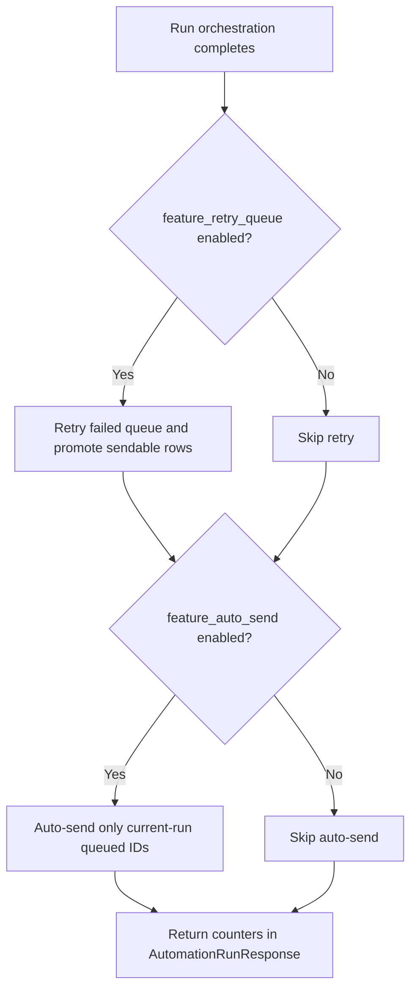

# CODEJOB Architecture (Current Branch)

## System shape

CODEJOB currently runs as:

- **Backend:** FastAPI app centered in `backend/app/main.py` with extracted runtime services.
- **Frontend:** React + TypeScript SPA centered in `dashboard/src/App.tsx`.
- **Persistence:** SQLite via SQLAlchemy models in `backend/app/models.py`.
- **Migration safety:** startup enforces Alembic head alignment via `MigrationRuntimeService.ensure_schema_ready()`.

## Runtime ownership and coupling hotspots

| Area | Current ownership | Evidence |
| --- | --- | --- |
| Backend API + composition root | `backend/app/main.py` | central route/wiring surface |
| Startup lifecycle | `backend/app/services/startup_service.py` | migration gate, default bootstrap, background services |
| Run orchestration | `backend/app/services/orchestration_service.py` + `backend/app/automation/run_orchestrator.py` | candidate processing, retry/auto-send post-run paths |
| Frontend workflow shell | `dashboard/src/App.tsx` | queue/settings/recent-runs state/actions remain centralized |

## Intended vs current runtime

### Intended architecture

- thinner composition root with smaller domain-focused route/UI modules.

### Current runtime behavior

- `backend/app/main.py` remains a central integration hub.
- `dashboard/src/App.tsx` remains a central UI state hub.

## Runtime automation phase (HR-5)

- Audit date: 2026-05-18
- Branch: `copilot/update-docs-md-files`
- Evidence basis: code inspection
- Verification limits: architecture ownership was verified from source files; runtime execution checks were limited by missing dependencies in this environment.
