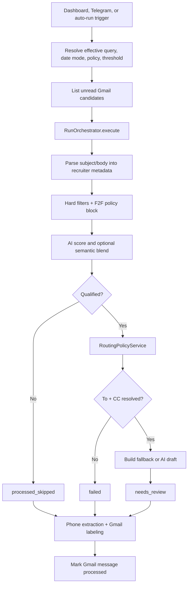
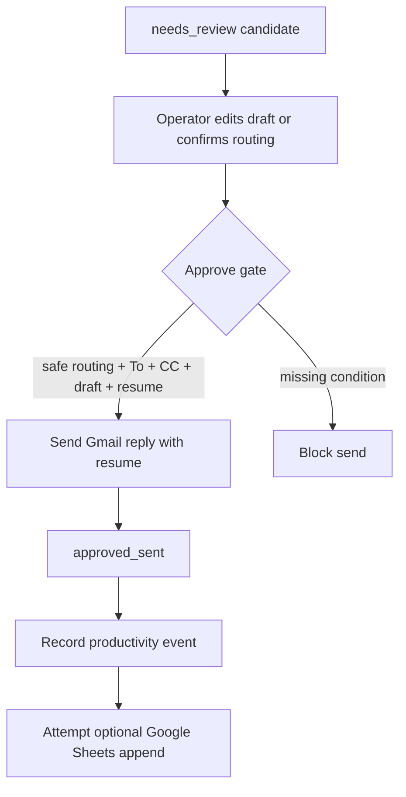

# CODEJOB Architecture (Current Branch)

Branch snapshot: `copilot/audit-and-sync-markdown-docs`

## 1. System shape

CODEJOB is a single-owner mail-operations system built from:

- **Backend:** FastAPI app centered in `backend/app/main.py`
- **Frontend:** React + TypeScript dashboard centered in `dashboard/src/App.tsx`
- **Persistence:** SQLite via SQLAlchemy models in `backend/app/models.py`
- **External services:** Gmail API, optional Google Sheets tracking, DeepSeek/OpenAI-compatible APIs, optional OpenRouter/OpenAI embeddings, Telegram Bot API

The codebase is still concentrated in a few large modules. `backend/app/main.py` remains the HTTP/composition hub, while orchestration and lifecycle logic are split across `backend/app/services/*` and `backend/app/automation/run_orchestrator.py`. `dashboard/src/App.tsx` remains the dominant UI state container.

## 2. Backend module map

| Area | Current implementation | Notes |
|---|---|---|
| API + composition root | `backend/app/main.py` | Wires routes, status endpoints, service dependencies, policy normalization, and runtime helpers |
| Startup lifecycle | `backend/app/services/startup_service.py` | Creates tables, applies additive SQLite patching, boots labeling, Telegram, and auto-runner threads |
| Run orchestration | `backend/app/services/orchestration_service.py`, `backend/app/automation/run_orchestrator.py` | Separates import-only sync from full parse/filter/route/draft queue processing |
| Parsing and fallback drafting | `backend/app/phase0.py` | Email parsing, recruiter heuristics, routing evidence extraction, fallback draft/signature logic |
| Routing policy | `backend/app/routing/policy.py` | Heuristic routing is live; learned adapter still delegates to heuristics |
| AI draft path | `backend/app/ai/*` | Draft generation, prompt building, resume context attribution, draft quality scoring |
| Semantic scoring | `backend/app/semantic/*` | Embedding generation, caching, similarity, and blended scoring |
| Phone intelligence | `backend/app/premium_numbers/*` | Premium lead extraction, manual review queue, recruiter/employer buckets, opportunity creation |
| Gmail labeling | `backend/app/gmail_labeling/*` | Rules-first labeling with optional AI fallback and Gmail label application |
| Cold call generation | `backend/app/cold_call/*` | Recruiter-opportunity cold call script generation with truthfulness guardrails |
| Query bucket | `backend/app/query_bucket/service.py` | Sanitizes and deduplicates saved Gmail queries |
| Telegram control plane | `backend/app/telegram_bot.py`, `backend/app/services/telegram_runtime_service.py` | Polling bot with menus, config commands, run/sync actions, and PIN-gated mutations |
| DB bootstrapping | `backend/app/db.py` | Runtime table/index creation and additive SQLite patching |

## 3. Frontend module map

| Area | Current implementation | Notes |
|---|---|---|
| Dashboard shell | `dashboard/src/App.tsx` | Single-screen app with six main sections plus inline settings and analytics |
| Navigation | `dashboard/src/components/Sidebar.tsx` | Sidebar counts and section switches; footer buttons remain placeholders |
| Candidate pagination | `dashboard/src/candidateBuckets.ts`, `dashboard/src/useCandidateBuckets.test.tsx` | Bucket-specific refresh and pagination behavior |
| Query bucket UI | `dashboard/src/features/query_bucket/*` | Saved Gmail query suggestions, add/remove actions, 10-item limit |
| Employer domain helpers | `dashboard/src/employerDomains.ts` | Normalization and validation helpers |
| AI UI surface | `dashboard/src/features/ai/*` | Minimal state/types helpers plus README; not a separate routed experience |

## 4. Runtime execution model

### Startup

Application startup performs all of the following in order:

1. Creates ORM tables.
2. Runs `ensure_sqlite_phase0_columns()` additive schema patching.
3. Creates or repairs the default `UserSettings` row.
4. Boots `GmailLabelingService` and pre-syncs allowed Gmail labels when Gmail is configured.
5. Starts `TelegramBotService` if bot token and allowed chat IDs are configured.
6. Starts the background auto-runner thread.

### Import-only Gmail sync

`POST /gmail/sync` and Telegram `/sync` run an import-focused path:

- create a `SyncRun` batch row,
- pull unread Gmail candidates,
- skip already-known or non-recruiter-like messages,
- write `RecruiterEmail` rows as `needs_review` or `auto_rejected`,
- apply Gmail labels,
- do **not** queue send-ready drafts through the full run digest.

### Full run pipeline

`POST /automation/run-once`, dashboard `Sync + Queue`, Telegram `/run`, and the auto-runner use the full queue-building pipeline:

### Approval path

## 5. Queue and orchestration rules

The live candidate state set is broader than the dashboard's main queues:

- `needs_review`: qualified candidate with resolved recipients; manual approval still required.
- `failed`: routing could not produce a valid recruiter `To` and employer `CC` pair.
- `processed_skipped`: full-run candidate filtered out by hard rules, score threshold, or F2F policy block.
- `auto_rejected`: import-only `/gmail/sync` candidate rejected before queueing.
- `approved_sent`: approval path completed successfully.
- `rejected`: operator explicitly rejected a `needs_review` candidate.

Important details from the implementation:

- Routing safety is determined by `RoutingPolicyService.evaluate()` and the approval-path sendability check.
- A routing pair is sendable only when routing is safe/confirmed with confidence `>= 0.8` or when routing has been manually confirmed.
- `feature_auto_send` exists in settings but does **not** bypass the manual approval gate in the current branch.
- `feature_retry_queue` is persisted but is not wired to a separate retry processor in the current branch.
- Redis/RQ are configured in project files, but live queueing is database- and thread-driven; no Redis-backed job worker is active in runtime code.

## 6. Service interactions

### Gmail

- OAuth bootstrap endpoints drive Gmail authorization.
- `/gmail/sync` performs import-only ingestion and records `SyncRun` batches.
- `/automation/run-once` and the auto-runner fetch unread candidates by effective query and build review queues.
- Approval sends threaded replies with the active resume attachment.
- Processed messages can be labeled through `GmailLabelingService`.

### Google Sheets

- After a successful approval, the backend attempts a best-effort tracking row append.
- Failures here do not roll back the send; they are stored as `last_error` warnings.

### AI and semantic systems

- Draft generation uses DeepSeek/OpenAI-compatible chat APIs when `feature_ai_enabled` is on.
- Semantic ranking uses the configured provider (`hash`, OpenAI-compatible, or OpenRouter) when `feature_semantic_enabled` is on.
- Resume context attribution records whether draft context was injected, limited, missing, extract-failed, or rules-only.
- `GET /ai/status` reports both chat-provider runtime health and embedding-provider runtime/config health.

### Telegram

- Telegram is a polling bot, not a webhook service.
- Allowed chats are enforced from configuration.
- Sensitive actions require `/auth <PIN>` or `pin=<PIN>` and create an in-memory session with TTL.
- `/sync` is import-only, `/run` executes the full queue pipeline, and `/recent_runs` reports recent `SyncRun` batches.
- Sessions are not persisted across process restarts.

## 7. API surface by capability

| Capability | Current endpoints |
|---|---|
| Health and status | `GET /health`, `GET /gmail/status`, `GET /ai/status`, `GET /telegram/status` |
| Settings and resumes | `GET/PUT /settings`, `POST /settings/resume`, `GET /settings/resumes` |
| Gmail auth and inbox operations | `POST /gmail/oauth/start`, `GET /gmail/oauth/url`, `POST /gmail/sync`, `POST /gmail/labeling/preview` |
| Automation | `POST /automation/run-once`, `POST /phase0/emails/ingest` |
| Candidate workflow | `GET /candidates`, `GET /candidates/{id}`, `POST /candidates/{id}/approve-send`, `POST /candidates/{id}/reject`, `POST /candidates/{id}/send-to-failed-mapping`, `POST /candidates/{id}/resolve-recipients`, `POST /candidates/reject-bulk` |
| Premium numbers | `GET /premium-numbers`, `GET /premium-numbers/{lead_id}`, `POST /premium-numbers/reextract/{recruiter_email_id}` |
| Number review queue | `GET /number-review`, `POST /number-review/{id}/mark-recruiter`, `POST /number-review/{id}/mark-employer`, `DELETE /number-review/{id}` |
| Recruiter and employer buckets | `GET /recruiter-numbers`, `POST /recruiter-numbers/{id}/swap-to-employer`, `GET /employer-numbers`, `POST /employer-numbers/{id}/swap-to-recruiter` |
| Opportunities | `GET /recruiter-opportunities`, `PATCH /recruiter-opportunities/{id}`, `POST /recruiter-opportunities/{id}/generate-cold-call-script` |
| Analytics | `POST /analytics/events/view`, `GET /analytics/events`, `GET /analytics/trend` |

## 8. Architecture constraints and partial systems

Current branch constraints that matter for future work:

- `main.py` is still the composition root and still carries some cross-cutting helpers.
- `App.tsx` remains the main UI state machine; post-mutation refreshes are coordinated manually through `schedulePostMutationRefresh()` and effects.
- Policy profiles are duplicated in backend and frontend code; they currently match in intent but can drift.
- `LearnedRoutingAdapter` is still a placeholder that delegates to heuristic routing.
- Dashboard recent-runs analytics are backed by `ProductivityEvent`; Telegram recent-runs reporting is backed by `SyncRun`, so the two surfaces are related but not identical.
- Sidebar footer buttons (`Settings`, `Help Center`) and `New Campaign` are presentational only in the current branch.

## 9. Source-of-truth summary

For this branch, the source of truth is the code, not historical docs. The most important implementation-grounded invariants are:

- manual approval before any outbound send,
- separate recruiter vs employer identity stores,
- duplicate prevention through both logic checks and DB uniqueness,
- owner-scoped settings and records,
- routing evidence preserved on workflow records,
- Gmail labeling and premium-number extraction running as side effects of both ingestion and orchestration,
- no live Redis-backed queue despite Redis/RQ configuration being present.
