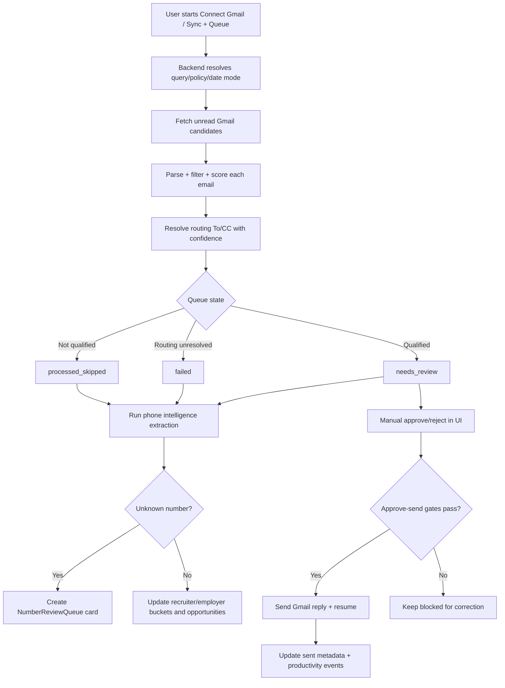
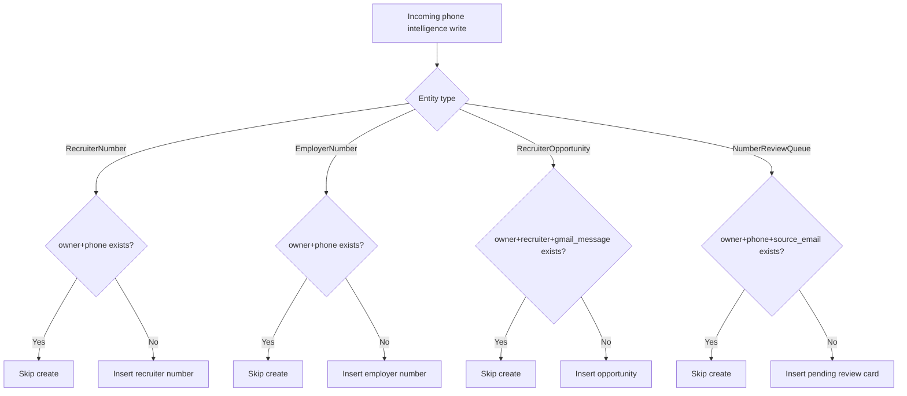

# CODEJOB Context

## 1. Project Overview

CODEJOB is an email/job-opportunity automation platform.

Its backend ingests unread recruiter-related emails from Gmail, parses and scores them, resolves routing recipients, drafts replies, and sends only after manual review approval. It also extracts phone intelligence to classify contacts into recruiter/employer buckets and track recruiter opportunity cards.

## 2. Purpose of the Project

This project exists to reduce manual recruiter-email processing overhead while preserving safety and traceability.

It helps the user:
- process more inbound recruiter emails faster
- avoid missing opportunities
- maintain controlled outbound responses with audit-friendly state transitions
- classify recruiter/employer phone identities without duplicate pollution

## 3. Target User

Primary user:
- A job seeker, recruiting-ops operator, or assistant managing inbound recruiter emails.

User goals:
- quickly triage incoming emails
- keep only relevant opportunities
- safely send tailored responses with resume attachments
- maintain clean recruiter/employer contact buckets and opportunity tracking

Pain points solved:
- repetitive inbox scanning
- manual email extraction/routing
- duplicate recruiter/opportunity records
- weak traceability from opportunity back to source email

## 4. Key Features

### Feature: Gmail OAuth + Inbox Sync
- What: Connect Gmail and fetch unread candidates by effective query.
- Why: Entry point for all automation.
- Files: `backend/app/gmail_client.py`, `backend/app/main.py`, `dashboard/src/App.tsx`

### Feature: Run Orchestrator
- What: Parse/filter/score/route/draft per message, then set queue states.
- Why: Core workflow engine.
- Files: `backend/app/automation/run_orchestrator.py`, `backend/app/main.py`, `backend/app/phase0.py`

### Feature: Manual Approval Queue
- What: Needs Review page with editable draft, live preview, and approve/reject actions.
- Why: Safety gate before outbound send.
- Files: `dashboard/src/App.tsx`, `backend/app/main.py`

### Feature: Failed Mapping Recovery
- What: User fixes To/CC when routing confidence is insufficient.
- Why: Recover unresolved routes without data loss.
- Files: `dashboard/src/App.tsx`, `backend/app/main.py`, `backend/app/routing/policy.py`

### Feature: Premium Number Intelligence
- What: Extract phone numbers, score relevance, classify unknowns, maintain recruiter/employer buckets.
- Why: Identity-level continuity and dedupe.
- Files: `backend/app/premium_numbers/extraction.py`, `service.py`, `intelligence.py`, `backend/app/main.py`

### Feature: Recruiter Opportunity Cards
- What: Create/update opportunity cards per recruiter number + source message.
- Why: Track repeated opportunities from same recruiter without duplicating recruiter identity.
- Files: `backend/app/models.py` (`RecruiterOpportunity`), `backend/app/main.py`

### Feature: Productivity Analytics
- What: Logs view/action/state events and renders trend bars/KPIs.
- Why: Operational visibility.
- Files: `backend/app/main.py`, `dashboard/src/App.tsx`

### Feature: Saved Query Bucket
- What: Saves/reuses normalized Gmail search queries from the dashboard.
- Why: Faster repeat runs with consistent query hygiene.
- Files: `dashboard/src/features/query_bucket/*`, `dashboard/src/App.tsx`, `backend/app/query_bucket/service.py`

### Feature: Gmail Labeling
- What: Applies or previews mailbox labels on processed Gmail messages.
- Why: Post-run inbox organization and traceability.
- Files: `backend/app/gmail_labeling/*`, labeling handlers in `backend/app/main.py`

### Feature: Recruiter Cold-Call Script
- What: Generates and stores an AI-assisted cold-call script per recruiter opportunity.
- Why: Speeds up recruiter follow-up from opportunity cards.
- Files: `backend/app/cold_call/*`, `POST /recruiter-opportunities/{id}/generate-cold-call-script`, `backend/app/main.py`

### Feature: Telegram Operations
- What: Remote commands for status/config/run/approve/reject.
- Why: Lightweight remote control.
- Files: `backend/app/telegram_bot.py`, telegram handlers in `backend/app/main.py`

## 5. Core Workflow

1. User triggers `Connect Gmail` or `Sync + Queue` from dashboard.
2. Backend resolves effective query/policy/date mode and fetches unread Gmail candidates.
3. For each candidate email, backend parses role/location/skills/salary and applies filters/scoring.
4. Routing policy resolves recruiter To and employer CC with confidence/evidence.
5. Backend writes/updates `RecruiterEmail` with one of key states:
   - `needs_review`
   - `failed`
   - `processed_skipped`
6. Phone intelligence extraction runs and may:
   - update premium lead records
   - create unknown review cards
   - append recruiter opportunity entries for known recruiter numbers
7. UI surfaces queue sections:
   - Needs Review (approve/reject)
   - Failed Mapping (manual To/CC correction)
   - Premium Numbers (manual recruiter/employer classification)
8. On approve-send, backend validates strict send gates and sends Gmail reply with resume attachment.
9. System updates sent metadata and emits productivity events.

## 6. Business Rules

These rules must not be broken.

- Manual approval is required before sending Gmail replies.
- Approve-send requires: safe routing, To, CC, non-empty draft, and active resume.
- Recruiter and Employer buckets are separate entities and must stay separate.
- Unknown phone numbers must enter manual review queue when not classifiable.
- Manual number classification options (`Mark as Recruiter`, `Mark as Employer`) must remain available.
- Duplicate prevention rules:
  - no duplicate recruiter email by external message id
  - no duplicate recruiter number per owner+phone
  - no duplicate employer number per owner+phone
  - no duplicate opportunity for same owner+recruiter number+gmail message
  - no duplicate number review card for same owner+phone+source email
- Recruiter opportunity records must remain traceable to source email/message.
- Routing confirmation must be explicit for low-confidence cases.
- System should prioritize correctness over aggressive automation.

## 7. UI Rules

Required screens/sections:
- Run Queue
- Needs Review
- Failed Mapping
- Premium Numbers
- Sent Items
- Recent Runs

Required actions/buttons that must not be removed:
- `Connect Gmail` / `Sync + Queue` (or equivalent authenticated run action)
- `Save Filters`
- `Approve & Send`
- `Reject`
- `Save Mapping & Move to Review`
- `Mark as Recruiter`
- `Mark as Employer`

Behavior rules:
- Needs Review approve button must stay disabled unless all send-safety conditions are met.
- Failed mapping must allow manual To/CC correction and return item to review.
- Premium “All” view must always permit manual recruiter/employer classification.

## 8. Data Models and Stored Information

### RecruiterEmail
- Purpose: central workflow record.
- Important fields: sender, subject, body, role/location/skills, state, routing fields, draft fields, sent metadata, external ids.
- Relations: source for premium leads and opportunities.
- Usage: run pipeline, review, send history.

### RecruiterNumber (Recruiter Bucket)
- Purpose: unique recruiter phone identity.
- Important fields: normalized/display phone, recruiter/company/designation/email, first_detected_email_id.
- Relation: parent for recruiter opportunities.

### EmployerNumber (Employer Bucket)
- Purpose: unique employer phone identity.
- Important fields: normalized/display phone, owner/company, source_email_id.
- Rule: must remain isolated from recruiter bucket.

### RecruiterOpportunity (Opportunity Card)
- Purpose: one opportunity instance tied to recruiter number + source email/message.
- Important fields: recruiter_number_id, source_email_id, gmail_message_id, subject/sender/open URL, status, notes.

### NumberReviewQueue
- Purpose: pending manual classification cards for unknown phone numbers.
- Important fields: normalized/display phone, owner/company/designation, evidence snippet, source email metadata, state.

### PremiumNumberLead
- Purpose: extracted lead catalog from candidate emails.
- Important fields: phone, confidence, contact_type, recruiter relevance score/reason, source details.

### UserSettings / ResumeAsset / ProductivityEvent
- Settings and policy controls, active resume metadata, analytics event stream.

## 9. Duplicate Handling Logic

Duplicate recruiter:
- Same owner + normalized recruiter phone (`ux_recruiter_numbers_owner_phone`) => do not create duplicate recruiter bucket row.

Duplicate employer:
- Same owner + normalized employer phone (`ux_employer_numbers_owner_phone`) => do not create duplicate employer bucket row.

Duplicate opportunity:
- Same owner + recruiter_number_id + gmail_message_id (`ux_recruiter_opportunities_owner_recruiter_msg`) => do not create new opportunity card.

Duplicate unknown review card:
- Same owner + normalized phone + source_email_id (`ux_number_review_queue_owner_phone_email`) => do not create duplicate pending card.

When new opportunity should be created:
- Existing recruiter number receives a **new Gmail message id** with opportunity context.

When system should do nothing:
- Number already exists in employer bucket and current action is employer classification path.
- Review card is already non-pending.
- Existing opportunity key already present.

## 10. AI Agent Instructions

- Read `docs/context.md` before changing workflow code.
- Preserve routing and send-safety business rules.
- Do not remove manual classification or mapping recovery actions.
- Do not merge recruiter and employer bucket logic.
- Do not introduce duplicate record writes; preserve idempotency checks and DB uniqueness.
- Keep source traceability fields for opportunities and premium leads.
- Do not alter core run/send state machine without explicit approval.
- Ask for clarification before changing orchestration helpers in `backend/app/main.py` and `run_orchestrator.py`.

## 11. Tech Stack

- Frontend framework: React + TypeScript + Vite
- Backend framework: FastAPI
- Database: SQLite (SQLAlchemy ORM)
- Authentication system: Gmail OAuth (Google OAuth flow)
- APIs/services:
  - Gmail API
  - Google Sheets API (optional tracking)
  - Telegram Bot API
  - DeepSeek via OpenAI-compatible client
- AI/automation:
  - AI draft generation (DeepSeek)
  - optional semantic embeddings (`hash`/OpenAI/OpenRouter providers)
- Package/build tools:
  - Backend: Python (`pyproject.toml`)
  - Frontend: npm scripts (`lint`, `build`, `test`)

## 12. Important Files and Folders

- `backend/app/main.py`  
  Central API + orchestration + safety logic. **High caution**.
- `backend/app/automation/run_orchestrator.py`  
  Run pipeline state transitions. **High caution**.
- `backend/app/phase0.py`  
  Parsing/routing heuristics and fallback draft rendering. **High caution**.
- `backend/app/premium_numbers/`  
  Extraction/classification/opportunity intelligence. **High caution**.
- `backend/app/gmail_labeling/`  
  Gmail labeling rules/service and preview flow.
- `backend/app/cold_call/`  
  Cold-call script generation service and prompting.
- `backend/app/db.py`  
  Startup schema creation/migration and uniqueness indexes. **High caution**.
- `backend/app/models.py`  
  ORM schema source of truth.
- `backend/app/routing/policy.py`  
  Routing decision model used for sendability checks.
- `dashboard/src/App.tsx`  
  Primary UI state machine and action wiring. **High caution**.
- `dashboard/src/candidateBuckets.ts`  
  Candidate pagination/refresh behavior.
- `docs/problem-fix-log.md`  
  Tangled code map and untangling priorities.

## 13. Current Limitations

- Frontend is monolithic (`App.tsx`), increasing change risk.
- Backend main orchestration is heavily concentrated in one module.
- Validation reliability depends on environment setup (Python/Node dependencies must be installed).
- Some tests appear stale relative to current branch contracts (for example `test_phone_attribution.py` references missing module).
- No dedicated production auth/multi-tenant separation in UI layer.

## 14. Safe Modification Guidelines

Safe areas:
- Documentation updates
- Isolated UI styling/text changes with no behavior changes
- Additive non-breaking API response metadata

Risky areas:
- Routing policy and sendability checks
- Approve-send validation and state transitions
- Number classification + dedupe + opportunity write path
- SQLite migration/index logic
- Shared refresh/effect logic in `App.tsx`

Require explicit approval:
- Changing core workflow state machine
- Removing manual classification/review controls
- Modifying dedupe/uniqueness behavior

Testing expectations after risky changes:
- Run backend tests and frontend lint/build/test
- Manually verify end-to-end: run -> needs_review/failed -> resolve -> approve-send -> premium classification flows

## 15. Summary

CODEJOB automates recruiter-email intake, review, and response while enforcing manual safety gates and preserving recruiter/employer contact intelligence.

The most important invariants are: routing/send safety, strict duplicate prevention, separate recruiter/employer buckets, and source-email traceability for opportunities.

Future AI agents must preserve these invariants, keep manual classification/review paths intact, and avoid changing core orchestration logic without explicit approval.
