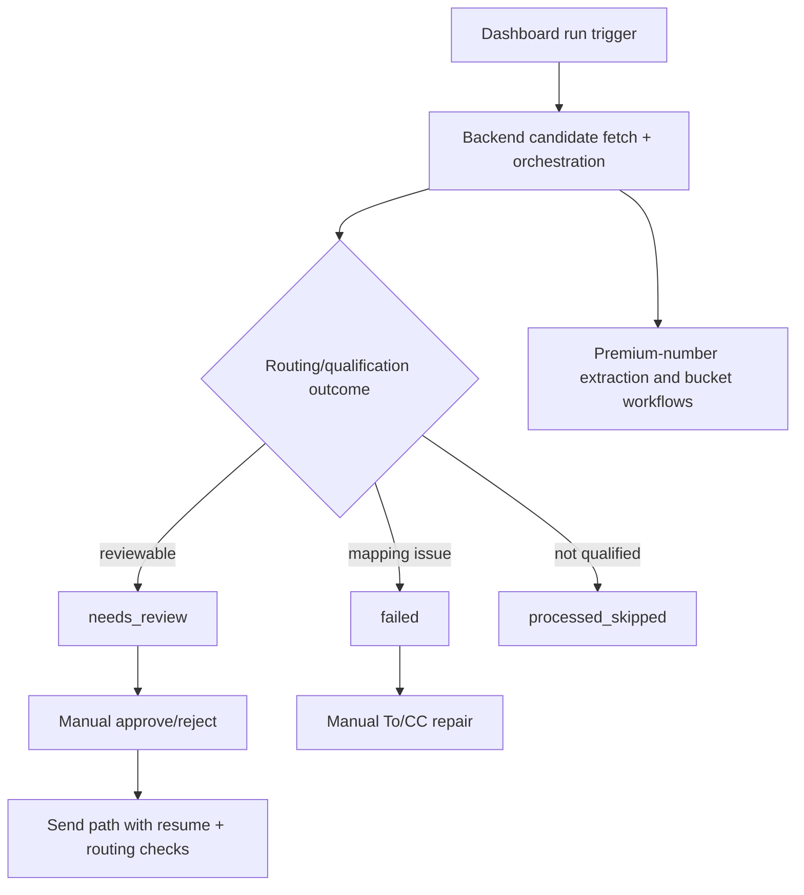

# CODEJOB Context

## Project Purpose

CODEJOB automates recruiter-email intake and triage with manual send-safety gates, while preserving recruiter/employer phone intelligence and opportunity traceability.

## Runtime Overview

1. User initiates sync/run from dashboard.
2. Backend resolves effective query/policy/date inputs.
3. Candidates are parsed, scored, and routed.
4. Queue state is assigned (`needs_review`, `failed`, `processed_skipped`).
5. Premium-number intelligence side effects run.
6. User performs manual review actions; approve-send enforces strict gates.

## Key Invariants

- Approve-send must keep routing, recipient, draft, and resume safety checks.
- Recruiter and employer number buckets must remain separate.
- Unknown number flows must allow manual classification.
- Opportunity records must remain traceable to source messaging context.

## Reviewer Attention

- `dashboard` verification passed in this session: `24` test files and `78` tests.
- The focused premium-number, analytics, and Telegram backend batch produced `30 passed, 1 failed`; the failing re-extraction test is tracked in `problem-fix-log.md` and `snowball.md`.
- Gmail OAuth, Gmail sync, Nvoids, Telegram polling, RQ workers, and Sheets append were not executed against configured external services.

- Audit date: 2026-08-05
- Branch: semantic-embeddings
- Evidence basis: both
- Verification limits: no full backend-suite result; one focused premium-number regression is unresolved.
