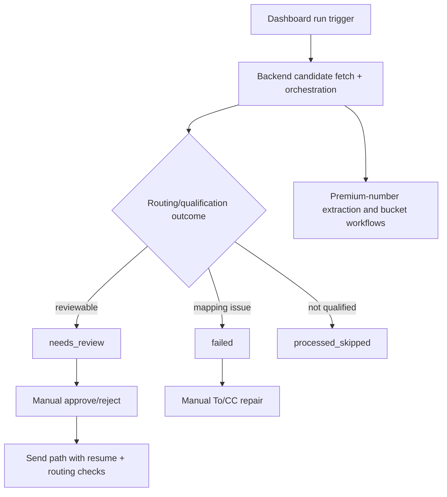

# CODEJOB Context

## Project Purpose

CODEJOB automates recruiter-email intake and triage with manual send-safety gates, while preserving recruiter/employer phone intelligence and opportunity traceability.

## Runtime Overview

1. User initiates sync/run from dashboard.
2. Backend resolves effective query/policy/date inputs.
3. Candidates are parsed, scored, and routed.
4. Queue state is assigned (`needs_review`, `failed`, `processed_skipped`).
5. Premium-number intelligence side effects run.
6. User performs manual review actions; approve-send enforces strict gates.

## Key Invariants

- Approve-send must keep routing, recipient, draft, and resume safety checks.
- Recruiter and employer number buckets must remain separate.
- Unknown number flows must allow manual classification.
- Opportunity records must remain traceable to source messaging context.

## Reviewer Attention

- Backend full verification is currently limited by stale import in `backend/tests/test_phone_attribution.py`.
- Frontend tests passed in this session (`npm test -- --run`), but lint/build were not rerun.

- Audit date: 2026-06-09
- Branch: copilot/update-md-files-another-one
- Evidence basis: both
- Verification limits: backend full-suite pass cannot be claimed due collection blocker and missing deps in this session.
