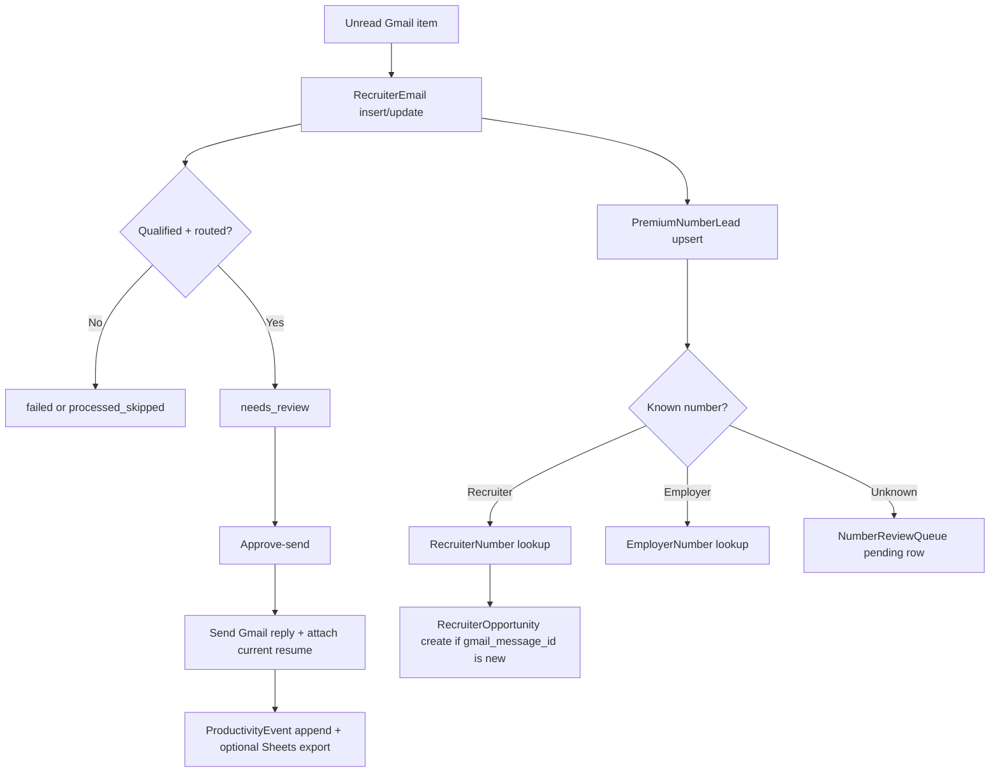

# CODEJOB Data Models and Data Flow (Current Branch)

## 1. Core ORM entities

### `RecruiterEmail`

Canonical workflow row for each processed candidate email.

Key responsibilities:

- stores parsed email metadata,
- stores queue state and send status,
- stores routing explanation and chosen recipients,
- stores draft generation metadata,
- links send history, Gmail labels, and premium-number side effects.

Important fields beyond the basic email body/subject metadata:

- scoring: `score`, `ai_score`, `ai_score_source`, `ai_summary`
- workflow: `state`, `decision`, `decision_reason`, `skip_reason`, `approval_status`, `sent_status`
- routing: `recipient_email`, `cc_email`, `routing_status`, `routing_confidence`, `routing_reason`, `routing_evidence`, `routing_candidates`, `routing_confirmed`
- draft: `draft_reply`, `draft_source`, `draft_model`, `draft_ai_error`, `draft_resume_context_status`
- Gmail tracking: `external_message_id`, `external_thread_id`, `external_rfc_message_id`, `gmail_sent_id`, `applied_gmail_label`, `applied_gmail_label_id`, `applied_gmail_label_at`
- attachment context: `resume_asset_id`, `resume_file_name`

### `UserSettings`

Owner-scoped settings row. It stores:

- live Gmail query and default Gmail query,
- saved Gmail queries JSON,
- date defaults,
- thresholds and qualification preferences,
- feature flags,
- fallback draft template and signature fields,
- serialized policy JSON.

### `ResumeAsset`

Versioned resume metadata plus on-disk file path and optional semantic embedding cache.

### `SyncRun`

Persists import-sync batch counters (`imported_count`, `skipped_count`, `error_count`) for `POST /gmail/sync` and Telegram `/recent_runs`.

### `DraftEditFeedback`

Stores original vs edited draft text when operators change a draft before approval.

### `RecipientRoutingFeedback`

Stores manual routing corrections keyed by sender domain to preserve historical correction hints.

### `ProductivityEvent`

Event stream used by `/analytics/events` and `/analytics/trend`, including dashboard view events and run/approval signals.

## 2. Phone-intelligence entities

### `PremiumNumberLead`

Per-email extracted lead catalog. These rows capture phone normalization, recruiter relevance, confidence, and source evidence.

### `NumberReviewQueue`

Pending manual classification queue for unknown numbers. State starts at `pending` and is updated by manual classification flows.

### `RecruiterNumber`

Unique recruiter identity store keyed by owner + normalized phone number.

### `EmployerNumber`

Unique employer identity store keyed by owner + normalized phone number. This table is intentionally separate from recruiter numbers.

### `RecruiterOpportunity`

Opportunity card associated with one recruiter number and one Gmail message. It stores email-derived metadata, cold call script text, notes, and a backend-validated status.

## 3. Important enums, states, and structured payloads

### Candidate states

- `needs_review`
- `failed`
- `processed_skipped`
- `auto_rejected`
- `approved_sent`
- `rejected`

### Resume context attribution states

- `injected`
- `limited`
- `missing_resume`
- `extract_failed`
- `rules_only`

### Draft quality labels

The current scoring helper can emit:

- `Excellent`
- `Strong`
- `Good`
- `Review`
- `Risky`

### Recruiter opportunity statuses

- `New`
- `Called`
- `Applied`
- `Follow Up`
- `Closed`
- `Not Interested`

### Routing evidence shape

`routing_evidence` and `routing_candidates` are stored as JSON arrays and returned as parsed lists by the API schema layer. Each item reflects the routing evidence contract from `phase0.py`, including the candidate email, a textual reason, and a confidence value.

### Draft quality shape

`RecruiterEmail.draft_quality` is derived data, not a stored column. Current fields are:

- `content_valid`
- `greeting_compliance`
- `resume_context_status`
- `confidence`
- `score`
- `label`
- `issues`

## 4. Duplicate-prevention rules

These are active code-and-schema invariants:

- `recruiter_emails.external_message_id` is unique.
- `ux_recruiter_numbers_owner_phone` prevents duplicate recruiter identities.
- `ux_employer_numbers_owner_phone` prevents duplicate employer identities.
- `ux_recruiter_opportunities_owner_recruiter_msg` prevents duplicate opportunity cards for the same recruiter number and Gmail message.
- `ux_number_review_queue_owner_phone_email` prevents duplicate unknown-review cards for the same number and source email.

## 5. End-to-end data flow

### Full queue-building run

### Import-only sync

`POST /gmail/sync` writes a `SyncRun`, inserts or updates `RecruiterEmail` rows, and can mark rows as `auto_rejected` without entering the full queue-processing state machine.

## 6. API schema anchors

The main request/response schema source is `backend/app/schemas.py`.

Useful schema groups:

- settings and resume schemas,
- candidate list/detail and approval schemas,
- premium-number and number-review schemas,
- recruiter/employer/opportunity schemas,
- analytics and status schemas.

Notable response behavior from current schemas:

- routing JSON strings are parsed into lists before response serialization,
- draft quality is exposed as a nested response object,
- Gmail label metadata is surfaced on candidate responses,
- AI status includes both chat-provider and embedding-provider health details.

## 7. Data decisions that matter operationally

- `RecruiterEmail` is the main audit record; downstream phone-intelligence rows depend on it.
- Saved Gmail queries are stored inside settings JSON, not a dedicated table.
- `SyncRun` is the source of truth for import-only sync history; dashboard recent-runs analytics come from `ProductivityEvent` instead.
- Cold call scripts are stored on recruiter opportunities, which makes that table the source of truth for recruiter follow-up notes.
- Runtime telemetry such as Telegram auth sessions and last AI timing is in memory, not persisted in the database.
