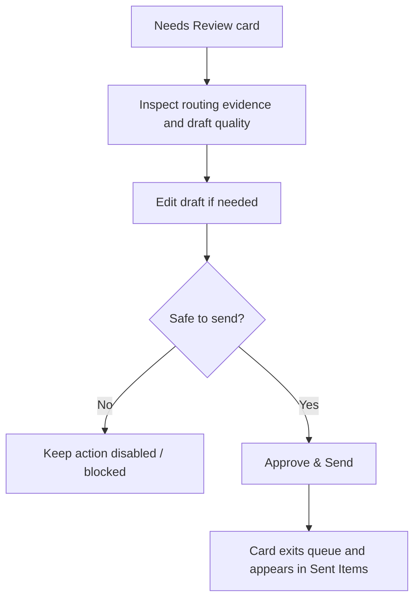

# CODEJOB UI and Interaction Design (Current Branch)

## 1. Dashboard structure

The dashboard is a single-page application with a persistent left rail and one active content pane.

Primary navigation items:

- Run Queue
- Needs Review
- Failed Mapping
- Premium Numbers
- Sent Items
- Recent Runs

The sidebar also renders `Settings` and `Help Center` footer buttons plus a `New Campaign` button, but those controls are currently visual affordances rather than separate routed features.

## 2. Run Queue and settings surface

The top of the dashboard combines runtime status and operator controls:

- Gmail auth state and OAuth bootstrap actions,
- AI runtime state with embedding-provider health,
- Telegram runtime state,
- current Gmail query and date filters,
- query bucket save/remove actions,
- policy profile chooser,
- profile settings and feature toggles,
- resume upload / replace actions,
- execution controls for one-shot runs.

This means the “Run Queue” area is both a command center and a settings page rather than a minimal queue list.

## 3. Query bucket UX

Saved queries are part of the live dashboard experience.

Current interaction details:

- inline input drives the active Gmail query,
- `+` saves the current query,
- `-` removes the exact current saved query,
- suggestions open on focus and support keyboard navigation,
- saved queries are deduplicated case-insensitively and capped at 10,
- selecting a suggestion updates both the input value and the active query selection state.

## 4. Needs Review UX

Each review card is expected to preserve these behaviors:

- show sender/subject/body-derived context,
- show routing evidence and candidate recipients,
- show Gmail and draft-quality metadata,
- allow draft editing,
- keep `Approve & Send`, `Reject`, and `Send to Failed Mapping` actions visible,
- keep approval disabled until the backend-required send conditions are satisfied.

## 5. Failed Mapping UX

The failed-mapping section is the human recovery lane for recipient resolution.

Required live behavior:

- display original email context,
- show current routing reason and evidence,
- allow `Correct To` and `Correct CC` editing,
- submit `Save Mapping & Move to Review`,
- return the item to `needs_review` with routing marked as confirmed.

## 6. Premium Numbers UX

The premium numbers screen combines multiple operational views:

- extracted leads,
- unknown review cards,
- recruiter numbers,
- employer numbers,
- recruiter opportunities.

Current interaction expectations grounded in the UI code:

- scope filters switch between review cards, recruiter numbers, employer numbers, and opportunities,
- lead lists support confidence filtering, search, and pagination,
- unknown review cards keep `Mark as Recruiter`, `Mark as Employer`, and delete actions,
- recruiter/employer bucket views expose counts and supporting metadata,
- opportunity cards support status changes, note editing, and cold call script generation/copying,
- opportunity filtering includes status-based filtering.

## 7. Sent Items and Recent Runs

- **Sent Items** shows approved and sent candidates with delivery context and historic reply data.
- **Recent Runs** is the dashboard analytics digest: trend bars, KPI totals, and recent productivity events.
- Telegram `/recent_runs` is a separate surface that shows `SyncRun` import batches rather than the dashboard analytics timeline.

## 8. Current design debt

The current branch still carries these UI debts:

- `App.tsx` is the dominant state container for almost every feature.
- Refresh sequencing after mutations is manually coordinated through timers/effects (`schedulePostMutationRefresh`).
- There is no dedicated router-level separation for settings/help/new campaign actions.
- Feature folders exist for AI and query bucket, but only query bucket has meaningful isolated UI behavior today.

## 9. Practical UI constraints for future changes

- Do not remove manual review controls from Needs Review, Failed Mapping, or Number Review flows.
- Do not assume the dashboard is section-isolated; changes in one area can affect global refresh behavior.
- Treat the settings panel as part of the core operator workflow, not an auxiliary page.
