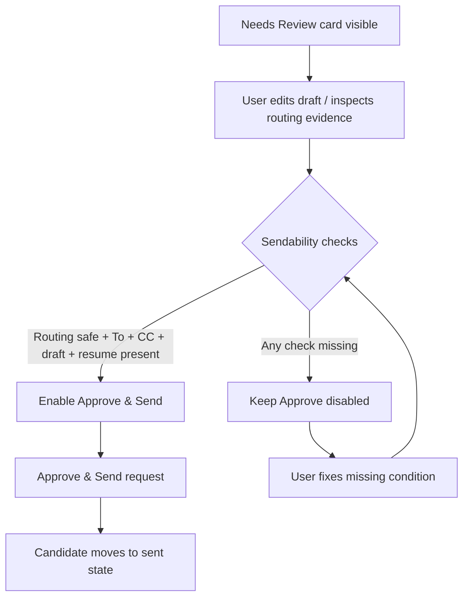
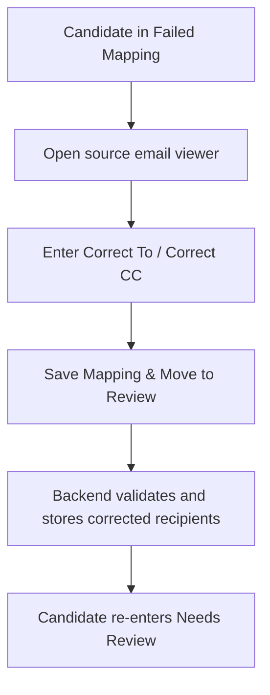

# CODEJOB UI/UX Design Notes (Current Branch)

## 1) Current UI structure

The dashboard is a single-page React app with sidebar navigation and section-based content panes.

Primary sections:
- Run Queue
- Needs Review
- Failed Mapping
- Premium Numbers
- Sent Items
- Recent Runs

## 2) Critical interaction contracts

- Top action must always expose:
  - `Connect Gmail` when unauthenticated
  - `Sync Now` / `Sync + Queue` when authenticated
- Date chip and date picker must allow filter + clear
- Settings form must keep `Save Filters` and resume upload/replace actions

## 3) Review safety UX

Needs Review cards must retain:
- Routing evidence panel
- To/CC visibility
- Editable draft + live preview
- `Approve & Send` and `Reject` buttons

Approve button stays disabled unless:
- routing is sendable
- To and CC exist
- non-empty draft exists
- resume is attached

## 4) Failed mapping UX

Failed mapping cards must retain:
- full source email content viewer
- editable `Correct To` and `Correct CC`
- `Save Mapping & Move to Review` action

This is the core human recovery path for unresolved routing.

## 5) Premium numbers UX

“All” view (number review queue) must retain both manual actions:
- `Mark as Recruiter`
- `Mark as Employer`

These manual buttons are required business controls and must not be removed.

Premium module also includes:
- Recruiter Numbers view
- Employer Numbers view
- Recruiter Opportunities view (status + notes updates)

## 6) Known design debt

- `dashboard/src/App.tsx` remains large and tightly coupled across sections/states, though some logic has been extracted to `dashboard/src/features/ai/*` and `dashboard/src/features/query_bucket/*`
- Several section refresh paths are manually coordinated (`schedulePostMutationRefresh`, multiple effect chains)
- Sidebar footer buttons (`Settings`, `Help Center`) are currently placeholders without full routing behavior
