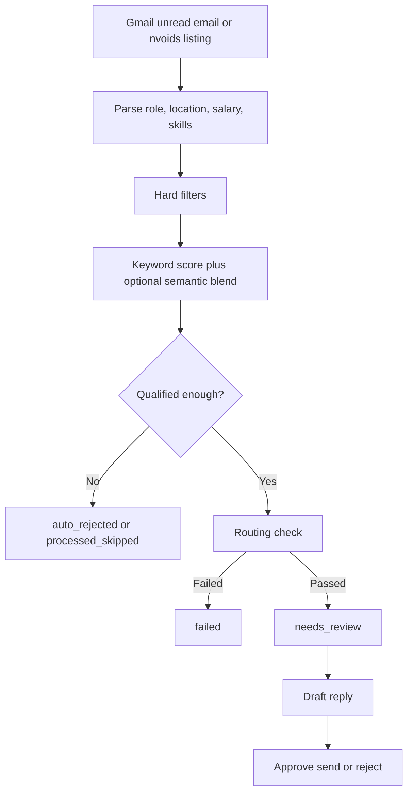
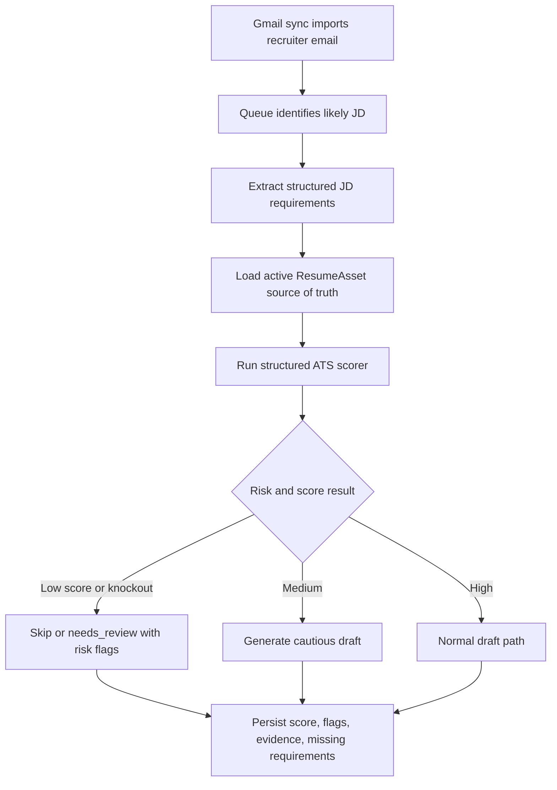

# Faulty Outcomes: ATS Scoring and Resume Matching

## Purpose

This document explains why the current CODEJOB scoring path can produce
misleading ATS-style outcomes and how a safer scoring model should fit into the
existing Gmail sync, queue, and nvoids sync flows.

It is written for a future implementation agent. It does not change runtime
behavior.

## Current Flow Summary

Current runtime is centered on these code paths:

- Gmail sync creates `RecruiterEmail` rows in
  `backend/app/services/orchestration_service.py`.
- Queue preparation and draft creation run through
  `backend/app/automation/queue_preparation.py`.
- Run-once orchestration persists queue outcomes in
  `backend/app/automation/run_orchestrator.py`.
- ATS-like scoring currently uses `hard_filter_check()` and
  `ai_assist_score()` in `backend/app/phase0.py` plus
  `compute_blended_ai_score()` in
  `backend/app/services/scoring_runtime_service.py`.
- nvoids sync creates `ExternalOpportunity` rows and can enqueue
  `RecruiterEmail` rows through `backend/app/external_feeds/service.py`.
- Final user actions such as approve, reject, failed-mapping, and recipient
  resolution run in
  `backend/app/services/orchestration_service.py`.

### Gmail sync

`sync_gmail()` in `backend/app/services/orchestration_service.py`:

- pulls unread Gmail candidates
- skips duplicates by `external_message_id`
- keeps only recruiter-like emails with `is_recruiter_like()`
- parses the subject and body with `parse_email()`
- runs `hard_filter_check()`
- computes `compute_blended_ai_score()`
- rejects below-threshold items
- routes qualified items
- writes a `RecruiterEmail` row with state, score, diagnostics, and draft

### Recruiter email queue flow

`run_once()` in `backend/app/services/orchestration_service.py` calls
`RunOrchestrator.execute()` in `backend/app/automation/run_orchestrator.py`.

That path currently:

- marks not-qualified items as `processed_skipped`
- marks unresolved routing items as `failed`
- queues qualified items as `needs_review`
- stores a draft reply before approval
- allows later user actions:
  - `approve_send()`
  - `reject_candidate()`
  - `send_to_failed_mapping()`
  - `resolve_recipients()`

### nvoids sync behavior

`sync_nvoids()` in `backend/app/external_feeds/service.py`:

- creates or reuses an `ExternalFeedSource`
- fetches nvoids search pages and detail pages
- parses listings into `ExternalOpportunity`
- deduplicates by `dedupe_hash` or `external_post_id`
- optionally bridges records into `RecruiterOpportunity`
- reuses `prepare_candidate_for_queue()` to enqueue a `RecruiterEmail`
  record with `source="nvoids"` and `state="needs_review"`

### Resume and draft source of truth

The active resume is the current `ResumeAsset` row with `is_current=True`.
Upload and versioning happen through `/settings/resume` and
`/settings/resumes` in `backend/app/main.py`.

Draft generation may use the active resume, but the current source of truth is
the uploaded resume asset, not a previously generated draft. Any future ATS
tailoring flow should keep that rule.

## Faulty Outcome Example

A JD asks for:

- 9+ years Java experience
- Java 11/17/21
- Spring Boot, Spring Cloud, Spring Data, Spring Security
- Kafka producers, consumers, Kafka Streams, Kafka Connect
- Cassandra, CQL, partition keys, clustering keys, tuning
- distributed systems, CAP theorem, eventual consistency
- PostgreSQL/MySQL
- Docker, Kubernetes
- AWS/GCP/Azure
- Jenkins/GitHub Actions/GitLab CI
- ELK/EFK, Prometheus/Grafana, Jaeger/Zipkin
- REST APIs, event-driven architecture, SOLID principles, design patterns

The current resume may match Java, Spring Boot, microservices, Kafka basics,
PostgreSQL/MySQL, AWS, Docker, Kubernetes, Jenkins, REST APIs, and testing.

But it may not strongly support:

- 9+ years if the resume says 7+
- Cassandra
- CQL
- partition keys and clustering keys
- Cassandra tuning
- Kafka Streams
- Kafka Connect
- the observability stack
- Java 21
- Spring Cloud

A naive ATS outcome such as 75 to 80 percent is misleading because the match is
driven by broad overlap while major gaps remain in mandatory areas. Current
CODEJOB code does not separate must-have requirements, evidence strength, years
of experience, or knockout gaps inside the AI score itself. Today the hard
filter only checks accepted locations, minimum salary, and configured
`must_have_skills`, while the score itself is mostly keyword overlap plus an
optional semantic blend.

## Why Keyword-Based ATS Scoring Fails

Current code already shows the main problem:

- `ai_assist_score()` in `backend/app/phase0.py` starts from `0.45`, then adds
  points for role keyword hits and generic skill hits.
- `SKILL_KEYWORDS` is a short flat list in `backend/app/phase0.py`.
- `blend_scores()` in `backend/app/semantic/ranking.py` mixes the keyword score
  with semantic similarity, but it still does not add requirement structure.

That leads to these flaws:

- Keyword presence is not the same as hands-on evidence.
- Mandatory requirements are not weighted separately from broad overlap.
- Missing disqualifiers can hide behind many small matches.
- Years of experience are not treated as a hard or semi-hard ATS rule in the
  current score.
- Related technology is not the same as the exact required technology.
  - MongoDB does not equal Cassandra.
  - Generic Kafka does not equal Kafka Streams or Kafka Connect.
  - CloudWatch does not equal ELK, Prometheus, Grafana, Jaeger, or Zipkin.
- Resume claims should be backed by project bullets, company experience, or
  direct work evidence.
- The system should not reward fake resume additions just because they would
  increase keyword count.

Even when semantic scoring is enabled, the current semantic path compares email
text and resume text at a broad similarity level. It does not explicitly reason
about hard requirements such as 9+ years, Cassandra tuning, or Kafka Streams.

## Better ChatGPT-Like ATS Scoring Model

The improved model should score a job against a resume in layers instead of a
single flat overlap pass.

### A. Requirement extraction

Parse each JD into a structured requirement set:

- hard requirements
- preferred requirements
- responsibilities
- tools and technologies
- experience filters
- domain expectations

This step should explicitly label items such as:

- exact frameworks
- exact database technologies
- minimum years
- location or work authorization rules
- true nice-to-have items

### B. Resume evidence extraction

Parse the active resume into structured evidence:

- exact skill matches
- project and employer evidence
- years of experience
- related but non-exact skills
- missing skills
- unsupported claims

Evidence should come from actual resume bullets, project summaries, roles, and
time ranges. A keyword in a top-level skills list should not be treated the same
as a project bullet showing real delivery work.

### C. Weighted scoring

Replace flat counting with weighted categories:

- hard requirements
- core technical stack
- responsibilities and project alignment
- cloud, devops, testing, and observability
- resume quality and keyword clarity

### D. Knockout detection

Add hard-risk flags before any draft is trusted:

- years requirement not met
- missing mandatory database or tool
- missing required framework
- missing location or work authorization
- no evidence for a claimed keyword

### E. Evidence confidence

Each matched skill should carry a confidence level:

- Strong: exact skill with project or bullet evidence
- Partial: related skill exists but not the exact required technology
- Weak: keyword appears only in a skills list
- Missing: no evidence found

### F. Final scoring output

The scorer should return:

- overall score
- technical score
- hard requirement score
- risk flags
- missing mandatory skills
- safe resume additions
- unsafe additions to avoid
- recommendation: High, Medium, or Low priority

## Proposed Scoring Weights

Suggested weights for the future scoring service:

| Category | Weight | Why |
| --- | ---: | --- |
| Hard requirements | 45% | Must-have items should dominate the result |
| Core technical stack | 25% | Main stack alignment still matters |
| Responsibilities and project alignment | 15% | Delivery evidence matters more than raw keywords |
| Cloud, devops, testing, observability | 10% | Important support stack, but usually secondary |
| Resume quality and keyword clarity | 5% | Helps parser quality, but should not mask hard gaps |

These weights should be configurable, but hard requirements should remain the
largest category.

## Knockout and Risk Flags

The improved scorer should emit explicit risk flags instead of hiding them in a
single number.

Recommended flags:

- `years_requirement_not_met`
- `missing_required_framework`
- `missing_required_database`
- `missing_required_observability_stack`
- `missing_location_or_work_auth`
- `exact_technology_not_supported`
- `claim_not_evidence_backed`

Queue automation should treat some flags as blockers and some as caution flags.

## Evidence Confidence Levels

Confidence should be attached per requirement, not only to the final score.

| Level | Meaning | Example |
| --- | --- | --- |
| Strong | Exact match with direct project or job evidence | Resume bullet mentions building Kafka consumers in a named project |
| Partial | Related but not exact evidence | Resume shows Kafka, but not Kafka Streams or Kafka Connect |
| Weak | Mentioned without delivery evidence | Skill appears only in a keyword list |
| Missing | No support found | No Cassandra or CQL evidence |

This keeps the system from overstating readiness for a role.

## Safe vs Unsafe Resume Additions

Safe additions should only clarify what the resume already proves.

Safe additions:

- expanding an existing bullet with already-supported details
- surfacing a version already shown in project evidence
- clarifying an existing responsibility using the same technology already named
- adding missing keywords only when the resume already proves them

Unsafe additions to avoid:

- adding Cassandra when the resume only shows MongoDB
- adding Kafka Streams or Kafka Connect when the resume only shows Kafka basics
- adding ELK or Prometheus when the resume only shows CloudWatch
- raising 7+ years to 9+ years without evidence
- turning related experience into exact technology claims

The scorer should help the system recommend safe clarifications while explicitly
warning against unsupported edits.

## Integration With Sync + Queue Flow

The improved scorer should fit into the current CODEJOB queue architecture like
this:

Desired behavior:

1. Gmail sync imports recruiter emails.
2. Queue identifies likely job descriptions.
3. JD text is extracted from the email body.
4. The active resume source of truth is loaded from the current `ResumeAsset`.
5. The ATS scoring module compares the JD against that source resume.
6. The scorer returns a structured result:
   - score
   - matched evidence
   - missing requirements
   - knockout risks
   - safe additions
   - recommendation
7. Queue logic uses score and risk level before drafting.
8. Low-score or hard-missing jobs should be skipped or marked `needs_review`
   with clear risk flags.
9. Medium-score jobs can generate a cautious draft.
10. High-score jobs can proceed to the normal draft flow.
11. Resume tailoring must never treat a previously generated Google Doc draft as
    the source of truth.
12. The uploaded active resume asset must remain the source of truth.

In code terms, the future scorer should replace or wrap the current flat
`ai_assist_score()` and broad `compute_blended_ai_score()` output with a richer
result object that queue preparation can read before setting `state`,
`decision_reason`, and draft behavior.

## Integration With nvoids Sync Flow

Current nvoids sync in `backend/app/external_feeds/service.py`:

- creates or updates `ExternalFeedSource`
- creates `ExternalScrapeRun`
- creates `ExternalOpportunity`
- may create `RecruiterOpportunity`
- may enqueue a `RecruiterEmail` through `_enqueue_needs_review_candidate()`
- reuses `prepare_candidate_for_queue()`

That means faulty scoring in the Gmail flow can also affect nvoids-created
queue items because both paths converge at queue preparation.

Specific risk points:

- A weak nvoids listing can still look good if broad Java or Spring keywords
  overlap with the active resume.
- Missing must-have items may not stop drafting unless they are already encoded
  in the current hard filters.
- Generic overlap may create `needs_review` or draft-ready records for weak JDs.

Recommended future behavior:

- attach the structured ATS result to both `ExternalOpportunity` and any derived
  `RecruiterEmail` record
- persist:
  - overall score
  - hard requirement score
  - risk flags
  - missing mandatory requirements
  - evidence confidence summary
- use those fields when `_enqueue_needs_review_candidate()` decides whether to:
  - skip
  - queue with warning
  - queue for cautious drafting

This prevents bad automation outcomes by making weak nvoids posts visibly risky
before they become normal review candidates.

Exact storage fields for those future results need verification in code.

## Expected Final Output Shape

The future scoring module should return a structured payload with fields like:

- job summary
- overall score
- hard requirement score
- technical stack score
- responsibility alignment score
- evidence list by requirement
- missing mandatory requirements
- related but non-exact matches
- knockout flags
- safe resume additions
- unsafe additions to avoid
- final recommendation

The recommendation should be one of:

- High priority
- Medium priority
- Low priority

## Implementation Notes

- Current hard filters are narrow. They only check location, minimum salary, and
  configured `must_have_skills` in `backend/app/phase0.py`.
- Current keyword scoring is flat. It uses a base score plus generic role and
  skill overlap in `backend/app/phase0.py`.
- Current semantic scoring is a blended similarity score in
  `backend/app/services/scoring_runtime_service.py` and
  `backend/app/semantic/ranking.py`.
- Current draft generation already distinguishes resume context status, but it
  does not expose ATS evidence confidence.
- Current Gmail labeling is state-driven in
  `backend/app/gmail_labeling/rules.py`, so richer risk flags could later help
  labeling too.
- If implementation details are unclear, mark them as `needs verification in
  code` instead of guessing.
- Local validation was limited in this session:
  - `cd backend && python -m pytest` failed with `/usr/bin/python: No module
    named pytest`
  - `cd dashboard && npm run lint` failed with `sh: 1: eslint: not found`
  - `cd dashboard && npm run test` failed with `sh: 1: vitest: not found`
  - `cd dashboard && npm run build` failed because TypeScript could not find
    `vite/client` and `node` type definitions
- Mermaid is needed here because this document explains live flow behavior.

## Non-Goals

This document does not:

- change backend logic
- change frontend logic
- change tests
- add migrations
- approve fake resume additions
- define final database schema changes
- define the final prompt wording for resume tailoring

## Recommended Next Steps

1. Introduce a structured requirement extractor for JD text.
2. Introduce a structured resume evidence extractor for the active resume asset.
3. Replace flat ATS scoring output with a multi-part result object.
4. Add knockout and risk flags to queue decisions before drafting.
5. Persist structured scoring summaries on queue records.
6. Update Gmail and nvoids queue decisions to respect those flags.
7. Add tests for false-positive scoring cases, especially around:
   - years of experience
   - exact versus related technology
   - unsupported resume additions
   - nvoids weak-listing approval risk
