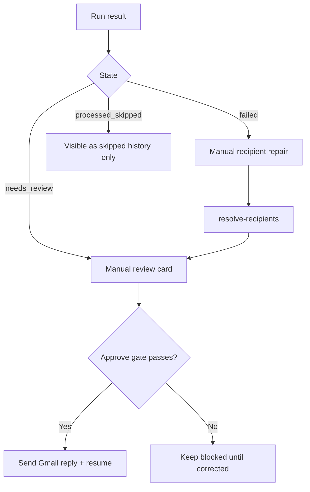

# CODEJOB Features (Current Implementation)

## 1. Inbox automation and orchestration

| Feature | What it does now | Status | Key files |
|---|---|---|---|
| Gmail OAuth bootstrap | Starts Gmail authorization and exposes auth URL/status endpoints | Live | `backend/app/gmail_client.py`, `backend/app/main.py` |
| Run-once automation | Resolves effective query/policy inputs and processes unread Gmail candidates | Live | `backend/app/main.py`, `backend/app/automation/run_orchestrator.py` |
| Background auto polling | Runs `automation_run_once()` on a timer when `feature_auto_polling` is enabled | Live | `backend/app/main.py` |
| Policy profiles | Supports Aggressive, Balanced, and Strict policies with query/run/qualification settings | Live, duplicated frontend/backend | `backend/app/main.py`, `dashboard/src/App.tsx` |
| AI draft generation | Generates replies through DeepSeek/OpenAI-compatible client and falls back to rules-based draft | Live, optional | `backend/app/ai/*`, `backend/app/phase0.py` |
| Semantic scoring | Blends AI/rules score with embedding similarity when semantic feature is enabled | Live, optional | `backend/app/semantic/*`, `backend/app/main.py` |
| Query bucket | Stores and recalls saved Gmail queries with dedupe and 10-query cap | Live | `backend/app/query_bucket/service.py`, `dashboard/src/features/query_bucket/*` |

## 2. Candidate review workflow

| Feature | What it does now | Status | Key files |
|---|---|---|---|
| Needs Review queue | Displays qualified candidates awaiting manual decision | Live | `dashboard/src/App.tsx`, `backend/app/main.py` |
| Routing evidence | Shows why routing chose specific `To`/`CC` values and how confident the match is | Live | `backend/app/phase0.py`, `backend/app/routing/policy.py`, `dashboard/src/App.tsx` |
| Approve & Send gate | Enforces routing safety, recipient presence, resume presence, and non-empty draft | Live | `backend/app/main.py` |
| Draft edit capture | Stores edited-vs-original draft deltas on approval | Live | `backend/app/models.py`, `backend/app/main.py` |
| Reject actions | Supports single-item reject and bulk reject | Live | `backend/app/main.py` |
| Failed Mapping repair | Lets operators supply corrected `To`/`CC` values and move back to review | Live | `backend/app/main.py`, `dashboard/src/App.tsx` |

## 3. Phone intelligence and opportunity features

| Feature | What it does now | Status | Key files |
|---|---|---|---|
| Premium lead extraction | Extracts normalized phone leads from email content and upserts lead rows per email | Live | `backend/app/premium_numbers/extraction.py`, `service.py` |
| Domain guard | Skips phone capture when sender domain should not be processed for premium logic | Live | `backend/app/premium_numbers/domain_guard.py` |
| Unknown number review queue | Creates pending manual-review cards when a number is neither a known recruiter nor employer | Live | `backend/app/premium_numbers/intelligence.py`, `backend/app/main.py` |
| Recruiter bucket | Maintains unique recruiter identities by owner + normalized phone | Live | `backend/app/models.py`, `backend/app/main.py` |
| Employer bucket | Maintains unique employer identities in a separate table | Live | `backend/app/models.py`, `backend/app/main.py` |
| Opportunity cards | Creates one opportunity record per recruiter number + Gmail message | Live | `backend/app/premium_numbers/intelligence.py`, `backend/app/models.py` |
| Cold call script generation | Generates a recruiter-specific cold call script with AI fallback and truthfulness capping | Live | `backend/app/cold_call/service.py`, `backend/app/main.py` |

Current opportunity statuses accepted by the backend are:

- `New`
- `Called`
- `Applied`
- `Follow Up`
- `Closed`
- `Not Interested`

## 4. Labeling, analytics, and remote operations

| Feature | What it does now | Status | Key files |
|---|---|---|---|
| Gmail labeling | Chooses one of six labels via rules first and AI fallback second, then applies the Gmail label | Live | `backend/app/gmail_labeling/*` |
| Productivity analytics | Stores view/action/state events and exposes event/trend APIs for dashboard charts | Live | `backend/app/main.py`, `backend/app/models.py` |
| Recent run digest | Persists run summaries and exposes them in UI and Telegram digests | Live | `backend/app/main.py`, `dashboard/src/App.tsx` |
| Telegram control plane | Supports status, query/date updates, run, approve, reject, and auth flows | Live | `backend/app/telegram_bot.py`, `backend/app/main.py` |
| Google Sheets export | Attempts post-send row append for approved replies | Live, best effort | `backend/app/gmail_client.py`, `backend/app/main.py` |

Current Gmail labels managed by the application are:

- `assessment`
- `AVAILABILITY ACTION`
- `Interview`
- `must reply`
- `must reply/important`
- `screening`

## 5. Feature flags and what they actually control

| Setting | Implemented behavior |
|---|---|
| `feature_auto_polling` | Enables the background auto-runner thread to periodically trigger inbox processing |
| `feature_auto_poll_interval_minutes` | Controls auto-run cadence, clamped to 1–1440 minutes |
| `feature_ai_enabled` | Enables AI draft generation in orchestration and manual ingest paths |
| `feature_semantic_enabled` | Enables semantic embedding similarity in scoring |
| `feature_auto_send` | Stored in settings only; no current code path bypasses manual approval |
| `feature_retry_queue` | Stored in settings only; no separate retry queue processor is currently active |

## 6. Current branch realities worth documenting

- The frontend exposes AI, semantic, and polling toggles in settings.
- AI draft quality is surfaced as structured metadata, not just raw text.
- Cold call generation is attached to recruiter opportunities, not to generic candidate records.
- Gmail labeling runs alongside ingestion/orchestration and can classify skipped, failed, and reviewable messages.
- Saved Gmail queries are part of settings persistence and are not a separate backend entity.
