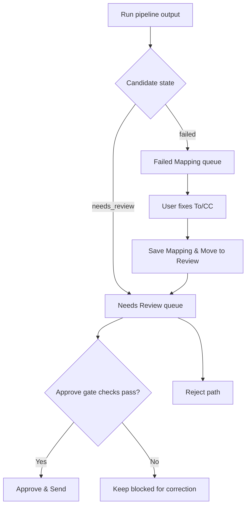
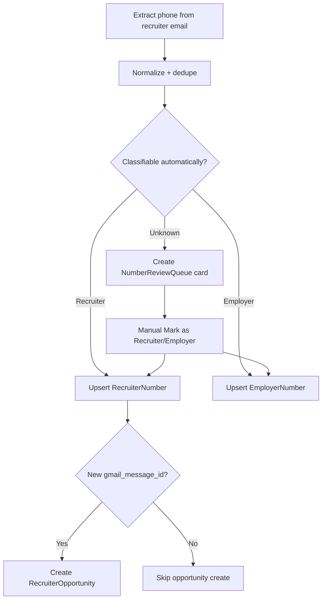

# CODEJOB Features (Current Implementation)

## Core inbox automation

| Feature | What it does | Why it matters | Key files |
|---|---|---|---|
| Gmail OAuth bootstrap | Starts/monitors Gmail auth flow | Enables inbox fetch and send | `backend/app/gmail_client.py`, `backend/app/main.py` |
| Run once pipeline | Fetches unread candidates and routes each through scoring/routing/draft logic | Main automation entry point | `backend/app/main.py`, `backend/app/automation/run_orchestrator.py` |
| Policy-driven query/run behavior | Applies profile/policy controls for date mode, batch limit, dry run, threshold override | Lets users tune aggressiveness and risk | `backend/app/main.py`, `dashboard/src/App.tsx` |
| Saved query bucket | Saves and reuses normalized Gmail query presets | Reduces repetitive query retyping and drift | `dashboard/src/features/query_bucket/*`, `backend/app/query_bucket/service.py`, `backend/app/main.py` |
| AI-assisted draft generation | Uses DeepSeek when enabled; falls back to rules-based draft | Better draft quality with safe fallback | `backend/app/ai/*`, `backend/app/phase0.py` |
| Semantic scoring (optional) | Blends rules score + embedding similarity | Improves relevance scoring when enabled | `backend/app/semantic/*`, `backend/app/main.py` |
| Gmail labeling | Applies mailbox labels for processed candidates and supports preview | Keeps inbox organization aligned with pipeline outcomes | `backend/app/gmail_labeling/*`, `POST /gmail/labeling/preview`, `backend/app/main.py` |

## Manual safety workflow

| Feature | What it does | Why it matters | Key files |
|---|---|---|---|
| Needs Review queue | Holds qualified items for human decision | Prevents uncontrolled outbound sends | `dashboard/src/App.tsx`, `backend/app/main.py` |
| Approve & Send gate | Validates routing safety, To/CC, resume, draft before Gmail send | Critical safety invariant | `backend/app/main.py` |
| Reject actions | Marks candidate rejected (single and bulk) | Fast queue hygiene | `backend/app/main.py` |
| Failed Mapping correction | Lets user fix To/CC and requeue candidate | Human-in-loop routing recovery | `dashboard/src/App.tsx`, `backend/app/main.py` |
| Routing evidence panel | Shows confidence and evidence/candidates | Supports explainable decisions | `dashboard/src/App.tsx`, `backend/app/phase0.py` |

## Premium number intelligence and classification

| Feature | What it does | Why it matters | Key files |
|---|---|---|---|
| Phone extraction + dedupe | Extracts phone numbers from email context and dedupes by normalized number | Creates stable phone intelligence base | `backend/app/premium_numbers/extraction.py`, `service.py` |
| Premium lead listing/filtering | Lists extracted leads with confidence/search/filter controls | Operator triage visibility | `GET /premium-numbers`, `dashboard/src/App.tsx` |
| Unknown number review queue | Queues unclassified numbers and supports manual classification buttons | Preserves manual classification mechanism | `GET /number-review`, `mark-recruiter`, `mark-employer` |
| Recruiter bucket | Stores recruiter numbers and aggregates opportunity counts | Non-duplicate recruiter identity store | `RecruiterNumber`, `/recruiter-numbers` |
| Employer bucket | Stores employer numbers separately | Prevents recruiter/employer mixing | `EmployerNumber`, `/employer-numbers` |
| Recruiter opportunities | Creates one opportunity card per recruiter-number + source Gmail message | Tracks repeated recruiter opportunities without duplicating recruiter records | `RecruiterOpportunity`, `/recruiter-opportunities` |
| Cold-call script generation | Generates and stores call scripts for recruiter opportunities | Supports structured recruiter follow-up | `backend/app/cold_call/*`, `POST /recruiter-opportunities/{id}/generate-cold-call-script` |

## Monitoring and ops

| Feature | What it does | Why it matters | Key files |
|---|---|---|---|
| Productivity analytics | Records and displays activity trend/events | Operational feedback loop | `ProductivityEvent`, `/analytics/*`, `dashboard/src/App.tsx` |
| Recent run digest | Shows status/details/counters for recent runs | Fast run verification | `dashboard/src/App.tsx` |
| Telegram command/control | Supports remote status/run/approve/reject/config flows | Lightweight remote ops | `backend/app/telegram_bot.py`, telegram handlers in `main.py` |
| Optional Google Sheets tracking | Appends approved-send rows externally | Simple audit export | `append_tracking_sheet_row` path in `gmail_client.py`, `main.py` |

## Current notable gaps

- No production-ready auth/multi-tenant UI login flow (owner-scoped backend setting only)
- Dashboard is still mostly centralized in `App.tsx` despite partial extraction into `dashboard/src/features/*`
- `backend/tests/test_phone_attribution.py` references `app.phone_attribution`, which is not present in current branch
