<!-- markdownlint-configure-file {"MD013": false} -->

# CODEJOB Mermaid Feature Flows

- Audit date: 2026-08-05
- Branch: semantic-embeddings
- Commit: cb68a92737671f5db2546c380205327b4f082b68
- Evidence basis: both
- Verification limits: dashboard tests passed; focused premium-number tests contain one failure. External integrations were not executed.

## Feature Coverage Summary

| Feature | Frontend entry | Backend endpoint/service | Status | Diagram updated |
| --- | --- | --- | --- | --- |
| Gmail OAuth and inbox sync | `dashboard/src/App.tsx` status/oauth actions | `GET /gmail/status`, `POST /gmail/oauth/start`, `GET /gmail/oauth/url`, `POST /gmail/sync` | Live | Yes |
| Run-once automation | Run button in `App.tsx` | `POST /automation/run-once` | Live | Yes |
| Candidate scoring, routing, and queue state assignment | queue rendering in `App.tsx` | `POST /phase0/emails/ingest`, routing services | Live | Yes |
| Needs Review approval and send gate | approve action in needs-review list | `POST /candidates/{id}/approve-send` | Live | Yes |
| Reject and bulk reject | reject actions in queue UI | `POST /candidates/{id}/reject`, `POST /candidates/reject-bulk` | Live | Yes |
| Failed Mapping recovery | failed mapping UI action | `POST /candidates/{id}/resolve-recipients`, `POST /candidates/{id}/retry-role-detection`, `DELETE /candidates/{id}` | Live | Yes |
| Premium number extraction | premium tab + run/reextract behavior | `POST /premium-numbers/reextract/{id}` + extraction workflow | Live | Yes |
| Unknown number review classification | premium review cards | `/number-review/*` endpoints | Live | Yes |
| Recruiter and employer number buckets | premium scope filters in `App.tsx` | `GET /recruiter-numbers`, `GET /employer-numbers` | Live | Yes |
| Recruiter opportunity cards | premium opportunity scope | `GET /recruiter-opportunities`, `PATCH/DELETE /recruiter-opportunities/{id}` | Live | Yes |
| Cold-call script generation | opportunity action button | `POST /recruiter-opportunities/{id}/generate-cold-call-script` | Live | Yes |
| Gmail labeling | no dedicated UI surface; backend runtime side effect | `POST /gmail/labeling/preview` + runtime apply service | Live (optional) | Yes |
| Productivity analytics | analytics panel in `App.tsx` | `/analytics/events/view`, `/analytics/events`, `/analytics/trend` | Live | Yes |
| Query bucket saved searches | query bucket component in `App.tsx` | `GET/PUT /settings` saved query fields | Live | Yes |
| Resume upload and active resume selection | resume upload controls in settings UI | `POST /settings/resumes`, `GET /settings/resumes` | Live | Yes |
| Settings and execution controls | settings form in `App.tsx` | `GET/PUT /settings` | Live | Yes |
| Auto polling | settings auto-poll toggle | auto runner loop + settings interval controls | Live (optional) | Yes |
| HR-5 auto-send and retry queue behavior | toggles and run summary display in UI | runtime orchestration paths using `feature_auto_send` and `feature_retry_queue` | Live (optional) | Yes |
| Telegram operations | telegram status shown in UI | `GET /telegram/status`, runtime telegram command/callback handling | Live (optional) | Yes |
| Google Sheets append | no dedicated UI; send side-effect only | orchestration send path integration | Unknown | Yes |

## Gmail OAuth and Inbox Sync

Runtime summary: frontend triggers status/oauth/sync calls; backend executes Gmail auth/sync routes.

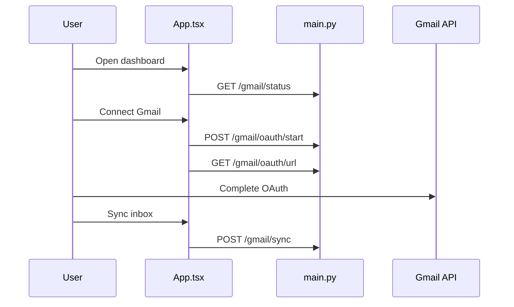

| Evidence type | Source |
| --- | --- |
| Frontend entry | `dashboard/src/App.tsx:662` |
| API endpoint | `GET /gmail/status`, `POST /gmail/oauth/start`, `GET /gmail/oauth/url`, `POST /gmail/sync` |
| Backend logic | `backend/app/main.py:gmail_status,gmail_oauth_start,gmail_oauth_url,gmail_sync` |
| Data touched | recruiter email records |
| Tests | No direct test found |
| Verification limit | OAuth flow not executed in this session |

## Run-Once Automation

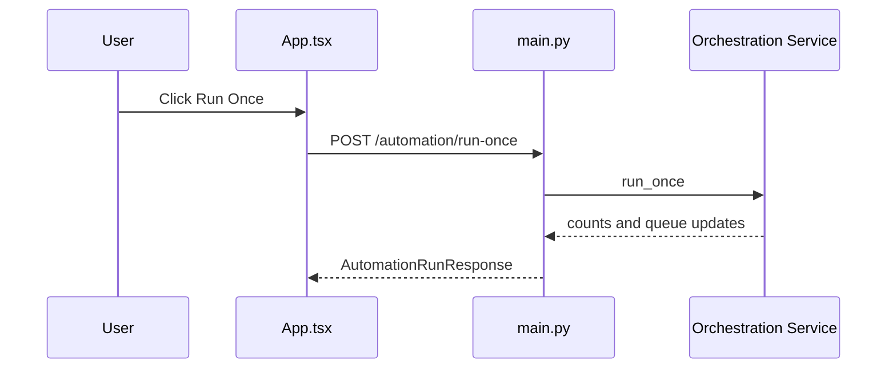

| Evidence type | Source |
| --- | --- |
| Frontend entry | `dashboard/src/App.tsx:1135` |
| API endpoint | `POST /automation/run-once` |
| Backend logic | `backend/app/main.py:automation_run_once` |
| Data touched | candidate queue states |
| Tests | No direct test found |
| Verification limit | endpoint not executed in this session |

## Candidate Scoring, Routing, and Queue State Assignment

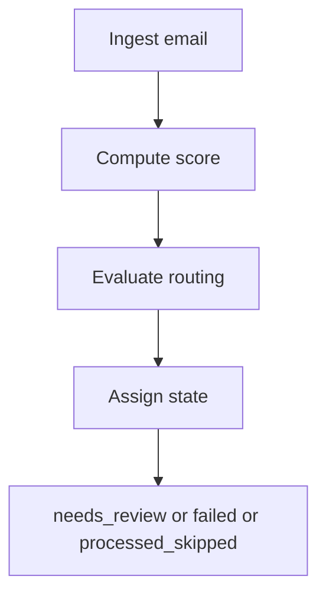

| Evidence type | Source |
| --- | --- |
| Frontend entry | `dashboard/src/App.tsx` queue views |
| API endpoint | `POST /phase0/emails/ingest`, `GET /candidates` |
| Backend logic | `backend/app/main.py:ingest_email,_compute_blended_ai_score,_evaluate_routing_for_email` |
| Data touched | recruiter email state fields |
| Tests | No direct test found |
| Verification limit | scoring/routing not replayed in runtime this session |

## Needs Review Approval and Send Gate

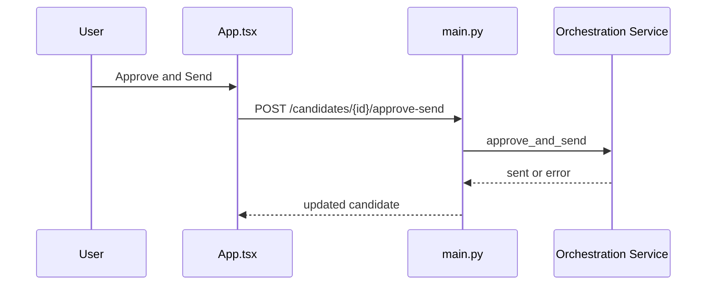

| Evidence type | Source |
| --- | --- |
| Frontend entry | `dashboard/src/App.tsx:1249` |
| API endpoint | `POST /candidates/{id}/approve-send` |
| Backend logic | `backend/app/main.py:approve_and_send` |
| Data touched | candidate state, draft send status |
| Tests | No direct test found |
| Verification limit | send operation not executed in this session |

## Reject and Bulk Reject

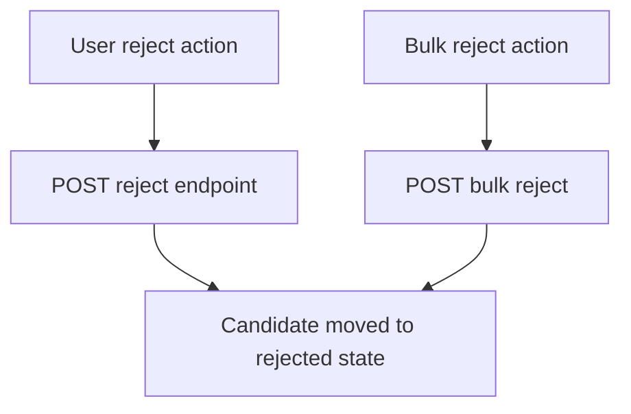

| Evidence type | Source |
| --- | --- |
| Frontend entry | `dashboard/src/App.tsx:1270` |
| API endpoint | `POST /candidates/{id}/reject`, `POST /candidates/reject-bulk` |
| Backend logic | `backend/app/main.py:reject_candidate,reject_bulk` |
| Data touched | candidate rejection fields |
| Tests | No direct test found |
| Verification limit | endpoints not executed in this session |

## Failed Mapping Recovery

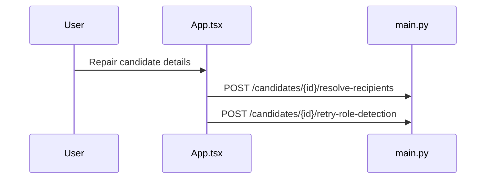

| Evidence type | Source |
| --- | --- |
| Frontend entry | `dashboard/src/App.tsx:1440` |
| API endpoint | `POST /candidates/{id}/resolve-recipients`, `POST /candidates/{id}/retry-role-detection`, `DELETE /candidates/{id}` |
| Backend logic | `backend/app/main.py:resolve_recipients,retry_role_detection,dismiss_failed_candidate` |
| Data touched | candidate routing/recipient fields |
| Tests | No direct test found |
| Verification limit | flow not replayed in session |

## Premium Number Extraction

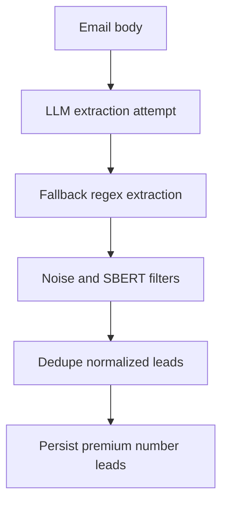

| Evidence type | Source |
| --- | --- |
| Frontend entry | `dashboard/src/App.tsx:2438` premium scope |
| API endpoint | `POST /premium-numbers/reextract/{id}` |
| Backend logic | `backend/app/premium_numbers/extraction.py:extract_phone_leads,dedupe_phone_leads` |
| Data touched | premium number lead records |
| Tests | `backend/tests/test_premium_numbers_extraction.py` passed (17 passed) |
| Verification limit | extraction verified with targeted unit tests only |

## Unknown Number Review Classification

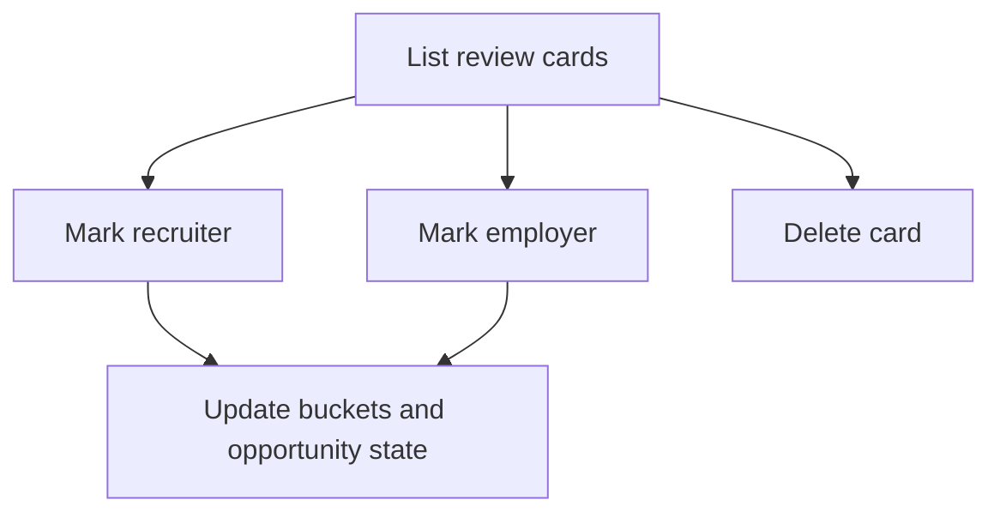

| Evidence type | Source |
| --- | --- |
| Frontend entry | `dashboard/src/App.tsx` review card actions |
| API endpoint | `GET /number-review`, `POST /number-review/{id}/mark-recruiter`, `POST /number-review/{id}/mark-employer`, `DELETE /number-review/{id}` |
| Backend logic | `backend/app/main.py:list_number_review_queue,mark_number_as_recruiter,mark_number_as_employer,delete_number_review_card` |
| Data touched | unknown review cards, recruiter/employer numbers |
| Tests | No direct test found |
| Verification limit | classification transitions not executed in this session |

## Recruiter and Employer Number Buckets

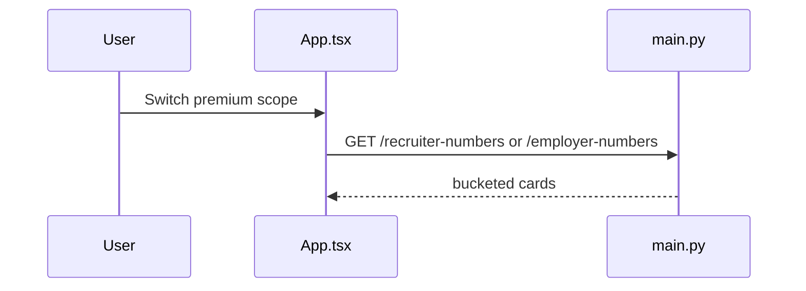

| Evidence type | Source |
| --- | --- |
| Frontend entry | `dashboard/src/App.tsx:2490` |
| API endpoint | `GET /recruiter-numbers`, `GET /employer-numbers` |
| Backend logic | `backend/app/main.py:list_recruiter_numbers,list_employer_numbers` |
| Data touched | recruiter_number and employer_number buckets |
| Tests | No direct test found |
| Verification limit | list endpoints not executed in session |

## Recruiter Opportunity Cards

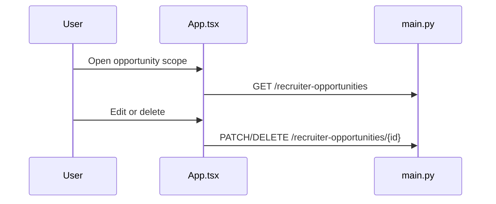

| Evidence type | Source |
| --- | --- |
| Frontend entry | `dashboard/src/App.tsx:767` |
| API endpoint | `GET /recruiter-opportunities`, `PATCH /recruiter-opportunities/{id}`, `DELETE /recruiter-opportunities/{id}` |
| Backend logic | `backend/app/main.py:list_recruiter_opportunities,patch_recruiter_opportunity,delete_recruiter_opportunity` |
| Data touched | recruiter opportunity table |
| Tests | No direct test found |
| Verification limit | endpoint operations not executed in session |

## Cold-Call Script Generation

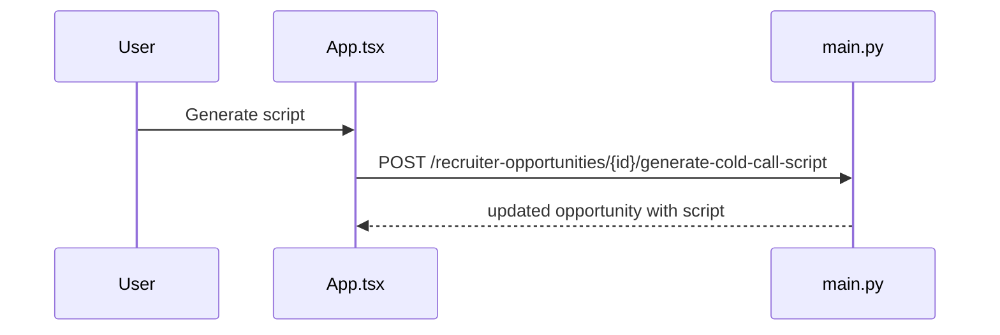

| Evidence type | Source |
| --- | --- |
| Frontend entry | `dashboard/src/App.tsx:843` |
| API endpoint | `POST /recruiter-opportunities/{id}/generate-cold-call-script` |
| Backend logic | `backend/app/main.py:generate_recruiter_opportunity_cold_call_script` |
| Data touched | opportunity script field |
| Tests | No direct test found |
| Verification limit | generation call not executed in session |

## Gmail Labeling

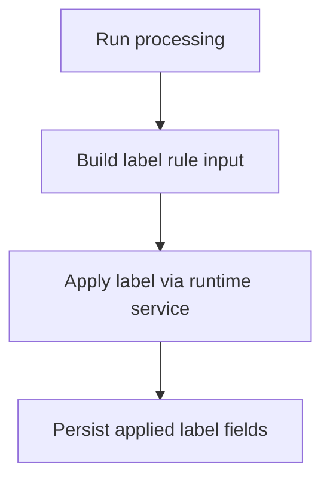

| Evidence type | Source |
| --- | --- |
| Frontend entry | no dedicated user flow in current shell |
| API endpoint | `POST /gmail/labeling/preview` |
| Backend logic | `backend/app/main.py:gmail_labeling_preview,_apply_gmail_label_for_email` |
| Data touched | applied Gmail label fields on candidate |
| Tests | No direct test found |
| Verification limit | labeling flow not executed in session |

## Productivity Analytics

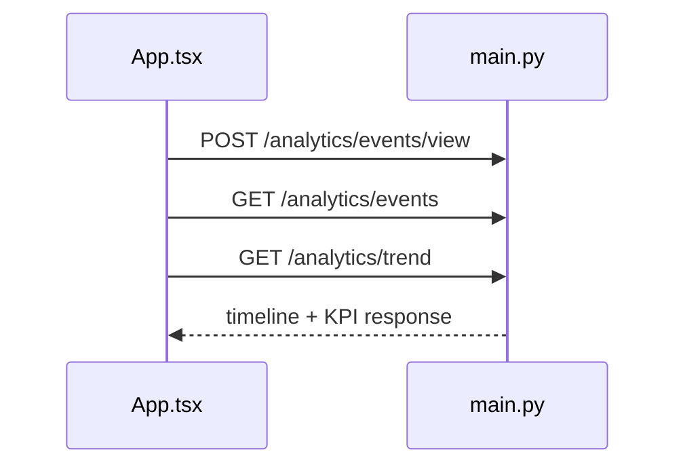

| Evidence type | Source |
| --- | --- |
| Frontend entry | `dashboard/src/App.tsx:907` |
| API endpoint | `POST /analytics/events/view`, `GET /analytics/events`, `GET /analytics/trend` |
| Backend logic | `backend/app/main.py:create_view_event,list_productivity_events,productivity_trend` |
| Data touched | productivity event records |
| Tests | No direct test found |
| Verification limit | analytics endpoints not executed in session |

## Query Bucket Saved Searches

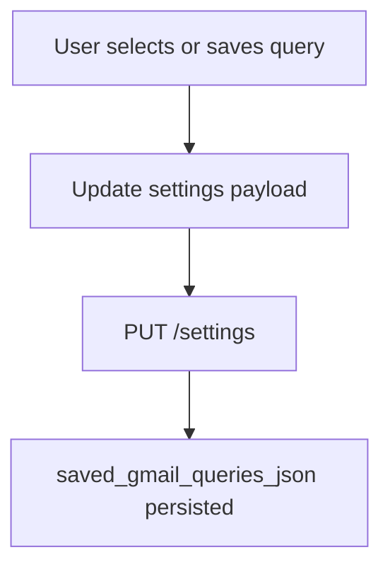

| Evidence type | Source |
| --- | --- |
| Frontend entry | `dashboard/src/App.tsx:1608` |
| API endpoint | `GET /settings`, `PUT /settings` |
| Backend logic | `backend/app/main.py:get_settings,update_settings` |
| Data touched | settings query fields |
| Tests | No direct test found |
| Verification limit | settings save not executed in session |

## Resume Upload and Active Resume Selection

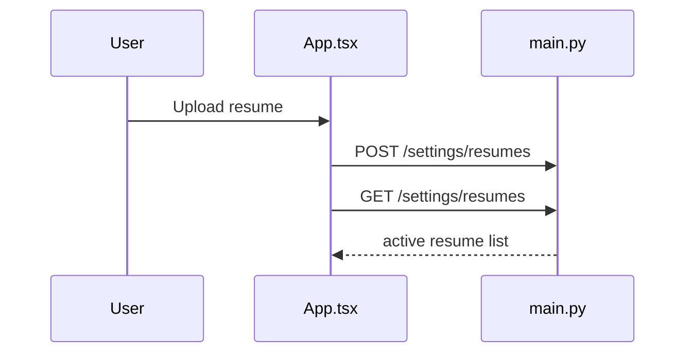

| Evidence type | Source |
| --- | --- |
| Frontend entry | `dashboard/src/App.tsx:1119` |
| API endpoint | `POST /settings/resumes`, `GET /settings/resumes` |
| Backend logic | `backend/app/main.py:upload_resume,list_resumes` |
| Data touched | resume asset and semantic embedding fields |
| Tests | No direct test found |
| Verification limit | upload flow not executed in session |

## Settings and Execution Controls

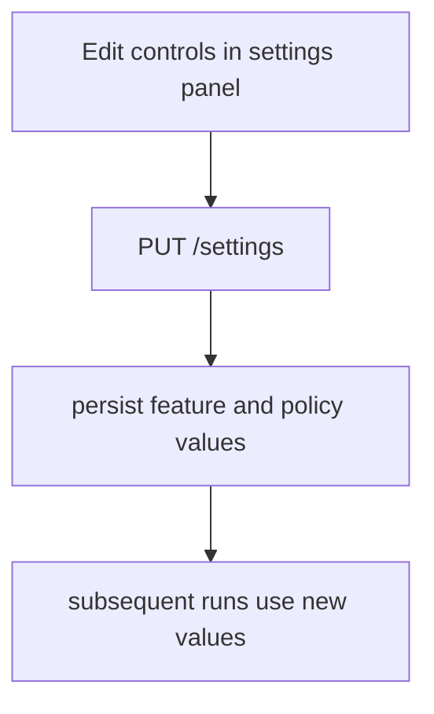

| Evidence type | Source |
| --- | --- |
| Frontend entry | `dashboard/src/App.tsx` settings form |
| API endpoint | `GET /settings`, `PUT /settings` |
| Backend logic | `backend/app/main.py:update_settings,_settings_response_from_model` |
| Data touched | user settings row |
| Tests | No direct test found |
| Verification limit | no settings mutation run in session |

## Auto Polling

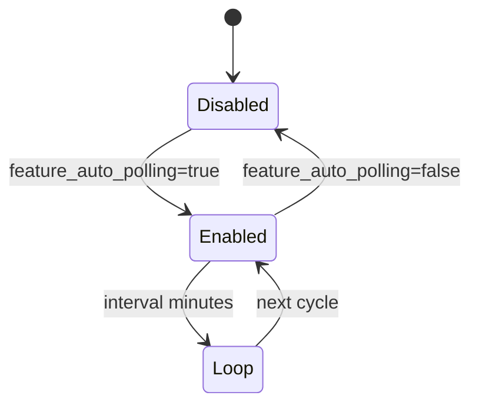

| Evidence type | Source |
| --- | --- |
| Frontend entry | `dashboard/src/App.tsx:1976` |
| API endpoint | `PUT /settings` |
| Backend logic | `backend/app/main.py:_auto_runner_loop,_poll_interval_minutes` |
| Data touched | settings poll flags |
| Tests | No direct test found |
| Verification limit | background loop not observed live in session |

## Nvoids Feed Sync

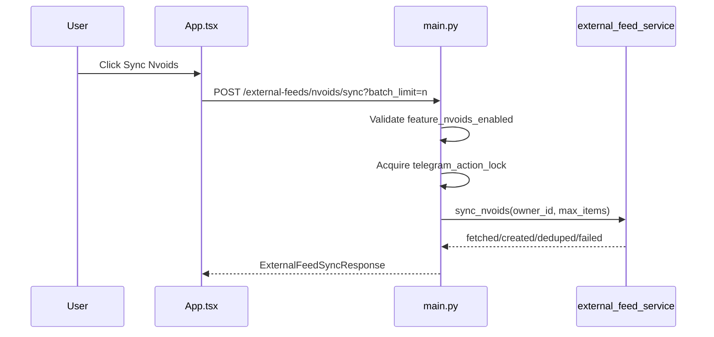

| Evidence type | Source |
| --- | --- |
| Frontend entry | `dashboard/src/App.tsx:1173` |
| API endpoint | `POST /external-feeds/nvoids/sync` |
| Backend logic | `backend/app/main.py:sync_external_nvoids` |
| Data touched | external feed run records and candidate ingest path |
| Tests | No direct test found |
| Verification limit | endpoint not executed in this session |

## HR-5 Auto-Send and Retry Queue Behavior

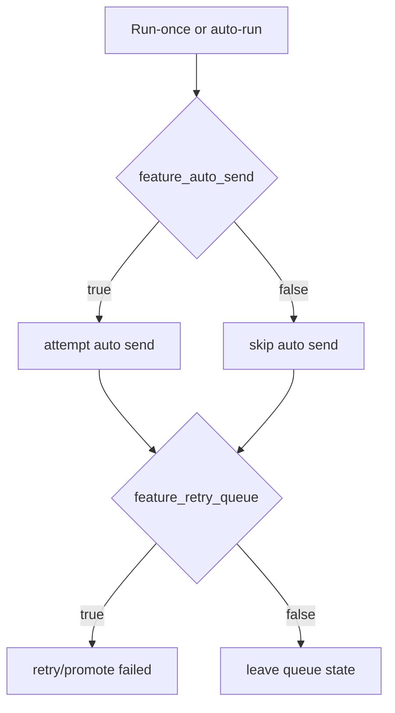

| Evidence type | Source |
| --- | --- |
| Frontend entry | `dashboard/src/App.tsx:2052` |
| API endpoint | `PUT /settings`, `POST /automation/run-once` |
| Backend logic | `backend/app/main.py:update_settings` + orchestration wiring for feature flags |
| Data touched | run summary counters and queue states |
| Tests | No direct test found |
| Verification limit | full HR-5 runtime cycle not executed in session |

## Telegram Operations

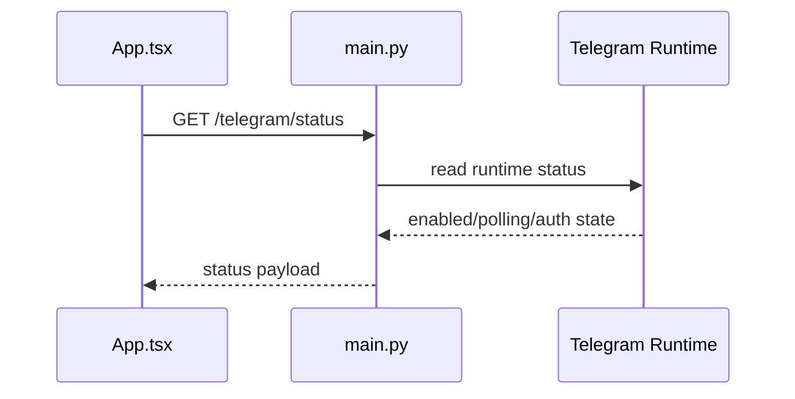

| Evidence type | Source |
| --- | --- |
| Frontend entry | `dashboard/src/App.tsx:676` |
| API endpoint | `GET /telegram/status` |
| Backend logic | `backend/app/main.py:telegram_status,_init_telegram_service` |
| Data touched | runtime status state |
| Tests | No direct test found |
| Verification limit | bot command interactions not executed in session |

## Google Sheets Append

```mermaid
flowchart TD
  A[Approve and send candidate] --> B[Send via Gmail path]
  B --> C[Optional append integration]
  C --> D[No direct UI confirmation path]
```

| Evidence type | Source |
| --- | --- |
| Frontend entry | no dedicated UI control |
| API endpoint | send path only (`POST /candidates/{id}/approve-send`) |
| Backend logic | orchestration send integration wiring in backend services |
| Data touched | external sheet rows when configured |
| Tests | No direct test found |
| Verification limit | no direct sheet append command or assertion in this session |

## Reviewer Attention

- Runtime flows not executed in this session: OAuth completion, Telegram interactions, run-once full-cycle send, Nvoids sync, and Google Sheets append.
- Tests run in this session: `dashboard` suite (`24 files`, `78 tests` passed); premium/analytics/Telegram backend batch (`30 passed`, `1 failed`).
- Human validation still needed for integration-dependent flows (Gmail, Telegram, optional sheets).

- Audit date: 2026-08-05
- Branch: semantic-embeddings
- Commit: cb68a92737671f5db2546c380205327b4f082b68
- Evidence basis: both
- Verification limits: external integrations and full end-to-end runtime flows were not executed; one premium-number test failed.
