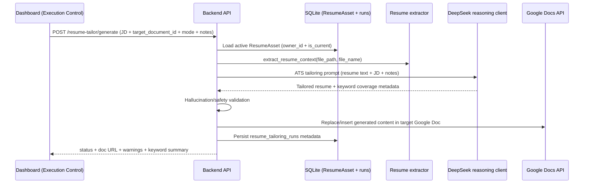

<!-- markdownlint-configure-file {"MD013": false} -->

# ATS Resume Generator Feasibility and Build Plan

## Goal

Add an on-demand ATS resume generation flow that uses the uploaded active resume as the only source of truth, with Google Docs used only as an output canvas.

## Feasibility Verdict

Status: **Feasible (high confidence)**.

The current branch already has the core building blocks needed:

- Active resume persistence and versioning (`ResumeAsset`) with current-flag semantics.
- Resume upload/list API and on-disk storage.
- Resume text extraction helper.
- Existing DeepSeek integration pattern.
- Existing Google OAuth credential bootstrap and shared Google API client setup pattern.

## Code Evidence Snapshot

| Capability | Current evidence |
| --- | --- |
| Active resume selection | `backend/app/main.py:767-773` (`_active_resume`) |
| Resume upload + current versioning | `backend/app/main.py:1100-1148` (`POST /settings/resume`) |
| Resume list endpoint | `backend/app/main.py:1151-1158` (`GET /settings/resumes`) |
| Resume text extraction | `backend/app/ai/resume_context.py:44-63` (`extract_resume_context`) |
| Current DeepSeek client tuned for short drafts | `backend/app/ai/deepseek_client.py:8-25` (`temperature=0.35`, `max_tokens=550`) |
| AI draft pipeline reading resume text first | `backend/app/ai/reply_service.py:83-100` |
| Google OAuth scopes currently Gmail + Sheets | `backend/app/gmail_client.py:24-27` |
| Dashboard location for source resume controls | `dashboard/src/App.tsx:2045-2145` (Execution Control panel) |

## Source-of-Truth Contract

Mandatory rule for this feature:

- **Resume source for AI context must always come from active `ResumeAsset`**, not from Google Docs.
- Google Docs content must be write-only output for this workflow.

Required query pattern:

- `owner_id == settings.owner_id`
- `is_current == True`
- prefer latest `version desc` (consistent with existing `_active_resume` behavior)

## Proposed Runtime Flow

## Backend Design Plan

### 1) API Surface

- Add `POST /resume-tailor/generate`.
- Request fields: `job_description`, `target_document_id`, `mode`, optional `notes`.
- Response fields: generation status, source resume identifiers, model name, keyword/warning metadata, document URL.

### 2) AI Layer Separation

Add dedicated modules:

- `backend/app/ai/resume_tailoring_prompts.py`
- `backend/app/ai/resume_tailoring_service.py`
- `backend/app/ai/deepseek_reasoning_client.py`

Keep it separate from `deepseek_chat_completion` because output length/constraints differ from short email drafting.

### 3) Prompt and Guardrails

Prompt contract should enforce:

- Source resume is authoritative.
- No fabrication of employers, dates, degrees, certs, projects, metrics, or tools.
- Rephrase/reorder/emphasize only when evidence exists in source resume.
- Return finalized resume content plus compact keyword coverage metadata.

### 4) Docs Writing Client

Add `backend/app/google_docs_client.py`:

- Builds Docs service from existing OAuth token flow.
- Supports replace-document mode first.
- Uses batch update for clear + insert operations.

### 5) OAuth Scope Upgrade

Update OAuth scopes to include:

- `https://www.googleapis.com/auth/documents`
- and optionally `https://www.googleapis.com/auth/drive.file` for template-copy phase.

Operational note: existing token likely needs re-consent after scope expansion.

### 6) Persistence and Auditability

Add table: `resume_tailoring_runs` with fields for:

- source linkage (`owner_id`, `resume_asset_id`, `source_resume_sha256`)
- request metadata (`job_description_hash`, job/company guesses)
- output linkage (`google_document_id`, URL)
- model and status
- keyword/warning payloads
- timestamps

This preserves auditability that generated drafts originated from uploaded resume assets.

## Frontend Plan (Execution Control)

Add an **ATS Resume Generator** block in the existing Execution Control area:

- Display current active source resume (name + version).
- Inputs: JD text area, optional notes, target Google Doc ID.
- Action button: Generate ATS Resume.
- Result area: status, warnings, keyword coverage, open-doc link.

## Delivery Phases

1. **Phase 1 (recommended first release)**  
   Replace-content mode on a fixed target Google Doc.
2. **Phase 2**  
   Template-copy-per-JD mode (Drive API) for immutable per-JD artifacts.
3. **Phase 3**  
   Better ATS scoring heuristics and run history UX.

## Risks and Mitigations

| Risk | Impact | Mitigation |
| --- | --- | --- |
| AI hallucination in resume output | Trust/safety issue | Add strict output validation + warnings + reject/regenerate path |
| OAuth scope changes break existing token assumptions | Runtime auth failures | Detect missing scopes, surface reconnect action clearly |
| Overwriting same doc removes manual edits | User experience issue | Keep mode explicit; add template-copy mode in phase 2 |
| Large JD/resume input exceeds model window | Partial output/failure | Bound input, summarize long JD sections, enforce robust retry/error responses |

## Validation and Rollout Checklist

- Add backend unit tests for:
  - active resume selection and missing resume handling
  - prompt guardrails
  - response parsing/validation
  - docs write request construction
  - API success/failure paths
- Add frontend tests for panel actions and status rendering.
- Run staged rollout behind feature flag if needed.

## Current Session Verification Limits

- Baseline validation commands were attempted before this doc update:
  - `cd backend && python -m pytest` → failed during collection (`ModuleNotFoundError: app.phone_attribution` in existing test suite).
  - `cd dashboard && npm run lint && npm run build && npm run test -- --run` → failed at lint (`App.tsx` fast-refresh export rule).
- These failures appear pre-existing and unrelated to this docs-only change.

---

- Audit date: 2026-06-09
- Branch: `copilot/add-new-feature-resume-draft`
- Commit: `7c71e7c`
- Evidence basis: code inspection + validation command attempts
- Verification limits: existing backend/frontend baseline failures prevented clean full-suite pass in this session
