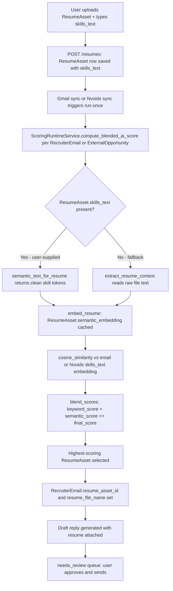

<!-- markdownlint-configure-file {"MD013": false} -->

# Prompt Refiner

## Original Intent

The user wants to reduce parsing noise and improve semantic matching speed by having users
supply skills explicitly when uploading a resume, so the scoring pipeline can match clean
skill tokens directly instead of extracting and filtering them from raw file text at scoring time.

---

## Refined Prompt (Codebase-Grounded)

### Feature: User-Supplied Skills on ResumeAsset Upload

**Goal**: When a user uploads a `ResumeAsset`, they should also supply the skills present in
that resume as a comma-separated `skills_text` value. This user-supplied `skills_text` is
stored directly on the `ResumeAsset` row (mirroring the existing `skills_text` field already
present on `RecruiterEmail`, `ExternalOpportunity`, and `RecruiterOpportunity`).

---

### Why This Matters (Pipeline Impact)

The current `ScoringRuntimeService.semantic_text_for_resume()` method calls
`extract_resume_context(resume.file_path, resume.file_name)` to produce a semantic text string
from the raw resume file. This full-text extraction is noisy (headers, formatting, addresses,
dates) and forces the embedding model to process irrelevant content.

By storing user-verified `skills_text` on `ResumeAsset` at upload time, the scoring service can
skip full-text extraction and build a clean, low-noise embedding from skill tokens only,
matching directly against `skills_text` fields already parsed from `RecruiterEmail` and
`ExternalOpportunity` (Nvoids) job listings.

---

### Data Model Change

Add a `skills_text` column to the `ResumeAsset` model (`backend/app/models.py`):

```
ResumeAsset.skills_text  (Text, default="")
```

This mirrors the pattern already used by:

- `RecruiterEmail.skills_text` — skills extracted from the recruiter email body
- `ExternalOpportunity.skills_text` — skills extracted from a Nvoids listing
- `RecruiterOpportunity.extracted_skills` — skills extracted from a cold-call opportunity

---

### Upload Flow Change (Dashboard)

When the user uploads a resume via the resume upload UI (currently handled through
`/resumes` endpoints and the dashboard), add an inline skills input step:

1. User selects resume file.
2. User types (or pastes) their skills as a comma-separated list into a `skills_text` field.
3. Both the file and `skills_text` are submitted together.
4. `ResumeAsset.skills_text` is persisted on creation.

The `skills_text` field should be editable after initial upload (to allow corrections)
without requiring a full re-upload of the file.

---

### Scoring Pipeline Change (ScoringRuntimeService)

Modify `ScoringRuntimeService.semantic_text_for_resume()` to check for user-supplied skills
before falling back to full-text extraction:

```
if resume.skills_text (non-empty, non-"none_detected"):
    return f"Skills: {resume.skills_text}"
else:
    return extract_resume_context(resume.file_path, resume.file_name)  # existing fallback
```

This change means that when `feature_semantic_enabled` is `True`, the resume embedding
(`ResumeAsset.semantic_embedding`) is computed from a clean skill-token string rather than
noisy full-text, reducing embedding tokens and improving cosine similarity precision in
`semantic_similarity(email_embedding, resume_embedding)`.

---

### Matching and Draft Selection

During `compute_blended_ai_score()`, the semantic similarity is computed between:

- **Email/Nvoids side**: `RecruiterEmail.skills_text` or `ExternalOpportunity.skills_text`
  (already parsed by the existing pipeline)
- **Resume side**: `ResumeAsset.skills_text` (now user-supplied, clean, no noise)

The blended score (`blend_scores`) combines `keyword_score` and `semantic_score` via
configurable weights (`semantic_keyword_weight` / `semantic_similarity_weight`).

The `ResumeAsset` with the **highest blended score** for a given `RecruiterEmail` or
`ExternalOpportunity` is selected and its `id` is stored as `RecruiterEmail.resume_asset_id`,
and its `file_name` is stored as `RecruiterEmail.resume_file_name`, so the draft is attached
to the best-matching resume when sent.

---

### End-to-End Flow (Proposed)



---

### Scope Boundaries

| In scope | Out of scope |
| --- | --- |
| Add `ResumeAsset.skills_text` column | Auto-parsing skills from uploaded file (user does this manually) |
| Skills input on resume upload UI | Re-ranking historical `ResumeAsset` rows automatically |
| `semantic_text_for_resume` skill-first path | Changing `RecruiterEmail.skills_text` extraction |
| Resume selection logged via `resume_asset_id` | Changing the `blend_scores` weight formula |
| Editable skills after upload | Multi-resume concurrent scoring benchmarks |

---

### Terminology Reference (Codebase)

| Term | Location |
| --- | --- |
| `ResumeAsset` | `backend/app/models.py` |
| `ResumeAsset.semantic_embedding` | `backend/app/models.py` |
| `skills_text` (email side) | `RecruiterEmail.skills_text`, `ExternalOpportunity.skills_text` |
| `semantic_text_for_resume()` | `backend/app/services/scoring_runtime_service.py` |
| `extract_resume_context()` | `backend/app/ai/resume_context.py` (current full-text path) |
| `compute_blended_ai_score()` | `backend/app/services/scoring_runtime_service.py` |
| `blend_scores()` | `backend/app/semantic/ranking.py` |
| `semantic_similarity()` | `backend/app/semantic/ranking.py` |
| `resume_asset_id` | `RecruiterEmail.resume_asset_id` (links draft to resume) |
| `feature_semantic_enabled` | `UserSettings.feature_semantic_enabled` |
| Nvoids listing | `ExternalOpportunity` via `ExternalFeedSource` (nvoids source type) |

---

- Prompt refined: 2026-06-13
- Branch: context from `semantic-embeddings` / current checked-out state
- Evidence basis: code inspection (`models.py`, `scoring_runtime_service.py`, `ranking.py`, `external_feeds/models.py`)
- Verification limits: no runtime test run; prompt describes intended design change only
