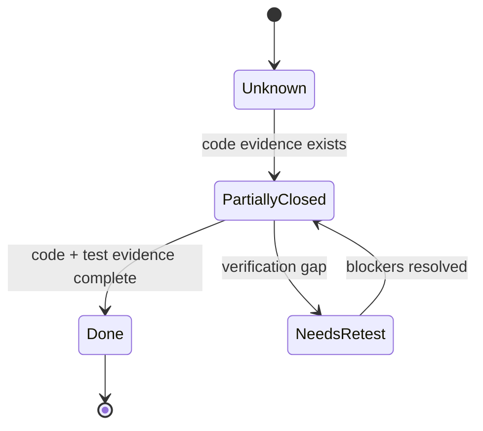

<!-- markdownlint-configure-file {"MD013": false} -->

# Snowball Risk Register (Verified Audit)

## High-Risk Tickets

### HR-1: Backend integration hub remains concentrated

- Status: Partially Closed
- Severity: High
- Remaining issue: `backend/app/main.py` is still the central route/runtime composition root.
- Evidence: route declarations and runtime wiring remain in `backend/app/main.py` with partial delegation to service modules.
- Recommended next action: continue decomposition by endpoint domain while preserving route contracts.

### HR-2: Routing and approval safety remain multi-step

- Status: Still Open
- Severity: High
- Remaining issue: queue-time and approve-time sendability checks remain coupled.
- Evidence: routing policy path and `/candidates/{id}/approve-send` gate in backend runtime flow.
- Recommended next action: enforce one canonical sendability contract and back it with route-level regression tests.

### HR-3: Premium-number intelligence flow is dense

- Status: Still Open
- Severity: High
- Remaining issue: extraction, classification, review queue, and opportunity conversion span multiple modules and routes.
- Evidence: `backend/app/premium_numbers/extraction.py` and `/premium-numbers/*`, `/number-review/*`, `/recruiter-opportunities/*` route set.
- Recommended next action: expand flow-specific tests for review-card transitions and opportunity lifecycle edges.

### HR-4: Migration/runtime ownership verification gap

- Status: Unknown
- Severity: High
- Remaining issue: migration execution evidence was not captured in this session.
- Evidence: no migration command output in this audit turn.
- Recommended next action: run migration status commands before status upgrade.

### HR-5: Runtime flags are active but full closure is pending

- Status: Partially Closed
- Severity: High
- Remaining issue: settings flags are wired, but full branch verification coverage is not complete in this session.
- Evidence: `/settings` update path and runtime orchestration dependencies in backend; settings controls in `dashboard/src/App.tsx`.
- Recommended next action: run broader validation after stale test and tooling blockers are resolved.

## Medium-Risk Tickets

### MR-1: Frontend monolith

- Status: Still Open
- Severity: Medium
- Remaining issue: `dashboard/src/App.tsx` remains dominant for state/effects/workflow actions.
- Evidence: queue actions, settings, analytics, premium numbers, and integrations all managed in one component.
- Recommended next action: extract by workflow domain.

### MR-2: Policy duplication risk

- Status: Still Open
- Severity: Medium
- Remaining issue: policy-like defaults and behavior remain split between frontend and backend.
- Evidence: settings and query policy handling in both `App.tsx` and backend runtime paths.
- Recommended next action: centralize policy profile source.

### MR-3: Deployment-sensitive defaults

- Status: Still Open
- Severity: Medium
- Remaining issue: permissive/local-biased defaults remain in source.
- Evidence: hardcoded defaults in runtime config paths.
- Recommended next action: enforce environment-bound production defaults.

### MR-4: Non-durable runtime state

- Status: Still Open
- Severity: Medium
- Remaining issue: selected runtime coordination state remains process-memory scoped.
- Evidence: runtime state usage in backend startup/telegram orchestration paths.
- Recommended next action: persist critical operational state where continuity is required.

### MR-5: Verification confidence gap

- Status: Needs Re-test
- Severity: Medium
- Remaining issue: only targeted tests were run this session.
- Evidence: `python -m pytest tests/test_premium_numbers_extraction.py` passed; no full-suite evidence in this turn.
- Recommended next action: execute full suite once blockers are cleared.

## Low-Risk Tickets

### LR-1: Documentation drift pressure

- Status: Partially Closed
- Severity: Low
- Remaining issue: runtime hotspots can drift quickly after service-level changes.
- Evidence: centralized runtime ownership in backend/frontend hubs.
- Recommended next action: require docs updates for orchestration/routing/premium-number changes.

### LR-2: Sidebar placeholders

- Status: Still Open
- Severity: Low
- Remaining issue: sidebar contains presentational controls without full workflow backing.
- Evidence: `dashboard/src/components/Sidebar.tsx`.
- Recommended next action: wire, disable, or label explicitly as placeholder.

### LR-3: Partial module extraction

- Status: Still Open
- Severity: Low
- Remaining issue: selected feature extraction exists, but core dashboard composition remains centralized.
- Evidence: query bucket feature module exists while `App.tsx` remains workflow hub.
- Recommended next action: continue staged decomposition.

- Audit date: 2026-05-30
- Branch: semantic-embeddings
- Commit: 5991f97
- Evidence basis: both
- Verification limits: targeted premium-number extraction tests only; no full-suite rerun in this session.
