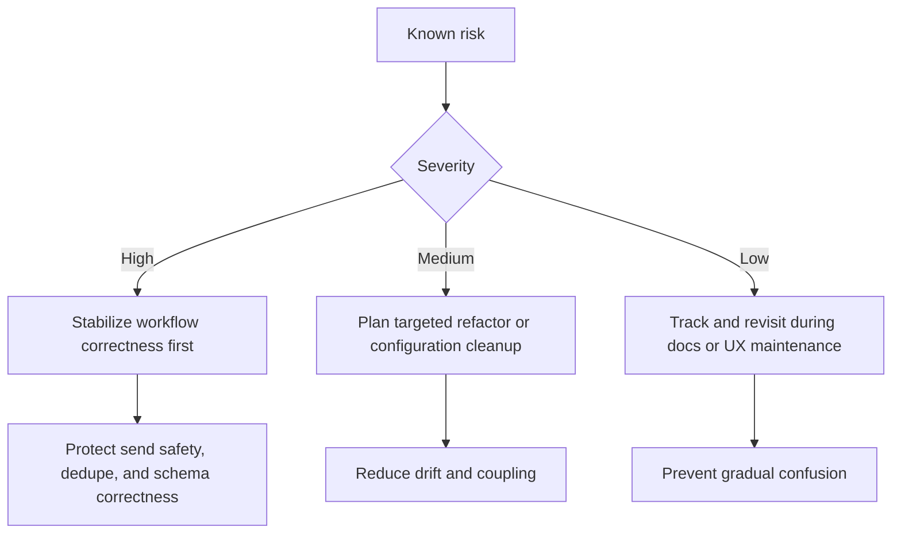

# Snowball Risk Register

Date: 2026-05-17  
Branch context: `copilot/audit-and-update-docs`

## 1. High-risk problems

### HR-1: Over-coupled backend orchestration in `backend/app/main.py`
- **Current problem:** one module still owns startup, route handlers, policy helpers, Telegram command flows, Gmail labeling glue, analytics hooks, and approval logic.
- **Why it snowballs:** local edits can change multiple operational flows at once.
- **Likely outcome if ignored:** send-safety regressions, queue-state regressions, or silent behavior drift across UI and Telegram.

### HR-2: Routing safety remains a multi-step contract
- **Current problem:** routing is evaluated during orchestration, stored on the email record, and re-checked at approval time.
- **Why it snowballs:** subtle contract drift can create unsafe sends or permanent false blocks.
- **Likely outcome if ignored:** wrong recipients or operator frustration from inexplicable blocks.

### HR-3: Phone-intelligence write path is still dense and side-effect heavy
- **Current problem:** extraction, review queue creation, recruiter/employer dedupe, and opportunity creation all happen across multiple helpers.
- **Why it snowballs:** each new rule increases the chance of duplicate or orphaned records.
- **Likely outcome if ignored:** inflated identity data and broken source traceability.

### HR-4: Runtime schema mutation still depends on one large additive helper
- **Current problem:** startup schema patching in `ensure_sqlite_phase0_columns()` remains the live migration mechanism.
- **Why it snowballs:** every schema change increases startup complexity and compatibility risk.
- **Likely outcome if ignored:** startup failures or inconsistent database state across environments.

### HR-5: Persisted feature flags overstate implemented automation
- **Current problem:** `feature_auto_send` and `feature_retry_queue` look real in settings but do not map to full runtime systems.
- **Why it snowballs:** operators and future contributors can make incorrect assumptions from UI/config state alone.
- **Likely outcome if ignored:** accidental product drift between intent, UI copy, docs, and code.

## 2. Medium-risk problems

### MR-1: Frontend monolith and refresh coordination
- **Current problem:** `App.tsx` still owns nearly every workflow and coordinates refreshes manually.
- **Snowball effect:** each new dashboard feature increases coupling and stale-state risk.

### MR-2: Policy profile duplication between frontend and backend
- **Current problem:** named profiles are declared twice.
- **Snowball effect:** user-facing choices can diverge from backend execution rules.

### MR-3: Hardcoded deployment defaults remain in source
- **Current problem:** permissive CORS, local redirect URI defaults, and project-specific sheet defaults remain embedded in code.
- **Snowball effect:** environment-specific behavior becomes harder to control safely.

### MR-4: In-memory operational state is not durable
- **Current problem:** Telegram auth sessions, last AI timings, and label caches reset on process restart.
- **Snowball effect:** operational support can become inconsistent across restarts or multi-process deployments.

### MR-5: Validation confidence is weaker than it appears
- **Current problem:** some tests are stale and environment tooling may be missing when commands are run.
- **Snowball effect:** reviewers may overestimate automated coverage on critical paths.

## 3. Low-risk problems

### LR-1: Documentation drift pressure
- **Current problem:** docs are numerous and cover overlapping concerns.
- **Snowball effect:** without disciplined updates, branches can quickly reintroduce contradictions.

### LR-2: Placeholder navigation affordances
- **Current problem:** `New Campaign`, `Settings`, and `Help Center` appear in the sidebar without dedicated routed behavior.
- **Snowball effect:** small UX confusion accumulates even when workflow logic is correct.

### LR-3: Partial feature-module extraction
- **Current problem:** query bucket has a meaningful feature folder, but most dashboard capabilities still live in `App.tsx`; AI UI folder remains mostly a stub.
- **Snowball effect:** the codebase can look more modular than it really is.

## 4. Priority order

Recommended order for real remediation work:

1. protect routing/send safety and orchestration correctness,
2. reduce phone-intelligence write-path complexity,
3. replace or constrain startup schema mutation,
4. reconcile feature-flag intent with actual runtime behavior,
5. then tackle frontend decomposition and doc-maintenance ergonomics.
