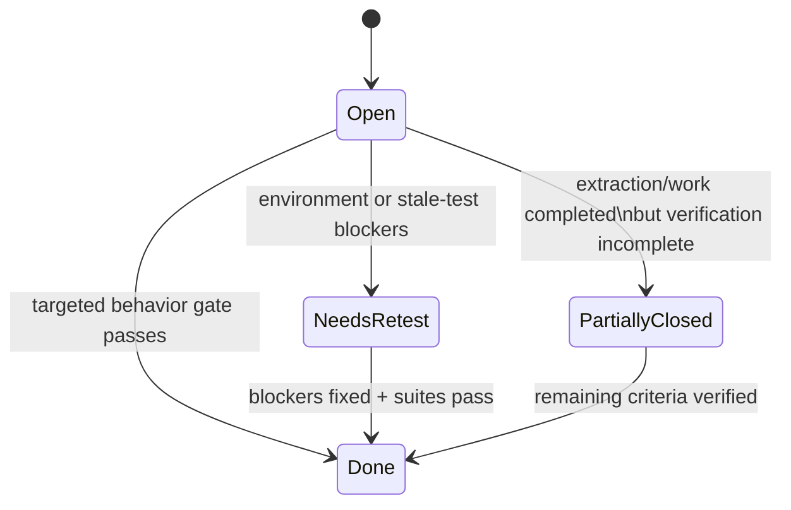

# Snowball Risk Register (Verified Audit)

Audit date: 2026-05-17  
Branch context: `snowball-md`

## High-risk tickets

### HR-1: Over-coupled backend orchestration in `backend/app/main.py`

- **Status:** Done
- **Severity:** High
- **Closeout evidence (D.1 targeted gate):** `test_approve_cc_regression.py`, `test_run_once_hotfix.py`, `test_routing_policy.py`, `test_telegram_interactive.py`, and `test_candidate_date_filtering.py` passed on `snowball-md`.
- **Tracked non-blocking debt:** `test_run_orchestrator.py` remains stale against current `RunOrchestratorDependencies` contract and is tracked as follow-up cleanup.

### HR-2: Routing safety remains a multi-step contract

- **Status:** Done
- **Severity:** High
- **Closeout evidence:** queue-time and approve-send now both consume canonical `RoutingDecision` via service-layer evaluation (`evaluate_routing_for_email`), removing the split boolean gate path.
- **Validation evidence:** targeted regression suite passed after change:
  - `tests/test_approve_cc_regression.py`
  - `tests/test_run_once_hotfix.py`
  - `tests/test_routing_policy.py`
  - `tests/test_candidate_date_filtering.py`
  - `tests/test_telegram_interactive.py`
  - Result: `29 passed`

### HR-3: Phone-intelligence write path is dense and side-effect heavy

- **Status:** Partially Closed
- **Severity:** High
- **Closeout evidence:** canonical transaction-scoped workflow boundary now exists in `app/services/phone_intelligence_workflow_service.py`, with centralized idempotency checkpoints for recruiter number, employer number, review-card, and opportunity paths.
- **Implementation evidence:** premium helper delegation (`premium_numbers/service.py`, `premium_numbers/intelligence.py`) and candidate runtime capture path now route through one workflow boundary; `/premium-numbers/reextract/{id}` is routed through the workflow path via candidate runtime.
- **Validation evidence:** targeted regression run passed (`39 passed`) across premium + HR safety set:
  - `backend/tests/test_premium_numbers_extraction.py`
  - `backend/tests/test_premium_numbers_api.py`
  - `backend/tests/test_approve_cc_regression.py`
  - `backend/tests/test_run_once_hotfix.py`
  - `backend/tests/test_routing_policy.py`
  - `backend/tests/test_candidate_date_filtering.py`
  - `backend/tests/test_telegram_interactive.py`
- **Residual risk:** full-suite confidence is still limited by stale import debt in `backend/tests/test_phone_attribution.py` (`ModuleNotFoundError: No module named 'app.phone_attribution'`).
- **Debt classification:** stale test/import contract, orphaned test-only reference, non-blocking for HR-3 closure.
- **Runtime isolation evidence:** no current backend route/service/runtime workflow imports `app.phone_attribution`.

### HR-4: Runtime schema mutation depends on one additive helper

- **Status:** Still Open
- **Severity:** High
- **Remaining issue:** startup still performs many SQLite `ALTER TABLE`/`CREATE INDEX` migrations at runtime.
- **Evidence:** `StartupService.startup()` calls `ensure_sqlite_phase0_columns()` in `app/db.py`.
- **Recommended next action:** replace runtime additive migration behavior with explicit schema migration tooling ownership.

### HR-5: Persisted feature flags overstate implemented automation

- **Status:** Still Open
- **Severity:** High
- **Remaining issue:** `feature_auto_send` and `feature_retry_queue` are persisted but do not activate dedicated execution flows.
- **Evidence:** flags exist in models/schemas/settings update path; no runtime auto-send or retry worker path uses them.
- **Recommended next action:** either implement execution semantics or remove/deprecate operator-facing exposure.

## Medium-risk tickets

### MR-1: Frontend monolith and refresh coordination

- **Status:** Still Open
- **Severity:** Medium
- **Remaining issue:** `dashboard/src/App.tsx` still owns most workflows and post-mutation refresh orchestration.
- **Evidence:** central state/actions and `schedulePostMutationRefresh()` in App.
- **Recommended next action:** split candidate workflow, settings, premium numbers, and analytics into dedicated containers.

### MR-2: Policy profile duplication between frontend and backend

- **Status:** Still Open
- **Severity:** Medium
- **Remaining issue:** profile definitions are duplicated in two places.
- **Evidence:** backend `policy_service.policy_profiles()` and frontend `App.tsx` local `policyProfiles`.
- **Recommended next action:** move profile definitions to one shared source.

### MR-3: Hardcoded deployment defaults remain in source

- **Status:** Still Open
- **Severity:** Medium
- **Remaining issue:** permissive and project-specific defaults remain hardcoded.
- **Evidence:** `allow_origins=["*"]` in `main.py`; redirect URI and sheets defaults in `config.py`.
- **Recommended next action:** externalize sensitive defaults and tighten production defaults.

### MR-4: In-memory operational state is not durable

- **Status:** Still Open
- **Severity:** Medium
- **Remaining issue:** runtime sessions/caches reset on process restart.
- **Evidence:** `runtime_state` stores telegram auth sessions, pending input state, and runtime process state in memory.
- **Recommended next action:** persist critical operational state where restart continuity is required.

### MR-5: Validation confidence is weaker than it appears

- **Status:** Needs Re-test
- **Severity:** Medium
- **Remaining issue:** full-suite confidence is incomplete due stale/contract-mismatch tests and lint/build debt.
- **Evidence:** full backend run now fails at collection because `test_phone_attribution.py` imports missing `app.phone_attribution`; no active runtime path imports that module; `test_run_orchestrator.py` is stale vs current dependency contract; dashboard lint/build fail with current rule/type/runtime constraints.
- **Recommended next action:** keep `phone_attribution` as non-blocking stale-test debt for current closure gates, and track separate follow-up to decide test removal vs compatibility shim restoration; then re-run full backend/frontend suites.

## Low-risk tickets

### LR-1: Documentation drift pressure

- **Status:** Partially Closed
- **Severity:** Low
- **Remaining issue:** this audit improves consistency, but drift risk remains ongoing.
- **Evidence:** docs were aligned to current code in this branch, yet architecture remains fast-moving in `main.py`/`App.tsx`.
- **Recommended next action:** keep docs updates mandatory in behavioral PRs touching orchestration, routing, or queue logic.

### LR-2: Placeholder navigation affordances

- **Status:** Still Open
- **Severity:** Low
- **Remaining issue:** `New Campaign`, `Settings`, and `Help Center` buttons are presentational.
- **Evidence:** `Sidebar.tsx` renders buttons without routed feature actions.
- **Recommended next action:** either wire these actions or clearly mark them as disabled placeholders in UI.

### LR-3: Partial feature-module extraction

- **Status:** Still Open
- **Severity:** Low
- **Remaining issue:** query bucket is modularized; most dashboard behavior remains centralized.
- **Evidence:** `App.tsx` remains primary state container; `features/ai` is still a minimal stub.
- **Recommended next action:** continue module extraction by workflow domain.

## Priority reminder

1. protect routing/send safety and orchestration correctness,
2. reduce phone-intelligence write-path complexity,
3. replace or constrain runtime schema mutation,
4. reconcile feature-flag intent with actual runtime behavior,
5. then continue frontend decomposition.

Evidence basis: both  
Verification limits: full backend suite still blocked by stale import in `test_phone_attribution.py`; full dashboard lint/build still failing in current local runtime.
