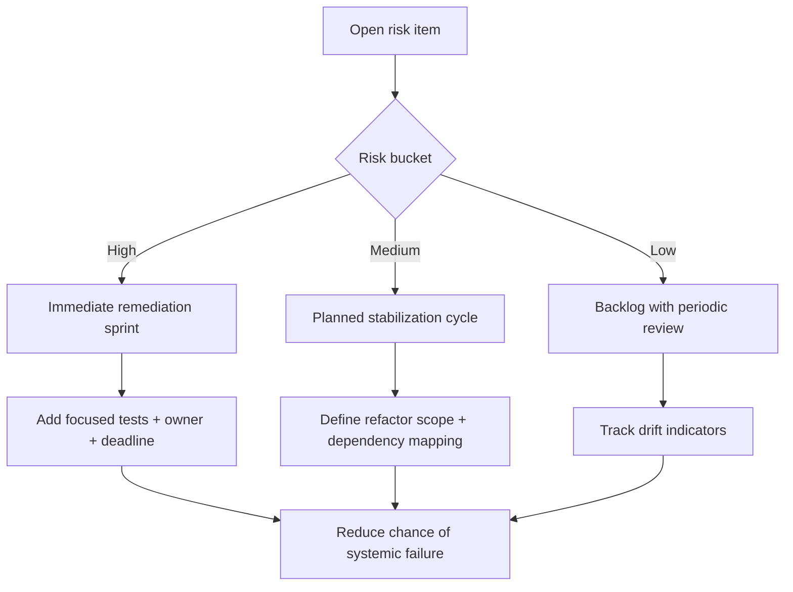

# Snowball Risk Register

Date: 2026-05-15  
Branch context: `copilot/update-docs-except-agent-context`

This file captures project risks that can snowball over time if ignored.

---

## 1) High Risk Problems

These are issues that can create major data corruption, unsafe behavior, or severe production instability if left unresolved.

### HR-1: Over-coupled orchestration in `backend/app/main.py`
- **Current problem:** Core workflow logic, API endpoints, policy normalization, Telegram handlers, routing gates, analytics logging, and side-effect helpers are concentrated in one large file.
- **Why this can snowball:** Small local edits can unintentionally change multiple user flows (`/automation/run-once`, `/approve`, `/reject`, Telegram `/run`), causing cascading regressions.
- **Potential chaos outcome:** Unsafe sends, broken queue transitions, or inconsistent business-rule behavior across UI and Telegram.
- **Evidence anchor:** `backend/app/main.py` + `docs/problem-fix-log.md` (tangled backend zones).

### HR-2: Routing safety logic split across multiple paths
- **Current problem:** Sendability depends on interactions among `_evaluate_routing_policy`, `_routing_is_sendable`, manual confirmation, and state transitions.
- **Why this can snowball:** Divergence between queue-time routing checks and approve-time checks can accumulate subtle “false safe/false blocked” behavior.
- **Potential chaos outcome:** Accidental sends to wrong recipients or permanent block of valid opportunities.
- **Evidence anchor:** `backend/app/main.py`, `backend/app/routing/policy.py`, `backend/app/automation/run_orchestrator.py`.

### HR-3: Number-classification write path complexity (premium leads + review queue + buckets + opportunities)
- **Current problem:** Multiple modules and endpoints collaboratively enforce dedupe and classification (`extract_and_store_premium_numbers`, `process_email_number_intelligence`, `mark-recruiter`, `mark-employer`).
- **Why this can snowball:** Any mismatch in assumptions or transaction boundaries can create duplicate identity data or orphaned opportunity records.
- **Potential chaos outcome:** Inflated recruiter/employer buckets, duplicated opportunities, and broken source traceability.
- **Evidence anchor:** `backend/app/premium_numbers/*`, `backend/app/main.py`, unique indexes in `backend/app/db.py`.

### HR-4: Startup schema mutation via large imperative migration helper
- **Current problem:** `ensure_sqlite_phase0_columns()` performs broad additive migration logic at runtime.
- **Why this can snowball:** Ongoing schema changes through one imperative function increases drift risk, order dependencies, and upgrade fragility.
- **Potential chaos outcome:** Production DB incompatibility, broken startup, missing indexes/columns, or data consistency issues.
- **Evidence anchor:** `backend/app/db.py`.

### HR-5: Stale/invalid tests already exist for critical areas
- **Current problem:** At least one test imports a missing module (`app.phone_attribution`), and some orchestrator tests appear based on older dependency contracts.
- **Why this can snowball:** Teams may assume test coverage exists while critical paths are actually unverified or broken.
- **Potential chaos outcome:** High-risk regressions slip through review and reach runtime.
- **Evidence anchor:** `backend/tests/test_phone_attribution.py`, `docs/testcases.md` known mismatch section.

### HR-6: Manual safety controls are mandatory but fragile if altered
- **Current problem:** Workflow safety depends on preserving specific UI and API actions (manual classification buttons, failed-mapping fix action, approve gate checks).
- **Why this can snowball:** Any removal/weakening of these controls silently degrades operational accuracy over time.
- **Potential chaos outcome:** Loss of human-in-loop correction, misclassification growth, and wrong outbound communication.
- **Evidence anchor:** `dashboard/src/App.tsx`, `backend/app/main.py`, `docs/context.md` business/UI rules.

---

## 2) Medium Risk Problems

These issues are less immediately catastrophic than high-risk items, but can significantly reduce maintainability, reliability, or operational efficiency over time.

### MR-1: Frontend monolith (`dashboard/src/App.tsx`) with tightly coupled state/effects
- **Current problem:** Most UI sections, API calls, polling, and mutation refresh behavior live in one component.
- **Snowball effect:** Each new feature increases regression surface and makes bug isolation slower.
- **Likely future pain:** Repeated race conditions, stale state bugs, and expensive refactors.

### MR-2: Multi-source refresh sequencing is brittle
- **Current problem:** Refresh logic after mutations is spread across timed callbacks and effect-driven reloads.
- **Snowball effect:** As feature count grows, refresh ordering bugs become more common.
- **Likely future pain:** Inconsistent queue counts, delayed UI truth, and user mistrust of dashboard state.

### MR-3: Frontend/backend policy default duplication
- **Current problem:** Policy profile defaults exist in both backend and frontend.
- **Snowball effect:** Drift between definitions creates hidden behavior mismatch.
- **Likely future pain:** User sees one policy intent but backend executes another.

### MR-4: Hardcoded operational defaults in runtime code
- **Current problem:** Project-specific or sensitive defaults (e.g., sheets id, signature fallbacks, permissive CORS) remain in source.
- **Snowball effect:** Environments diverge and security/identity assumptions become harder to control.
- **Likely future pain:** Unsafe defaults persisting into deployment and repeated config debt.

### MR-5: Low observability around high-risk decisions
- **Current problem:** While analytics events exist, there is limited structured decision-level auditing for every routing/classification branch.
- **Snowball effect:** Root-cause analysis for production issues grows harder as workflow complexity increases.
- **Likely future pain:** Slow incident response and repeated unresolved defects.

### MR-6: Validation environment dependency fragility
- **Current problem:** Local/CI shells without installed tooling immediately block lint/test/build feedback.
- **Snowball effect:** Documentation and code changes may proceed without reliable fast feedback loops.
- **Likely future pain:** Increased review cycles and delayed defect discovery.

---

## 3) Low Risk Problems

These are quality and maintainability issues with lower immediate impact, but still worth tracking.

### LR-1: Documentation synchronization overhead
- **Current problem:** Many architecture/risk/context docs now exist and require consistent updates.
- **Snowball effect:** If not routinely maintained, docs slowly drift from implementation.
- **Likely pain:** Onboarding confusion and outdated risk assumptions.

### LR-2: Naming/casing compatibility files in docs
- **Current problem:** Compatibility alias files (like `Context.md` pointing to `context.md`) require intentional upkeep.
- **Snowball effect:** If content diverges by mistake, readers may follow stale guidance.
- **Likely pain:** Minor documentation confusion across environments/tools.

### LR-3: Placeholder/partial UX affordances
- **Current problem:** Some sidebar/footer actions are present as placeholders.
- **Snowball effect:** Minor mismatch between perceived capabilities and actual behavior.
- **Likely pain:** Small UX friction rather than core workflow failure.

### LR-4: Heuristic tuning debt
- **Current problem:** Keyword/hint lists and scoring terms are hand-tuned and evolve with data.
- **Snowball effect:** Precision may slowly degrade if no periodic tuning cycle exists.
- **Likely pain:** More manual review overhead, but recoverable through calibration.

---

## Priority Note

If only a few issues can be addressed immediately, prioritize in this order:
1. High-risk items HR-1 through HR-4 (core safety, data integrity, migration risk)
2. High-risk item HR-5 (restore trustworthy automated test coverage)
3. Medium-risk frontend decomposition and refresh stabilization (MR-1, MR-2)

Ignoring these first-order risks is most likely to snowball into systemic instability.

