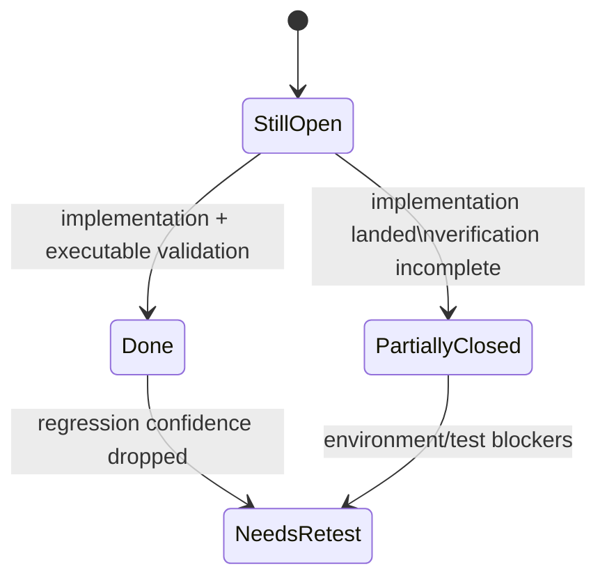

# Snowball Risk Register (Current Branch Audit)

## High-risk tickets

### HR-1: Over-coupled backend orchestration in `backend/app/main.py`

- **Status:** Needs Re-test
- **Severity:** High
- **Remaining issue:** service extraction exists, but runtime behavior was not executed in this session.
- **Evidence:** `backend/app/main.py`, `backend/app/services/orchestration_service.py`, `backend/app/services/startup_service.py`
- **Recommended next action:** install backend test dependencies and rerun targeted regression set for orchestration and approval flows.

### HR-2: Routing safety remains a multi-step contract

- **Status:** Needs Re-test
- **Severity:** High
- **Remaining issue:** routing is implemented through runtime services, but no executable verification was possible in this session.
- **Evidence:** `backend/app/services/routing_runtime_service.py`, `backend/app/services/orchestration_service.py:468-510`, `backend/app/main.py`
- **Recommended next action:** run backend routing/approve tests after restoring runnable pytest environment.

### HR-3: Phone-intelligence write path is dense and side-effect heavy

- **Status:** Partially Closed
- **Severity:** High
- **Remaining issue:** centralized workflow exists, but full confidence is limited because backend tests were not executable here.
- **Evidence:** `backend/app/services/phone_intelligence_workflow_service.py`, `backend/app/premium_numbers/intelligence.py`, `backend/app/premium_numbers/service.py`
- **Recommended next action:** re-run premium-number extraction/API tests once dependencies are available.

### HR-4: Runtime schema mutation and migration safety

- **Status:** Needs Re-test
- **Severity:** High
- **Remaining issue:** migration gate is implemented, but strict startup behavior was not executed in this session.
- **Evidence:** `backend/app/services/migration_runtime_service.py`, `backend/app/services/startup_service.py:30-33`, `backend/alembic/*`
- **Recommended next action:** run Alembic current/upgrade checks and strict startup validation in a dependency-ready environment.

### HR-5: Persisted feature flags vs implemented automation

- **Status:** Partially Closed
- **Severity:** High
- **Remaining issue:** runtime code paths and response counters are present, but behavior was not executed in this session.
- **Evidence:** `backend/app/services/orchestration_service.py:339-387`, `backend/app/schemas.py:389-392`, `dashboard/src/App.tsx:2221-2227`
- **Recommended next action:** run backend HR-5 tests and UI run-once smoke checks after dependency installation.

## Medium-risk tickets

### MR-1: Frontend monolith and refresh coordination

- **Status:** Still Open
- **Severity:** Medium
- **Remaining issue:** `App.tsx` remains the central workflow state container.
- **Evidence:** `dashboard/src/App.tsx`
- **Recommended next action:** continue domain extraction from `App.tsx`.

### MR-2: Policy profile duplication between frontend and backend

- **Status:** Still Open
- **Severity:** Medium
- **Remaining issue:** policy profile shape remains duplicated.
- **Evidence:** `backend/app/services/policy_service.py`, `dashboard/src/App.tsx`
- **Recommended next action:** move policy profiles to one shared source.

### MR-3: Hardcoded deployment defaults remain in source

- **Status:** Still Open
- **Severity:** Medium
- **Remaining issue:** permissive/project-specific defaults remain hardcoded.
- **Evidence:** `backend/app/main.py:243-249`, `backend/app/config.py`
- **Recommended next action:** externalize defaults and tighten production-safe defaults.

### MR-4: In-memory operational runtime state is non-durable

- **Status:** Still Open
- **Severity:** Medium
- **Remaining issue:** operational state is process-local and resets on restart.
- **Evidence:** `backend/app/runtime_state.py`, `backend/app/services/startup_service.py`
- **Recommended next action:** persist critical operator/session state where restart continuity is required.

### MR-5: Validation confidence remains constrained

- **Status:** Needs Re-test
- **Severity:** Medium
- **Remaining issue:** test/lint/build commands are currently blocked by missing dependencies.
- **Evidence:** command outcomes in `docs/testcases.md`; `backend/tests/test_phone_attribution.py:3`
- **Recommended next action:** install backend/frontend dependencies, then re-run full quality gates.

## Low-risk tickets

### LR-1: Documentation drift pressure

- **Status:** Partially Closed
- **Severity:** Low
- **Remaining issue:** docs were refreshed for this branch, but drift risk remains while `main.py`/`App.tsx` are central hubs.
- **Evidence:** current audit updates in `docs/*.md` and hub ownership in runtime files.
- **Recommended next action:** require docs audit updates in behavior-changing PRs.

### LR-2: Placeholder navigation affordances

- **Status:** Still Open
- **Severity:** Low
- **Remaining issue:** sidebar placeholder actions are still non-routed.
- **Evidence:** `dashboard/src/components/Sidebar.tsx:46-48`, `dashboard/src/components/Sidebar.tsx:64-65`
- **Recommended next action:** wire placeholders to real routes or mark them explicitly disabled.

### LR-3: Partial feature-module extraction

- **Status:** Still Open
- **Severity:** Low
- **Remaining issue:** only partial modularization exists; the main workflow remains centralized.
- **Evidence:** `dashboard/src/App.tsx`, `dashboard/src/features/*`
- **Recommended next action:** continue incremental extraction by workflow domain.

- Audit date: 2026-05-18
- Branch: `copilot/update-docs-md-files`
- Evidence basis: both
- Verification limits: `python -m pytest`, `npm run lint`, and `npm run test` are blocked by missing tools in this session; `npm run build` fails with missing TypeScript type definitions.
