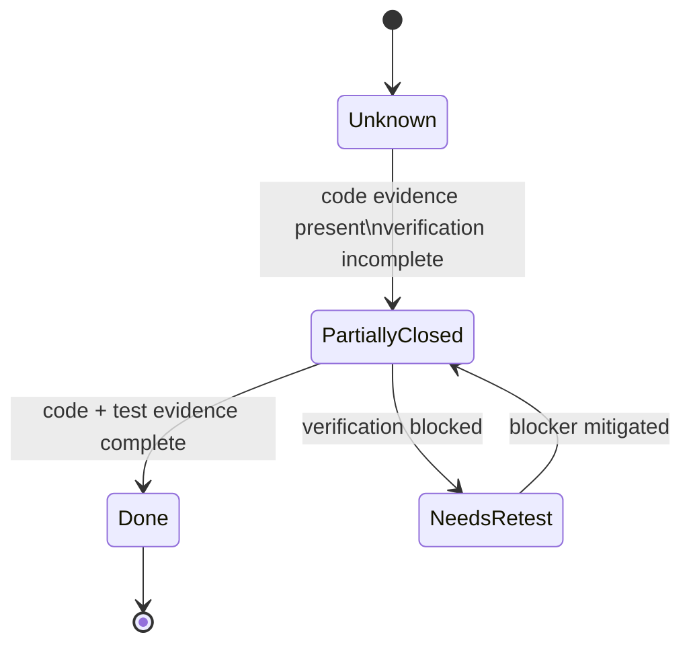

# Snowball Risk Register (Verified Audit)

## High-risk tickets

### HR-1: Backend integration hub remains concentrated

- Status: Partially Closed
- Severity: High
- Remaining issue: `backend/app/main.py` is still a large composition root for route wiring and runtime orchestration.
- Evidence: `backend/app/main.py` plus service delegation into `app/services/startup_service.py`, `app/services/orchestration_service.py`, and `app/services/routing_runtime_service.py`.
- Recommended next action: Continue moving endpoint-specific orchestration logic from `main.py` into service modules while preserving API contracts.

### HR-2: Routing safety remains multi-step and high-impact

- Status: Partially Closed
- Severity: High
- Remaining issue: Routing and approval safety gates exist, but end-to-end backend verification is incomplete in this session.
- Evidence: `POST /candidates/{email_id}/approve-send` in `backend/app/main.py` delegates to orchestration; routing policy in `backend/app/routing/policy.py`.
- Recommended next action: Re-run backend routing/approve regression subset after fixing stale import blocker.

### HR-3: Premium-number intelligence write path is dense

- Status: Partially Closed
- Severity: High
- Remaining issue: Multiple phone-intelligence flows and side effects still converge through a complex path.
- Evidence: `backend/app/premium_numbers/extraction.py`, `backend/app/premium_numbers/intelligence.py`, `backend/app/services/phone_intelligence_workflow_service.py`, and endpoints in `backend/app/main.py` (`/premium-numbers/*`, `/number-review/*`, `/recruiter-opportunities/*`).
- Recommended next action: Add focused backend tests for reviewer bucket swaps and opportunity lifecycle edges.

### HR-4: Migration ownership and startup gate

- Status: Unknown
- Severity: High
- Remaining issue: This session validated route/runtime code only; migration commands were not re-run in this audit.
- Evidence: migration files exist in `backend/alembic/versions/*`; startup wiring references migration checks in service layer.
- Recommended next action: Execute `alembic current` and `alembic upgrade head` in this branch session before claiming closure.

### HR-5: Persisted feature flags now drive runtime behavior

- Status: Partially Closed
- Severity: High
- Remaining issue: Runtime behavior is implemented, but backend test pass is limited by collection failure.
- Evidence: `SettingsPayload` and execution controls in `dashboard/src/App.tsx`; additive automation counters in frontend rendering and backend schema/service flow.
- Recommended next action: Keep frontend evidence as verified and complete backend verification after stale import fix.

## Medium-risk tickets

### MR-1: Frontend monolith and refresh coordination

- Status: Still Open
- Severity: Medium
- Remaining issue: `dashboard/src/App.tsx` remains the dominant state and effect owner.
- Evidence: major UI workflows, status polling, queue actions, premium flows, and analytics are all handled in one component.
- Recommended next action: extract run queue, review queue, and premium-number containers.

### MR-2: Policy profile duplication

- Status: Still Open
- Severity: Medium
- Remaining issue: profile-like behavior is configured in frontend defaults and backend policy handling.
- Evidence: policy/default definitions in `dashboard/src/App.tsx` and backend policy/runtime helpers.
- Recommended next action: establish a single policy profile source.

### MR-3: Deployment-sensitive hardcoded defaults

- Status: Still Open
- Severity: Medium
- Remaining issue: permissive/project defaults remain in source.
- Evidence: `allow_origins=["*"]` in `backend/app/main.py`; defaults in `backend/app/config.py`.
- Recommended next action: externalize production defaults through environment configuration.

### MR-4: Non-durable runtime state

- Status: Still Open
- Severity: Medium
- Remaining issue: in-memory runtime state resets on process restart.
- Evidence: `backend/app/runtime_state.py` usage in `backend/app/main.py`.
- Recommended next action: persist critical state needed for operational continuity.

### MR-5: Verification confidence is incomplete

- Status: Needs Re-test
- Severity: Medium
- Remaining issue: backend full test run fails at collection.
- Evidence: `pytest -q` failed with `ModuleNotFoundError: No module named 'app.phone_attribution'` from `backend/tests/test_phone_attribution.py`; frontend `npm test -- --run` passed.
- Recommended next action: fix/remove stale import contract and rerun backend suite.

## Low-risk tickets

### LR-1: Documentation drift pressure

- Status: Partially Closed
- Severity: Low
- Remaining issue: docs are now refreshed for this branch snapshot, but fast-moving runtime hotspots can drift quickly.
- Evidence: concentrated ownership in `backend/app/main.py` and `dashboard/src/App.tsx`.
- Recommended next action: require doc updates for orchestration/routing/premium-number changes.

### LR-2: Placeholder sidebar controls

- Status: Still Open
- Severity: Low
- Remaining issue: sidebar includes non-routed placeholder actions.
- Evidence: `dashboard/src/components/Sidebar.tsx`.
- Recommended next action: wire actions or mark as disabled with explicit labels.

### LR-3: Partial module extraction only

- Status: Still Open
- Severity: Low
- Remaining issue: query bucket module extraction exists but core dashboard remains centralized.
- Evidence: `dashboard/src/features/query_bucket/*` exists; `dashboard/src/App.tsx` remains orchestration hub.
- Recommended next action: continue decomposition by workflow domain.

- Audit date: 2026-05-22
- Branch: external-recruiter-feed-ingestion
- Evidence basis: both
- Verification limits: backend full pytest blocked at collection by stale import (`app.phone_attribution`); migration commands were not re-run in this session.
