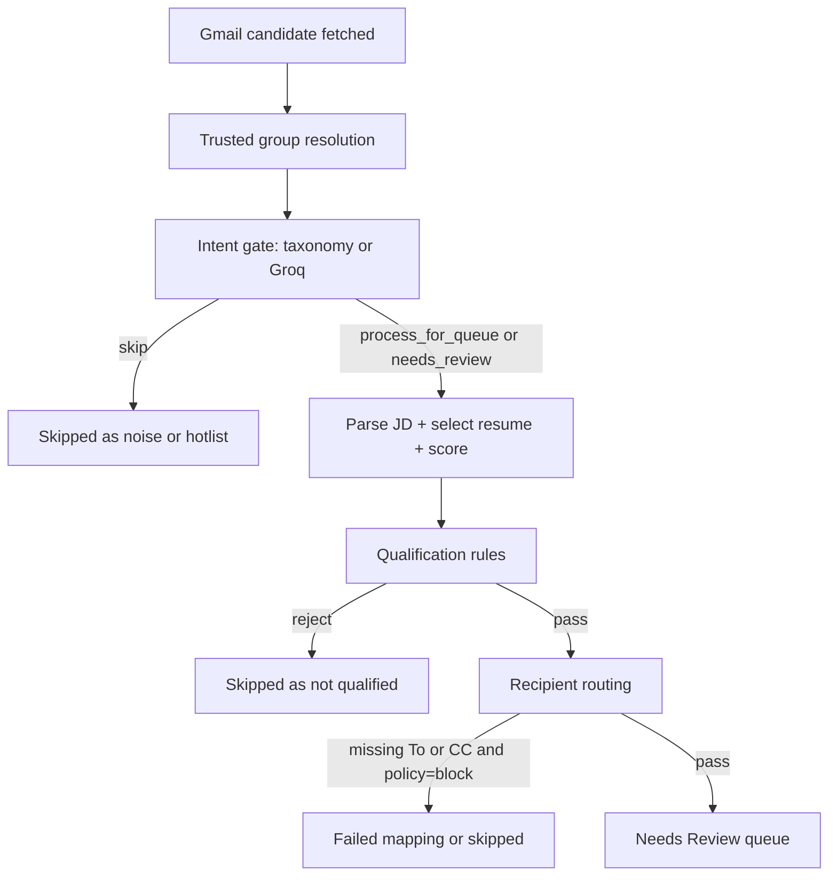
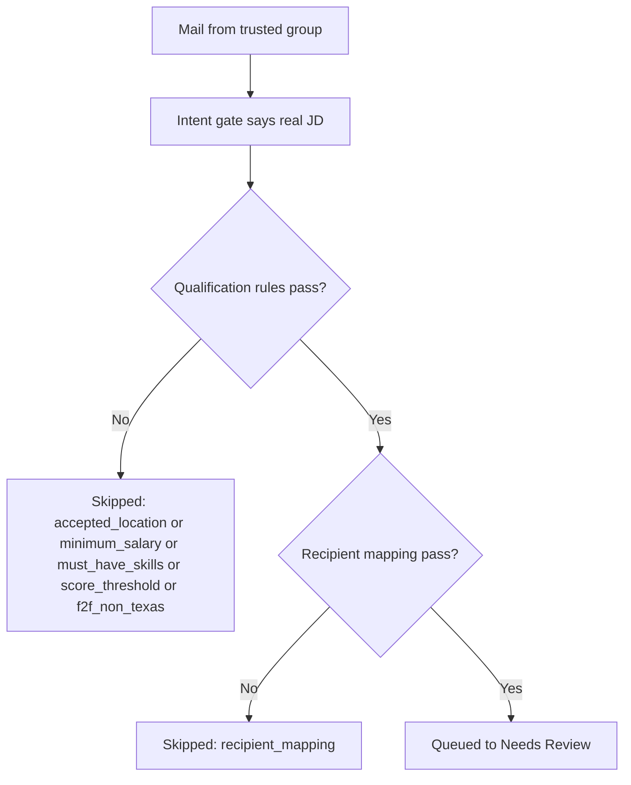

# Gmail Requirement Skip Analysis for `semantic-embeddings`

## 1. Executive Finding

The current `semantic-embeddings` branch already implements most of the architecture proposed in [temp55.md](/D:/My%20Websites/CodeJob/docs/temp%20files/temp55.md):

- trusted Gmail requirement groups are stored separately and exposed through settings/bootstrap
- Gmail list headers are preserved in the fetched candidate payload
- trusted-group resolution exists as a dedicated resolver service
- Recent Runs supports source-group and qualification diagnostics

The mismatch is in expectations, not just in missing code.

The current implementation **does not** treat a trusted group as a queue bypass. It only improves source recognition at the **intent-gating** stage. After that, the same mail can still be skipped by:

- qualification rules
- resume-fit score threshold
- F2F policy
- recipient-routing failure

So if the user expectation was:

> trusted group = do not skip this Gmail

that expectation does **not** match the current architecture. The current branch implements:

> trusted group = do not misread Google Groups footer noise as proof that the mail is junk, but still apply downstream qualification and routing rules normally

## Confirmed From Code And Attachments

- Trusted-group support is present across backend, API, and dashboard.
- The attached Gmail PDFs contain explicit Google Groups delivery markers.
- The current code treats unsubscribe/footer text as weak evidence, not as an automatic hotlist/noise signal.
- The current code still allows later rejection after a mail has already been accepted as a real JD.

## Likely From Runtime Behavior But Not Directly Queryable From The Local DB

- The skipped July 13 Gmail items likely reached at least the intent stage successfully.
- If they were still skipped, the more likely causes are downstream qualification or recipient mapping, not Google Groups footer confusion.
- The exact per-message blocking rule cannot be proven from the workspace SQLite files because the local DB does not contain the July 13 run rows from the attached runtime log.

## 2. What The Attached Mails Prove

The attached PDFs are:

- `Gmail - [C2C-Corp2Corp-Jobs] We are hiring for Senior Agentic AI Solution Architect at Remote location.pdf`
- `Gmail - [C2C-Corp2Corp-Jobs] Senior Agentic AI Solution Architect _ Remote.pdf`
- `Gmail - Direct Client REQ's Only Contract job opportunity - Sr Python Backend Engineer at Atlanta, GA (Hybrid).pdf`

The PDFs visibly contain Google Groups delivery markers such as:

- `C2C-Corp2Corp-Jobs+unsubscribe@googlegroups.com`
- `dcro+unsubscribe@googlegroups.com`
- `groups.google.com/.../C2C-Corp2Corp-Jobs/...`

Those markers matter because they are exactly what the trusted-group feature is supposed to normalize. They are **delivery metadata**, not proof that the message is a hotlist, newsletter, or skippable noise.

In other words, the attached messages are valid examples of the problem space described in `temp55.md`: real requirement-looking mail delivered through Google Groups, with unsubscribe/footer artifacts that should not dominate classification.

## 3. Current End-To-End Pipeline



This is the key architectural distinction behind the observed behavior:

- **source recognition** decides whether the system understands where the mail came from
- **intent classification** decides whether the mail looks like a real recruiter requirement vs hotlist/noise
- **qualification rejection** happens after the message is already treated as a valid requirement candidate
- **routing rejection** happens even later if To/CC resolution is incomplete and policy blocks drafting

The trusted Gmail group feature only affects the first two layers. It does not override the last two.

## 4. Exact Code-Path Evidence

### 4.1 Gmail candidate now preserves list metadata

[`backend/app/gmail_client.py`](/D:/My%20Websites/CodeJob/backend/app/gmail_client.py) now includes list metadata in `GmailMessageCandidate`, including:

- `to_header`
- `cc_header`
- `list_id`
- `list_post`
- `list_unsubscribe`
- `delivered_to`
- `mailing_list`

That appears in the candidate type and the Gmail extraction path around lines 366-397.

```python
class GmailMessageCandidate(TypedDict):
    external_message_id: str
    external_thread_id: str
    external_rfc_message_id: str
    sender: str
    recipient_email: str
    subject: str
    body: str
    snippet: str
    gmail_received_at: datetime | None
    label_ids: list[str]
    to_header: str
    cc_header: str
    list_id: str
    list_post: str
    list_unsubscribe: str
    delivered_to: str
    mailing_list: str
```

This is important because the older failure mode in `temp55.md` depended on the system **not** having reliable mailing-list identity. That gap is no longer the main architectural problem in this branch.

### 4.2 Trusted-group resolution is a resolver, not a queue bypass

[`backend/app/services/gmail_group_source_service.py`](/D:/My%20Websites/CodeJob/backend/app/services/gmail_group_source_service.py) normalizes Google Groups addresses and resolves configured groups by priority.

It explicitly normalizes values like `foo+unsubscribe@googlegroups.com` back to `foo@googlegroups.com`, then matches in this order:

1. `list_post`
2. `list_unsubscribe`
3. `list_id`
4. `to_header`
5. `cc_header`
6. `delivered_to`
7. `mailing_list`
8. subject prefix
9. footer fallback

```python
ordered_checks = [
    ("list_post", 1.0, _extract_candidate_emails(list_post)),
    ("list_unsubscribe", 0.98, _extract_candidate_emails(list_unsubscribe)),
    ("list_id", 0.95, _extract_list_id_candidates(list_id)),
    ("to_header", 0.92, _extract_candidate_emails(to_header)),
    ("cc_header", 0.9, _extract_candidate_emails(cc_header)),
    ("delivered_to", 0.88, _extract_candidate_emails(delivered_to)),
    ("mailing_list", 0.86, _extract_candidate_emails(mailing_list)),
]
```

This resolver improves source attribution. It does **not** tell the pipeline to queue the mail unconditionally.

### 4.3 Intent gate explicitly treats footer noise as weak evidence

[`backend/app/gates/job_description_gate.py`](/D:/My%20Websites/CodeJob/backend/app/gates/job_description_gate.py) tells the Groq gate to treat unsubscribe/footer noise as weak evidence only, and to use trusted groups as a positive prior rather than an automatic pass.

```python
"Treat a trusted requirement group as positive source context, not as an automatic pass. "
"Treat unsubscribe text, Google Groups footers, and reply prefixes as weak evidence only unless the rest of the email is clearly non-job. "
"If a trusted group message is clearly a hotlist or candidate marketing, still classify it as candidate_marketing_or_hotlist. "
"If the message is candidate marketing or a hotlist, classify it as candidate_marketing_or_hotlist instead of newsletter. "
```

This means the current branch already aligns with the intended Gmail-group behavior at the **intent** stage.

### 4.4 Fallback taxonomy also uses trusted groups as a positive prior only

[`backend/app/taxonomy/job_description_taxonomy.py`](/D:/My%20Websites/CodeJob/backend/app/taxonomy/job_description_taxonomy.py) adds positive weight when a trusted group is matched, but it still requires real JD signals to emit `recruiter_job_requirement / process_for_queue`.

```python
if trusted_group_context and trusted_group_context.matched and trusted_group_context.trusted:
    positive_score += 1.6
    group_name = trusted_group_context.group_name or trusted_group_context.group_email or "trusted_group"
    positive_evidence.append(f"trusted_group:{group_name}")
```

Then later:

```python
if positive_score >= 4.0 and (structure_hits or recruiter_action_hits or staffing_hits or role_hits or learned_positive_hits):
    return JobDescriptionTaxonomyDecision(
        intent_type="recruiter_job_requirement",
        action="process_for_queue",
        ...
    )
```

And if there is trusted-group context but not enough JD evidence:

```python
if trusted_group_context and trusted_group_context.matched and trusted_group_context.trusted:
    return JobDescriptionTaxonomyDecision(
        intent_type="unknown",
        action="needs_review",
        ...
    )
```

So the current design is:

- trusted group helps
- trusted group does not force queueing
- trusted group does not override hotlist signals
- trusted group does not override missing JD evidence

### 4.5 Skips after intent now happen in queue preparation

[`backend/app/automation/queue_preparation.py`](/D:/My%20Websites/CodeJob/backend/app/automation/queue_preparation.py) is the main downstream decision layer after intent acceptance.

It contains the structured blockers:

- `describe_hard_filter_block()` at line 72
- `describe_score_threshold_block()` at line 116
- `describe_f2f_block()` at line 124
- `describe_routing_block()` at line 132

Representative snippets:

```python
def describe_score_threshold_block(*, ai_score: float, threshold: float) -> tuple[str, str, dict[str, object]]:
    return (
        "score_threshold",
        f"Resume-fit score {ai_score:.2f} was below threshold {threshold:.2f}.",
        {"ai_score": round(ai_score, 4), "threshold": round(threshold, 4)},
    )
```

```python
def describe_routing_block(routing_decision: RoutingDecision) -> tuple[str, str, dict[str, object]]:
    return (
        "recipient_mapping",
        "Recipient routing could not resolve both recruiter To and employer CC.",
        {
            "routing_status": routing_decision.status,
            "recommended_skip_reason": routing_decision.recommended_skip_reason,
        },
    )
```

`prepare_candidate_for_queue()` can still return downstream outcomes like:

- `not_qualified`
- `routing_failed`

That is the main reason a genuine requirement mail can still disappear from queueing in the current branch.

### 4.6 Run orchestration records trusted-group context, then still records downstream skip reasons

[`backend/app/automation/run_orchestrator.py`](/D:/My%20Websites/CodeJob/backend/app/automation/run_orchestrator.py) resolves trusted-group context before intent classification:

```python
trusted_group_context = resolve_trusted_group_context(
    groups=request.trusted_groups,
    subject=subject,
    body=body,
    to_header=str(item.get("to_header") or ""),
    cc_header=str(item.get("cc_header") or ""),
    list_id=str(item.get("list_id") or ""),
    list_post=str(item.get("list_post") or ""),
    list_unsubscribe=str(item.get("list_unsubscribe") or ""),
    delivered_to=str(item.get("delivered_to") or ""),
    mailing_list=str(item.get("mailing_list") or ""),
)
```

Then it classifies intent:

```python
intent_decision = request.deps.classify_email_intent(
    sender=sender,
    subject=subject,
    body=body,
    snippet=snippet,
    recruiter_like=recruiter_like,
    groq_enabled=bool(request.user_settings.feature_groq_job_parser_enabled),
    trusted_group_context=trusted_group_context,
    approved_learning_signals=approved_learning_signals,
)
```

But if queue preparation later rejects the mail, it records a skipped item with downstream fields such as:

- `qualification_result`
- `blocking_rule`
- `qualification_detail`

That means the branch already supports the distinction `temp55.md` asked for. The presence of that distinction in code does **not** guarantee that a particular runtime row is available in the workspace DB.

### 4.7 Gmail sync path behaves the same way

[`backend/app/services/orchestration_service.py`](/D:/My%20Websites/CodeJob/backend/app/services/orchestration_service.py) mirrors the same staged behavior in the Gmail sync flow.

It resolves trusted groups before intent classification around lines 243-256, then still applies downstream qualification logic around lines 347-417.

That means both paths:

- `RunOrchestrator.execute()`
- `OrchestrationService.sync_gmail()`

share the same conceptual rule:

> trusted group affects source recognition and intent scoring, but downstream qualification and routing still control whether the mail reaches Needs Review

### 4.8 Dashboard already supports showing the distinction

[`dashboard/src/App.tsx`](/D:/My%20Websites/CodeJob/dashboard/src/App.tsx) already hydrates `gmail_requirement_groups` from bootstrap and renders skip diagnostics such as:

- `Source Group`
- `Matched Through`
- `Qualification Result`
- `Blocking Rule`
- `Qualification Detail`

The relevant skipped-item rendering appears around lines 4878-4898.

So the branch is no longer limited by missing UI structure alone. The remaining limitation in this investigation is that the exact July 13 runtime rows are not present in the workspace database.

## 5. Why These Mails Are Still Skipped



The correct explanation is not a single blanket guess. It is a staged decision tree.

### `C2C-Corp2Corp-Jobs` Agentic AI mails

**Confirmed**

- They carry trusted-group evidence.
- They contain Google Groups delivery artifacts that the current resolver is designed to normalize.
- The current intent-stage logic is designed to prevent those footer/unsubscribe artifacts from causing a false hotlist/noise skip on their own.

**Likely if still skipped**

- downstream qualification block
- downstream recipient-mapping block

**Not the best-supported explanation**

- hotlist classification caused only by Google Groups footer noise

That explanation no longer matches the current code design.

### `Direct Client REQ's Only` Python Backend Engineer mail

**Confirmed**

- It carries `dcro+unsubscribe@googlegroups.com`.
- That fits the same trusted-group normalization path.

**Likely if still skipped**

- accepted-location mismatch, because the title explicitly includes `Atlanta, GA (Hybrid)`
- or later routing / scoring / qualification checks

The code proves those later blocks are possible. The local DB does not contain the July 13 run rows needed to prove which exact one fired for this message.

## 6. Why This Differs From The Expectation In `temp55.md`

`temp55.md` was trying to solve this product problem:

> user-managed trusted groups should stop real requirement mails from being mistaken for skippable noise because of Google Groups footer artifacts

In the current branch, that part is largely implemented.

But the actual branch behavior is:

- trusted source improves intent classification
- trusted source does not override qualification
- trusted source does not override routing requirements
- trusted source does not mean unconditional queue admission

So the current behavior diverges from one possible user expectation:

> if a mail came from one of my trusted requirement groups, it should not be skipped

The branch does **not** implement that rule.

It implements this narrower rule instead:

> if a mail came from one of my trusted requirement groups, do not let Google Groups footer noise unfairly hurt the intent decision

That is why a user can still experience a final skipped outcome and feel that the mail was “wrongly skipped as noise,” even when the real reason is a later qualification or routing block.

## 7. Runtime Evidence From The Attached Log

The attached pasted runtime log gives important evidence even though the local SQLite files do not contain the corresponding rows.

### Confirmed From The Attached Runtime Log

- Alembic ran migration `20260713_0008 Add trusted Gmail requirement groups and diagnostics`
- `POST /settings/gmail-groups/bulk` happened before the run
- `GET /settings/bootstrap` followed
- `POST /automation/run-once` completed successfully
- Recent Runs later queried:
  - `automation_run:07a56da5-6281-4c4a-903e-1afdb250abb2`

This matters because it proves the observed run happened **after** the trusted-group migration and diagnostics work had already been loaded into that runtime.

### Explicit Caveat

The workspace database files do **not** contain the July 13 run rows from that runtime. The repo-local DB inspection showed:

- `backend/data/codejob.db` exists but has no `user_settings` data and no Gmail runtime rows relevant to the July 13 run
- `data/codejob.db` is effectively empty

So this briefing correlates:

- the attached runtime log
- the attached Gmail PDFs
- the current branch code paths

rather than directly quoting persisted skipped-item rows from local SQLite.

## Conclusion

The current branch is no longer primarily failing because it cannot recognize Google Groups source context. That part has largely been implemented.

The real reason these genuine requirement mails can still be skipped is that the branch intentionally preserves later blockers:

- qualification rules
- score threshold
- F2F rule
- recipient mapping

So the current architecture already supports:

- trusted group source recognition
- intent-stage protection from footer noise
- downstream diagnostic fields

but it still allows a real requirement to be skipped after intent acceptance.

That is why the attached mails can be genuine requirements and still fail to queue, without contradicting the current codebase.
