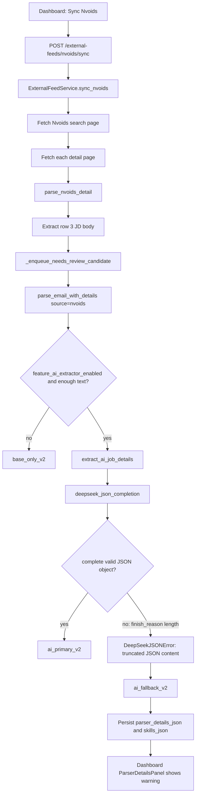
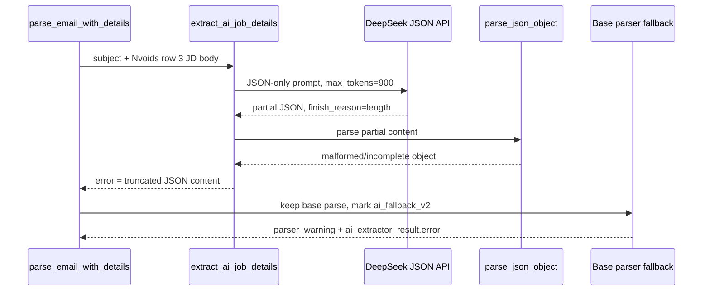
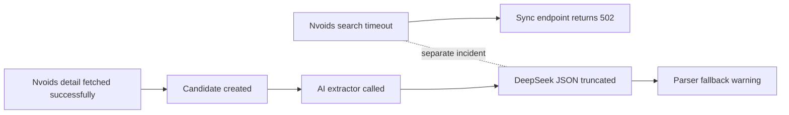
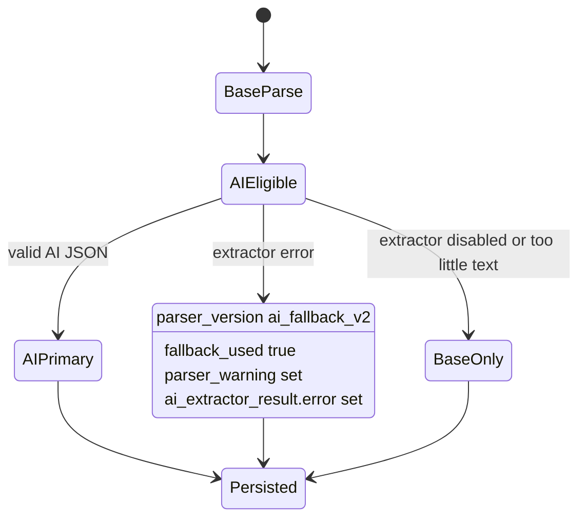
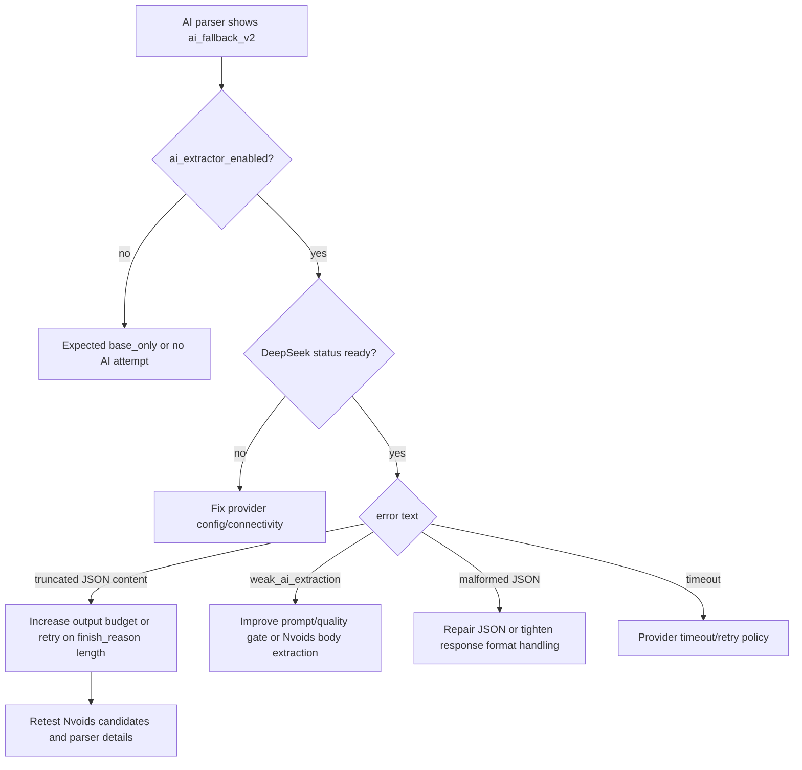

# AI Parser Fallback Analysis: `truncated JSON content`

Date checked: 2026-07-25  
Scope: documentation-only analysis. No application code was changed.

## Short answer

The AI parser is being invoked, but it is not completing a valid JSON object for the affected Nvoids jobs. The backend asks DeepSeek to return a structured JSON object, caps the completion at `max_tokens=900`, then rejects the response when DeepSeek stops with `finish_reason == "length"` and the content is not parseable as one complete JSON object. That exact condition is mapped to the user-facing warning:

```text
AI extractor failed; base parser fallback used: truncated JSON content
```

So the parser is not "off" and the dashboard is not inventing the warning. The backend is intentionally falling back to the base rules parser because the AI provider response is incomplete.

The strongest live evidence is:

- `/settings/bootstrap` reports `feature_ai_extractor_enabled: true`.
- `/ai/status` reports DeepSeek `configured: true`, `connected: true`, `provider: deepseek`, `model: deepseek-v4-flash`, `detail: Ready`.
- The newest Nvoids candidates for `2026-07-24` all show `parser_version: ai_fallback_v2`, `parser_mode: ai_fallback`, `fallback_used: true`, and `ai_error: truncated JSON content`.
- The same newest candidates used the Nvoids detail JD body as the AI input: `ai_input_source: nvoids_detail_table_row_3`, with `ai_input_chars` between 1,251 and 2,873 characters.

## What the screenshot is showing

The screenshot card is reading persisted `parser_details_json` from the candidate row and rendering it in `ParserDetailsPanel`.

The visible values mean:

- `Parser Version: ai_fallback_v2`: the backend attempted AI mode, but returned the compatibility fallback parser output.
- `Source: nvoids`: this candidate came from external Nvoids sync, not Gmail.
- `Mode: ai_fallback`: the AI extractor path ran and failed.
- `Fallback Used: Yes`: the base parser result was kept so the candidate could still be queued.
- `Warning: AI extractor failed; base parser fallback used: truncated JSON content`: the provider response reached the JSON parsing layer, but the JSON object was incomplete.

This is not the same as:

- DeepSeek API key missing.
- AI extractor disabled.
- Groq parser failing.
- Dashboard parsing the candidate incorrectly.
- Redis breaking parsing.
- Nvoids search timeout by itself causing this exact warning.

## Live runtime state

I checked the running backend endpoints.

`/settings/bootstrap` relevant values:

```text
feature_ai_enabled: false
feature_ai_extractor_enabled: true
feature_groq_job_parser_enabled: true
feature_semantic_enabled: false
nvoids_batch_limit: 10
nvoids_detail_title_mode: job_details
nvoids_locations: tx, texas, remote
mail_date: 2026-07-24
```

Important nuance:

- `feature_ai_enabled` controls AI draft generation.
- `feature_ai_extractor_enabled` controls the JD AI parser/extractor.

The attached backend log line:

```text
nvoids_sync_endpoint_failed owner_id='default-owner' batch_limit=10 semantic_enabled=False ai_enabled=False
```

prints `feature_ai_enabled`, not `feature_ai_extractor_enabled`. That log can make it look like the parser AI is off, but the live settings show the extractor flag is on.

`/ai/status` relevant values:

```text
configured: true
connected: true
provider: deepseek
model: deepseek-v4-flash
detail: Ready
groq_configured: true
groq_enabled_in_settings: true
groq_model: llama-3.1-8b-instant
groq_request_mode: json_object
```

This means provider setup is currently healthy at the status-check level. The failure is happening during specific extraction calls.

## Affected live candidates

The newest visible Nvoids candidates on `2026-07-24` all show the same failure contract:

| Candidate | Subject | AI input chars | Parser mode | Error |
|---:|---|---:|---|---|
| 4709 | We are hiring for Java Spring Boot Developer// Remote (NO / ) (T-Mobile Experience is mandatory) | 1251 | `ai_fallback` | `truncated JSON content` |
| 4708 | OpenText Documentum // San Antonio TX | 2873 | `ai_fallback` | `truncated JSON content` |
| 4707 | Urgent requirement of Java Springboot developer for Plano, TX | 2418 | `ai_fallback` | `truncated JSON content` |
| 4706 | Java Developer with Agentic AI Experience | 1568 | `ai_fallback` | `truncated JSON content` |
| 4705 | JOB || OpenText Documentum Developer || San Antonio, TX onsite | 2845 | `ai_fallback` | `truncated JSON content` |

All five used:

```text
ai_input_source: nvoids_detail_table_row_3
```

That is useful because it rules out a single weird job body. The extractor is consistently failing on normal Nvoids JD bodies of moderate size.

## End-to-end flow



## Where the warning is created

The warning is created in `backend/app/phase0.py` inside `parse_email_with_details(...)`.

Relevant logic:

```python
if _should_run_ai_extractor(
    subject,
    ai_body,
    source=source,
    ai_extractor_enabled=ai_extractor_enabled,
):
    try:
        ai_result = extract_ai_job_details(
            subject,
            ai_body,
            source=source,
            source_hints=dict(source_hints or {}),
        )
        if ai_result.error:
            raise RuntimeError(ai_result.error)
    except Exception as exc:
        fallback_used = True
        parser_mode = "ai_fallback"
        parser_warning = f"AI extractor failed; base parser fallback used: {exc}"
        ai_payload = {"error": str(exc), "evidence": {"extractor_error": [str(exc)]}}
        ai_merge_notes.append(parser_warning)
```

Then the persisted diagnostics are assembled:

```python
parser_details = {
    "parser_version": {
        "base_only": "base_only_v2",
        "ai_primary": "ai_primary_v2",
        "ai_fallback": "ai_fallback_v2",
    }[parser_mode],
    "parser_mode": parser_mode,
    "source": source,
    "base_parser_result": base,
    "ai_extractor_result": ai_payload,
    "parser_warning": parser_warning,
    "fallback_used": fallback_used,
    "ai_input_source": str((source_hints or {}).get("ai_input_source") or ""),
    "ai_input_chars": int((source_hints or {}).get("ai_input_chars") or 0),
}
```

That is why the dashboard can show both the fallback warning and still show usable final skills. The fallback is designed to keep the candidate alive rather than fail ingestion.

## Why `truncated JSON content` specifically happens

The exact phrase comes from `backend/app/ai/deepseek_client.py`.

DeepSeek JSON completion currently uses:

```python
response = client.chat.completions.create(
    model=model_name or settings.deepseek_model_fast or "deepseek-v4-flash",
    messages=[
        {"role": "system", "content": system_prompt},
        {"role": "user", "content": user_prompt},
    ],
    temperature=0.0,
    max_tokens=900,
    response_format={"type": "json_object"},
)
```

Then it attempts to parse the returned content as one JSON object:

```python
content = response.choices[0].message.content if response.choices else ""
finish_reason = str(getattr(response.choices[0], "finish_reason", "") or "") if response.choices else ""
raw_content = content or ""
try:
    payload = _parse_json_object(raw_content)
except RuntimeError as exc:
    category = "truncated JSON content" if finish_reason == "length" else str(exc)
    raise DeepSeekJSONError(category, raw_content=raw_content, finish_reason=finish_reason) from exc
```

The important condition is:

```text
finish_reason == "length"
```

That means the model hit the configured output limit before it finished. Since the JSON was cut off, `_parse_json_object(...)` cannot parse a complete object. The client maps that to `DeepSeekJSONError("truncated JSON content")`.

## Why this is likely happening on these Nvoids posts

The AI extractor prompt asks for a fairly large structure:

```json
{
  "role_candidates": "string[]",
  "company": "string",
  "primary_location": "string",
  "mentioned_locations": "string[]",
  "work_mode": "string",
  "salary_text": "string",
  "visa_hints": "string[]",
  "experience_years_min": "number|null",
  "skills_text": "string",
  "skills": "string[]",
  "must_have_skills": "string[]",
  "nice_to_have_skills": "string[]",
  "excluded_skills": "string[]",
  "f2f_mentioned": "boolean",
  "asks_contact_fields": "boolean",
  "is_texas_role": "boolean",
  "confidence": "number",
  "evidence": "object"
}
```

The system prompt also asks the model to:

- extract every explicit technology, framework, programming language, platform, tool, database, testing tool, DevOps tool, methodology;
- include evidence;
- avoid invented details;
- return valid JSON only;
- for Nvoids, derive skills only from the body.

For the visible failed candidates, the JD body is not huge in raw characters, but the requested output can become large because the model may enumerate many skills and evidence strings. Candidate `4709`, for example, includes Java, Spring Boot 3.x, Microservices, REST APIs, AWS services, PostgreSQL, HLD/LLD, Design Patterns, CI/CD, Git, Kubernetes, Docker, Kafka, Terraform, Grafana, Prometheus, Dynatrace, Splunk, JUnit, Mockito, and explanatory responsibility text. If the model expands evidence for each field, 900 output tokens can be too small.

That produces this chain:



## Why Groq is probably not the failing parser here

The settings show:

```text
feature_groq_job_parser_enabled: true
groq_configured: true
groq_request_mode: json_object
```

But the structured JD parser path shown in `parse_email_with_details(...)` calls:

```python
extract_ai_job_details(...)
```

and `extract_ai_job_details(...)` calls:

```python
deepseek_json_completion(...)
```

Groq is used elsewhere for job intent gating, through `groq_chat_json`, not as the current provider for the parser card warning. In other words, Groq can be enabled and healthy while this specific parser warning is still DeepSeek-related.

## Why Redis is not the cause

The attached log starts with Redis booting normally:

```text
Ready to accept connections tcp
```

The parser warning is not queued in Redis, decoded by Redis, or produced by Redis. It is generated synchronously inside backend parsing logic and persisted in the candidate row.

Redis could affect background orchestration in other paths, but this specific message comes from the DeepSeek JSON extraction exception path.

## Why the Nvoids timeout in the attached log is related but separate

The pasted log includes this failure:

```text
nvoids_fetch_search_failed page=1 timeout_seconds=20.0
httpx.ReadTimeout: The read operation timed out
POST /external-feeds/nvoids/sync?batch_limit=10 HTTP/1.1" 502 Bad Gateway
```

That is a network/read timeout while fetching `https://nvoids.com/search_sph.jsp`. It explains a failed sync attempt at that timestamp.

It does not directly explain the screenshot warning because the screenshot is showing candidates that already made it through enough of the Nvoids flow to be parsed, scored, persisted, and displayed. For those candidates, the failure is later in the pipeline:



So there are two independent reliability issues visible:

- Nvoids fetch can time out.
- DeepSeek extraction can return truncated JSON.

Only the second one creates the parser warning in the screenshot.

## Nvoids-specific input path

For Nvoids, the service does not blindly pass the listing row. It fetches the detail page, parses the table, and uses row 3 as the AI parser body.

From `backend/app/external_feeds/parser.py`:

```python
jd_body = _extract_row_text_with_linebreaks(row_htmls[2], row_texts[2]).strip()
recruiter_phone = _extract_row3_recruiter_phone(jd_body)
recruiter_name = _extract_recruiter_name_from_row3(jd_body)
jd_body_source = "nvoids_detail_table_row_3" if jd_body else ""
```

From `backend/app/external_feeds/service.py`:

```python
parsed, parser_details = parse_email_with_details(
    subject,
    body,
    source="nvoids",
    ai_extractor_enabled=settings.feature_ai_extractor_enabled,
    ai_body_override=ai_parse_body,
    source_hints={
        "canonical_title": item.role,
        "canonical_location": item.location,
        "company": item.company,
        "work_mode": item.work_mode,
        "visa_hints": item.visa_hints,
        "ai_input_source": ai_input_source,
        "ai_input_chars": len(ai_parse_body or ""),
    },
)
```

This matches the live candidate diagnostics:

```text
ai_input_source: nvoids_detail_table_row_3
```

So the AI parser is receiving the intended detailed JD body, not only a search-list snippet.

## Why the fallback output still looks decent

The fallback is not an empty parser. Before AI is attempted, the backend already builds a base parse and structured requirement groups using deterministic rules:

```python
base = _base_parse_email(subject, body)
base["skills_text"] = audit_skills_text(
    normalize_skills_text(str(base.get("skills_text", "")), preserve_unknown=True)
).skills_text
_apply_nvoids_source_hints(base, source=source, source_hints=source_hints)
```

Then it slices and parses JD sections:

```python
sections = slice_jd_sections(cleaned_body)
rules_requirements = parse_structured_jd_requirements(
    build_skill_source_sections(sections),
    full_text="\n".join(part for part in [subject, cleaned_body] if str(part or "").strip()),
    source_hints=source_hints,
)
```

That is why the screenshot still has:

- final skills text;
- approved skills;
- ATS summary;
- structured requirement scoring;
- resume picker output.

The AI parser failed, but the rules parser and taxonomy pipeline continued.

## Backend error contract

The code intentionally treats any AI extractor error as non-fatal for ingestion:



This is a compatibility design choice. The app prefers preserving a candidate with base parsing over dropping the row when AI fails.

## Exact root cause

The immediate root cause is:

```text
DeepSeek returned a JSON-mode response that hit the output token limit and stopped with finish_reason=length. Because the JSON object was incomplete, the backend could not parse it and converted that condition to "truncated JSON content".
```

The probable contributing causes are:

- `max_tokens=900` is too low for the current extractor prompt plus evidence-heavy output.
- Nvoids jobs can contain dense skill lists and responsibilities, causing the model to produce a larger JSON object than expected.
- The requested schema includes several list fields plus an open-ended `evidence` object, which can expand quickly.
- The code does not retry DeepSeek parser extraction with a larger budget after `finish_reason=length`.
- The code does not persist `raw_content`, `finish_reason`, or token usage inside `parser_details_json` for this extractor path, so the dashboard can show the stable error but not the exact partial JSON.

## What is not the root cause

Based on the current evidence:

- Not a disabled AI extractor: `feature_ai_extractor_enabled` is true.
- Not a missing DeepSeek key: `/ai/status` says configured and connected.
- Not a broken dashboard: the UI renders the backend's persisted `parser_warning`.
- Not Redis: Redis is healthy and not involved in JSON parsing.
- Not semantic embeddings: `feature_semantic_enabled` is false, and semantic matching is separate from parser extraction.
- Not Groq JSON mode: Groq is configured for a different path; the parser warning comes from `deepseek_json_completion`.
- Not necessarily bad Nvoids HTML: candidates reached `nvoids_detail_table_row_3`, so detail extraction succeeded for the displayed rows.

## Secondary findings noticed during analysis

1. The Nvoids sync endpoint has a separate reliability issue.

   The attached logs show `httpx.ReadTimeout` fetching Nvoids search page 1 with a 20 second timeout. That can make `Sync Nvoids` return `502 Bad Gateway`, but it is separate from the parser warning.

2. The backend log message can be misleading.

   The Nvoids sync log prints `ai_enabled`, which maps to draft AI, not parser AI. Since `feature_ai_enabled=false` and `feature_ai_extractor_enabled=true`, someone reading only the log may think the parser AI is disabled even though it is active.

3. The dashboard has enough data to show the right high-level state, but not enough to debug the provider response.

   The candidate row stores `ai_extractor_result.error`, `parser_warning`, `ai_input_source`, and `ai_input_chars`, but not the provider `finish_reason`, completion token count, response hash, or raw partial JSON for parser extraction failures.

4. The fallback can inflate or misclassify some skills.

   In candidate `4709`, the fallback skills include useful terms, but also noisy tokens such as `X++`, `mobile`, `HTTP`, `HTTPs`, and `JSP`. Some of that likely comes from URLs, source text, or taxonomy/rules extraction rather than the AI path. The fallback keeps the system moving, but it is less precise than a successful AI extraction should be.

## Recommended fix direction, without implementing yet

The lowest-risk fix should target the extraction completion contract, not the dashboard.

Recommended order:

1. Add a characterization test that simulates DeepSeek returning `finish_reason="length"` and confirms the current fallback warning is preserved.
2. Add a second test for a successful retry after truncation, if retry behavior is desired.
3. Increase or make configurable the extractor completion budget for `deepseek_json_completion_with_diagnostics(...)`, especially for parser extraction.
4. On `DeepSeekJSONError` with `finish_reason="length"`, retry once with a larger output budget or a smaller repair prompt.
5. Consider limiting the extractor prompt's `evidence` requirement, because evidence is the easiest field to expand until the JSON is cut off.
6. Persist parser extraction diagnostics such as `finish_reason`, `duration_ms`, and response hash when available, without storing full raw provider content unless there is an explicit privacy decision.
7. Improve the Nvoids sync log wording so `ai_enabled` is not confused with `feature_ai_extractor_enabled`.
8. Treat Nvoids fetch timeouts separately: add retry/backoff or partial-page behavior for `fetch_search_page`, but do not conflate that with the AI parser fallback.

## Fix decision tree



## Practical conclusion

The AI parser is "working" up to the provider call, but failing at the final structured-output boundary. DeepSeek is returning incomplete JSON for these Nvoids extraction requests, probably because the extractor asks for a broad, evidence-rich JSON object while the completion is capped at 900 tokens. The backend catches that failure, preserves the base parser result, persists `ai_fallback_v2`, and the dashboard correctly displays the warning.

The next code change should be a small, characterized backend change around DeepSeek JSON extraction: either raise/configure the parser output token budget or add a one-time retry when `finish_reason == "length"`, then verify that Nvoids candidates move from `ai_fallback_v2` to `ai_primary_v2` without changing existing fallback behavior for genuine malformed or weak responses.

## Problem Statement

CodeJob’s AI extractor is enabled and connected to DeepSeek, but it fails to parse Nvoids job descriptions because DeepSeek’s structured JSON response is limited to **900 output tokens**. Dense job descriptions require many extracted fields, skills, and evidence entries, causing the model to reach the token limit before completing the JSON object.

DeepSeek returns `finish_reason="length"`, leaving incomplete JSON that the backend cannot parse. CodeJob then displays:

> AI extractor failed; base parser fallback used: truncated JSON content

The application does not lose the job because it automatically uses its rules-based parser and stores the candidate as `ai_fallback_v2`. However, fallback extraction is less accurate and may introduce noisy or incorrect skills such as `HTTP`, `X++`, or unrelated phrases.

The system currently has no automatic retry with a larger token allowance and stores limited diagnostics about the failed response. Separately, Nvoids search requests can exceed their 20-second timeout, but that issue is unrelated to the DeepSeek JSON truncation.

## Proposed Solution

Replace the fixed max_tokens=900 limit in backend/app/ai/deepseek_client.py with a configurable limit, initially around 2,000–3,000 tokens.

CodeJob should also:

Detect finish_reason="length".
Automatically retry once with a larger output limit.
Reduce unnecessary prompt and JSON verbosity, especially excessive evidence fields.
Validate the completed JSON before using it.
Store diagnostics such as model, token usage, finish reason, response hash, and retry result.
Continue using the existing rules-based parser only when the retry also fails.
Add tests for large job descriptions, truncated responses, valid JSON, and fallback behavior.

This keeps DeepSeek as the primary extractor while preserving the current safety fallback. The expected result is that dense Nvoids job descriptions produce complete structured JSON instead of falling back and generating noisy skills. The separate Nvoids 20-second HTTP timeout should be handled independently.

