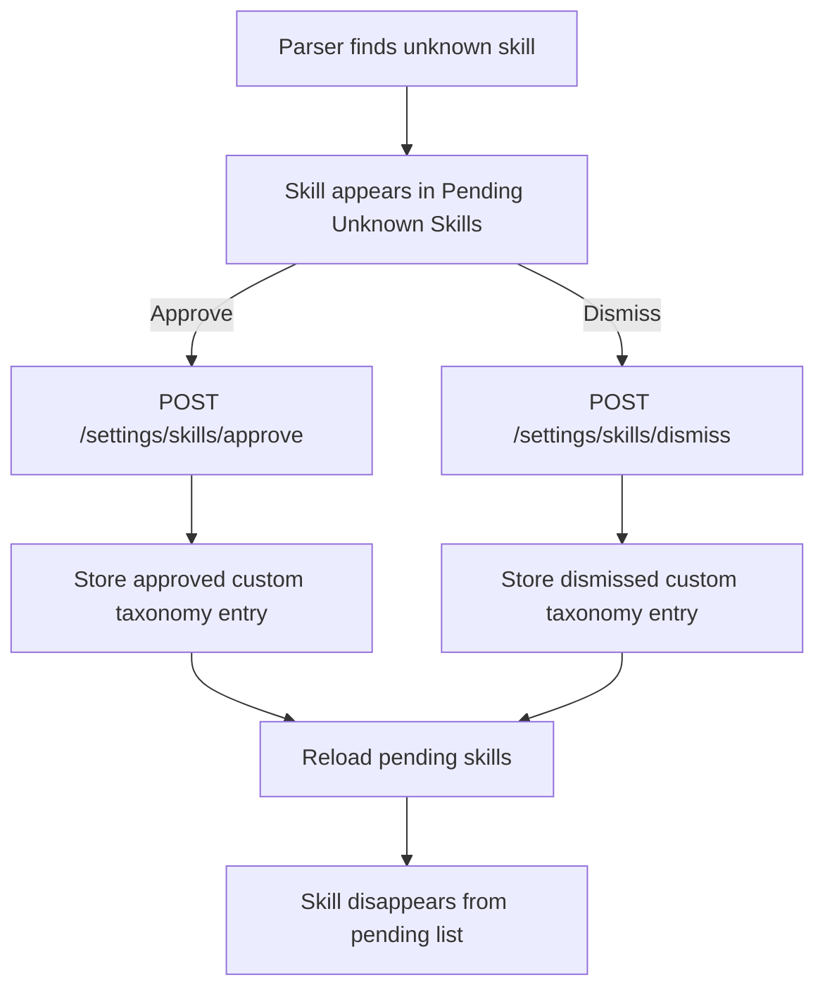

# Temp11: Upgrade Skills Card Simplification

## Summary

Status: Done

The `Upgrade Skills` card now uses the `Pending only` UX.

- The card shows only `Pending Unknown Skills`.
- `Approve` still adds the skill to the active custom taxonomy.
- `Dismiss` still keeps the skill out of the pending queue.
- After either action, the reviewed skill disappears from the pending list
  after reload.
- No approved-history list, count, or collapsed history remains visible in the
  card.

## Implemented Behavior

### Frontend

- `dashboard/src/App.tsx` now renders only the pending-review portion of the
  `Upgrade Skills` card.
- The helper copy is shorter and now explains the silent behavior:
  approve adds to taxonomy, dismiss removes from queue.
- `SkillUpgradeSectionProps` no longer accepts `approvedSkills`.
- The Settings bootstrap and refresh flow now reload only
  `GET /settings/skills/pending` for this card.
- `POST /settings/skills/approve` and `POST /settings/skills/dismiss` are
  unchanged and still trigger a refresh so the reviewed item disappears.

### Backend

- No backend code changed.
- `POST /settings/skills/approve` still persists an `approved` custom skill.
- `POST /settings/skills/dismiss` still persists a `dismissed` custom skill.
- Pending suppression rules are unchanged.
- `GET /settings/skills/approved` remains available for compatibility even
  though the dashboard card no longer uses it.

## Runtime Flow

## Validation

| Check | Result |
| --- | --- |
| `dashboard/src/App.skillUpgrade.test.tsx` updated for pending-only rendering | Done |
| Targeted skill-upgrade test run | Passed via `npm test -- App.skillUpgrade.test.tsx` |
| Dashboard build | Blocked by `.tsbuildinfo` EPERM write failure during `npm run build` |
| Markdown lint for this doc | Blocked by npm cache EPERM during `npx markdownlint-cli docs\\temp11.md` |
| Backend regression run | Not required because backend behavior was not changed |
| Runtime browser validation | Not run in this implementation pass |

## Notes

- This change is a UX simplification, not a taxonomy behavior change.
- The approved-skills backend endpoint can be removed in a later cleanup pass
  if no other consumer is added.
- Mermaid needed: yes, because the doc describes the post-action state flow.

Audit date: 2026-06-24
Branch: semantic-embeddings
Evidence basis: code inspection and targeted test run
Verification limits: No live browser validation was performed in this pass.
Build validation was blocked by `.tsbuildinfo` write permissions. Markdown lint
was blocked by npm cache permissions.
