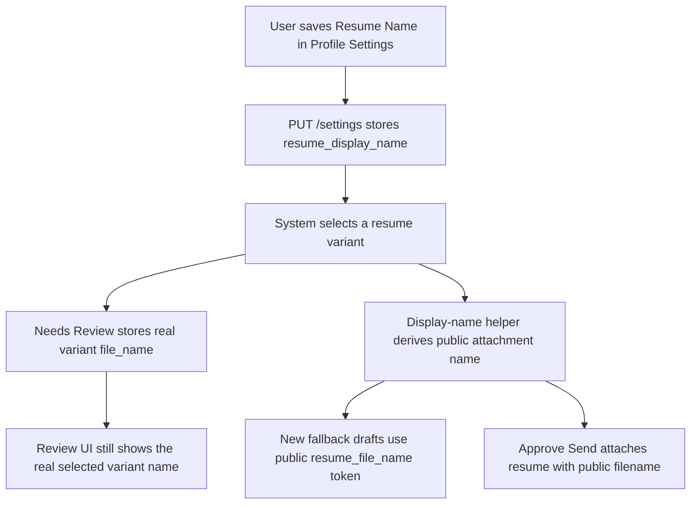

# Temp12: Standard Resume Name Setting

## Summary

Status: Done

The application now supports a `Resume Name` field in `Profile Settings`.

- The new setting stores a user-wide public resume attachment name.
- Drafts generated after the change use that public name for
  `{{resume_file_name}}`.
- Approve/send uses that public name as the actual outbound resume attachment
  filename.
- `Needs Review` still shows the real selected resume variant filename.
- Resume Database cards still show the real uploaded variant filenames.

Chosen queued-draft behavior:

- Changing `Resume Name` does not retroactively rewrite existing queued drafts.
- Newly generated drafts and drafts regenerated by existing runtime flows use
  the configured public name.
- Send-time attachment naming always uses the current setting.

## Implemented Behavior

### Settings and persistence

- `backend/app/models.py` now persists `UserSettings.resume_display_name`.
- `backend/app/schemas.py` now exposes `resume_display_name` on the settings
  request/response contract.
- `backend/app/main.py` now round-trips `resume_display_name` through
  `GET /settings` and `PUT /settings`.
- `backend/alembic/versions/20260624_0004_resume_display_name.py` adds the new
  `user_settings.resume_display_name` column with an empty-string default.

### Profile Settings UI

- `dashboard/src/App.tsx` now includes `resume_display_name` in the settings
  state.
- `Profile Settings` now renders a small `Resume Name` input with the
  placeholder `Chaithanya Dheeraj Resume`.
- The helper note explains that this changes the sent resume attachment name,
  while review and database cards still show the real variant name.

### Outbound resume display name

- `backend/app/services/candidate_runtime_service.py` now defines
  `resolve_resume_display_name(...)`.
- Behavior:
  - blank setting returns the real selected variant filename
  - configured setting replaces the visible attachment base name
  - the selected variant's original extension is preserved
  - if the user types a different extension into the setting, the system still
    normalizes back to the selected variant's actual extension

Example:

- Selected variant: `resume-best-match.pdf`
- Configured `Resume Name`: `Chaithanya Dheeraj Resume`
- Outbound display name: `Chaithanya Dheeraj Resume.pdf`

### Draft and send flow

- Manual ingest in `backend/app/main.py` now passes the public display name into
  fallback draft generation.
- Gmail sync and fallback draft regeneration in
  `backend/app/services/orchestration_service.py` now pass the public display
  name into newly generated fallback drafts.
- Unknown-role repair in
  `backend/app/services/candidate_runtime_service.py` now also uses the public
  display name when it regenerates a fallback draft.
- Approve/send in `backend/app/services/orchestration_service.py` now sends the
  resume attachment with the public display name.
- The stored review/audit field `email.resume_file_name` remains the real
  selected variant filename.

### Review and database invariants preserved

- Resume Database still renders `ResumeAsset.file_name`.
- `Needs Review` still renders `item.resume_file_name`.
- Extra attachment files are unchanged and keep their own filenames.
- Resume selection logic is unchanged.

## Runtime Flow

## Validation

| Check | Result |
| --- | --- |
| Backend settings round-trip | Passed via `backend/tests/test_external_feeds_api.py::ExternalFeedsApiTests::test_settings_round_trip_includes_nvoids_locations` |
| Invalid settings regression | Passed via `backend/tests/test_external_feeds_api.py::ExternalFeedsApiTests::test_settings_reject_invalid_draft_text_size` |
| Resume display-name helper and fallback draft behavior | Passed via `backend/tests/test_resume_display_name.py` |
| Approve/send public attachment name while preserving stored variant name | Passed via `backend/tests/test_approve_cc_regression.py` |
| Resume Database regression | Passed via `npm test -- App.resumeDatabase.test.tsx` |
| Dashboard build | Blocked by `.tsbuildinfo` EPERM write failure during `npm run build` |
| Markdown lint for this doc | Blocked by npm cache EPERM during `npx markdownlint-cli docs\\temp12.md` |

## Notes

- This is an attachment-naming change, not a resume selection change.
- Existing queued drafts are not rewritten just because `Resume Name` changes.
- Drafts regenerated by existing runtime flows can pick up the new public name.
- Mermaid needed: yes, because the implementation spans settings persistence,
  draft generation, send-time attachment naming, and review-state display.

Audit date: 2026-06-24
Branch: semantic-embeddings
Evidence basis: code inspection and targeted test run
Verification limits: No live browser validation was performed in this pass.
Dashboard build was blocked by `.tsbuildinfo` write permissions. Markdown lint
was blocked by npm cache permissions.
