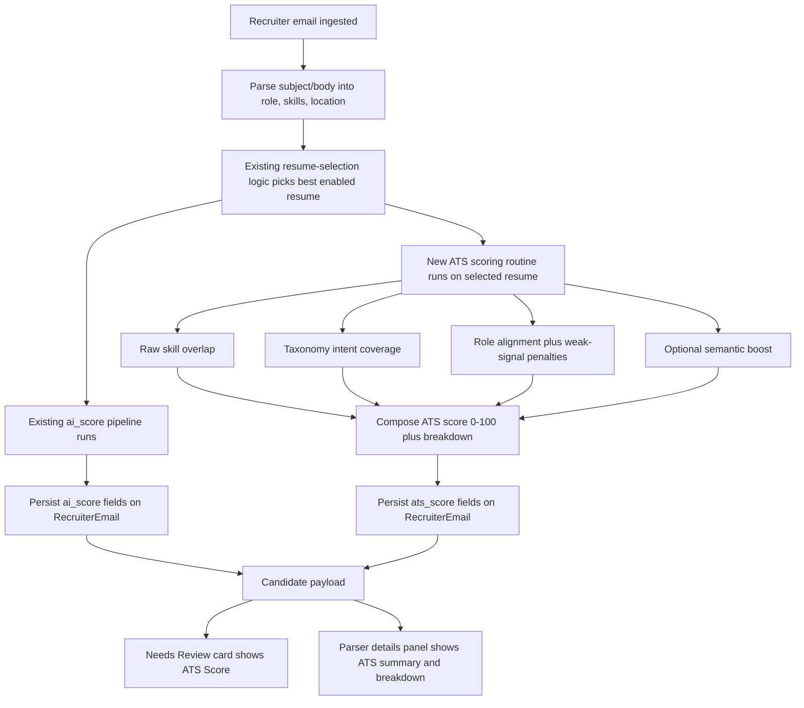

# Temp14 ATS Score Integration

## Status

Implemented on `semantic-embeddings` on 2026-06-24.

## Final UX Shipped

ATS is now a separate review metric in CodeJob.

- `ai_score` behavior stays unchanged.
- resume-selection behavior stays unchanged.
- ATS is computed only for the already-selected resume variant.
- ATS is shown in `Needs Review` as a compact `ATS Score` line.
- ATS details are shown in the parser/details panel for debugging and tuning.
- the `Resume:` line in `Needs Review` still shows the real selected resume
  variant filename.
- Resume Database still shows the real uploaded resume filenames.

## Final Method Shipped

The implementation does **not** use the standalone Google-style TF-IDF scorer
from `temp13.md`.

The shipped ATS method is a hybrid score built on current CodeJob scoring
primitives:

- raw JD vs resume skill overlap
- taxonomy intent-weighted match
- role/foundation alignment
- weak-signal penalties for vague AI wording
- semantic similarity as a bounded boost when semantic mode is enabled and
  cached embeddings are available

Current weight model:

- `45%` raw overlap
- `30%` intent-weighted match
- `15%` role/foundation alignment
- `10%` semantic boost

If semantic input is unavailable, deterministic components are renormalized
instead of returning a fake neutral semantic value.

## Backend Behavior Shipped

### New ATS persistence

Added to `RecruiterEmail`:

- `ats_score`
- `ats_score_source`
- `ats_summary`
- `ats_breakdown_json`

Added migration:

- `backend/alembic/versions/20260624_0005_ats_score_fields.py`

### ATS runtime flow

Implemented in `backend/app/services/scoring_runtime_service.py`.

Flow now is:

1. existing resume-selection logic picks the best enabled resume
2. existing `ai_score` pipeline runs as before
3. ATS is computed for that selected resume
4. ATS is persisted with the email row
5. ATS is returned through candidate payloads

### ATS payload shape

`EmailResponse` now includes:

- `ats_score`
- `ats_score_source`
- `ats_summary`
- `ats_breakdown`

The ATS breakdown currently includes:

- `raw_overlap`
- `intent_match`
- `role_alignment`
- `foundation_coverage`
- `semantic_similarity`
- `matched_raw_skills`
- `missing_raw_skills`
- `matched_clusters`
- `matched_specialization_skills`
- `missing_specialization_skills`
- `weak_signal_hits`
- `selected_resume_file_name`

### Integration points shipped

ATS is now stored during:

- manual ingest in `backend/app/main.py`
- Gmail/import queue ingestion in `backend/app/services/orchestration_service.py`
- Nvoids/external-feed ingestion in `backend/app/external_feeds/service.py`

`approve/send` behavior was intentionally left unchanged except that ATS is now
available on the reviewed candidate record.

## Frontend Behavior Shipped

### Needs Review

Implemented in `dashboard/src/App.tsx`.

Each review card now shows:

- `ATS Score: <rounded score> (<Strong|Moderate|Weak>)`

This is informational only in v1.

It does **not**:

- replace the current verdict logic
- replace current thresholds
- change which resume was selected

### Parser Details

The parser/details panel now shows:

- `ATS Summary`
- `ATS Breakdown`

This keeps ATS explainable without changing the main workflow.

## Mermaid Integration Diagram

## Files Changed

Backend:

- `backend/app/services/scoring_runtime_service.py`
- `backend/app/models.py`
- `backend/app/schemas.py`
- `backend/app/main.py`
- `backend/app/services/orchestration_service.py`
- `backend/app/external_feeds/service.py`
- `backend/alembic/versions/20260624_0005_ats_score_fields.py`

Frontend:

- `dashboard/src/App.tsx`

Tests:

- `backend/tests/test_scoring_runtime_service.py`
- `backend/tests/test_schemas.py`
- `backend/tests/test_external_feeds_api.py`
- `dashboard/src/App.parserDetails.test.tsx`
- `dashboard/src/App.ats.test.tsx`

## Tests Run

Passed:

- `DEBUG=false uv run pytest backend/tests/test_scoring_runtime_service.py backend/tests/test_schemas.py backend/tests/test_external_feeds_api.py`
- `npm test -- App.parserDetails.test.tsx App.ats.test.tsx`

## Verification Limits

- no full dashboard production build was run in this task
- no broad all-backend suite was run beyond the targeted ATS-related regression set
- no resume-selection algorithm change was made, so ATS is currently diagnostic
  and review-facing only

## Decisions Preserved

- ATS is a separate metric in v1
- `ai_score` remains the primary existing qualification metric
- ATS does not choose resumes
- ATS does not replace thresholds or routing behavior
- no new external NLP dependency was added
