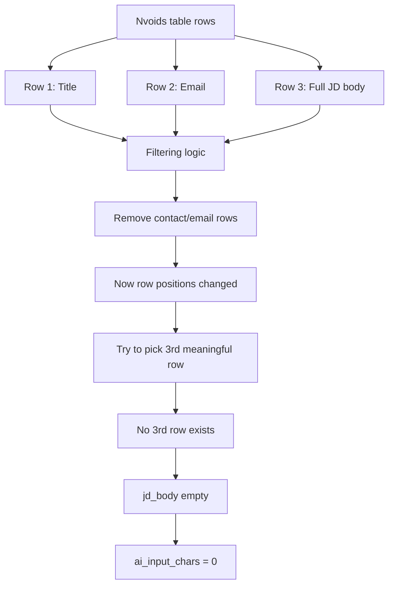
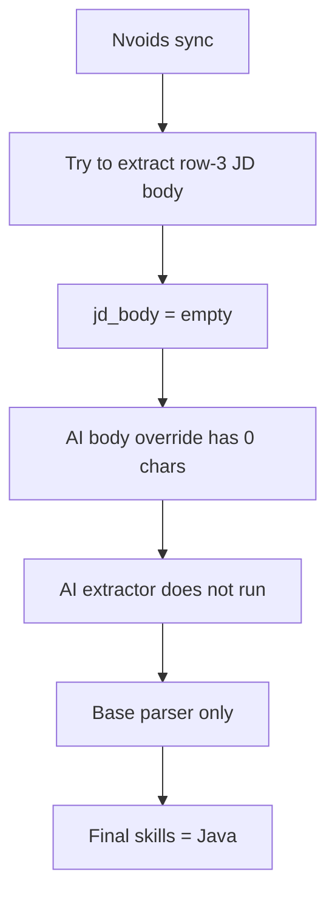

No, it is **not tough**.

This screenshot actually proves the rule should be much simpler than what was implemented.

The Nvoids detail page is shaped like this:

```text id="7awtau"
<tr> Row 1: Job title
<tr> Row 2: Email / recruiter contact
<tr> Row 3: Actual full JD body
```

In your browser screenshot, the selected third `<tr>` contains exactly the data we need:

```text id="34vjuw"
Role: Solution Architect
Client: Toyota
Location: Plano, TX
Must have skills:
Java, Spring Boot, NodeJS, AWS, Kafka
Responsibilities...
```

So the backend should not be doing a complicated “third meaningful row after filtering contact rows” calculation here.

## What is going wrong now

Your UI still shows:

```text id="2p1enf"
ai_input_chars: 0
```

That means the backend tried to extract the JD-only AI input, but it extracted **nothing**.

The likely mistake is this:



The filter is overthinking it.

If it removes the email row before counting, then the actual JD row is no longer “third meaningful row.” It becomes the second remaining row, or sometimes the only remaining long row.

## Correct logic

For this Nvoids page shape, the rule should be:

```text id="lfbvv5"
Use the third actual <tr> from the selected detail-page table.
Inside that row, extract the <td> text.
Do not filter email/contact rows before choosing row 3.
```

Simple flow:

```mermaid id="ndzndh"
flowchart TD
    A[Detail page HTML] --> B[Find main detail table]
    B --> C[Read all tr rows in order]
    C --> D{Has at least 3 rows?}
    D -->|Yes| E[Pick rows[2]]
    E --> F[Extract td text with line breaks]
    F --> G[jd_body]
    G --> H[Send jd_body to DeepSeek]

    D -->|No| I[Fallback to largest JD-looking row]
```

## Why your current card became `base_only`

For Email ID 3671:

```text id="8flf1y"
Mode: base_only
AI Extractor Result: -
ai_input_chars: 0
```

That means:



So the problem is not DeepSeek. DeepSeek is not even getting the JD row for this card.

## What Codex should fix now

The previous instruction should be corrected from:

```text id="4ypc56"
third meaningful row after filtering decorative/contact rows
```

to:

```text id="zas0ih"
third actual table row from the selected Nvoids job_details.jsp detail table
```

Then add fallback safety:

```text id="5f0txb"
If row 3 is missing or too short, use the longest row that contains JD markers like:
Role:
Client:
Location:
Must have skills
Responsibilities
Required
Skills
```

## Correct extraction from your screenshot

For this listing, the row-3 JD body clearly contains these skills:

```text id="772nvq"
Java, Spring Boot, Node.js, AWS, Kafka, Microservices
```

And likely additional role/context terms:

```text id="i70jud"
Solution Architecture, Cloud-native architecture, DevOps, Onsite delivery
```

## Final answer

No, this is **not technically hard**.

The bug is that the implementation made the rule too clever. It filtered rows first and then counted the third row, which can erase the exact row position you care about.

For Nvoids, the parser should do this bluntly:

```text id="xfklou"
table.find_all("tr")[2].get_text("\n", strip=True)
```

Then only use fallback logic if that third row is missing or empty.
