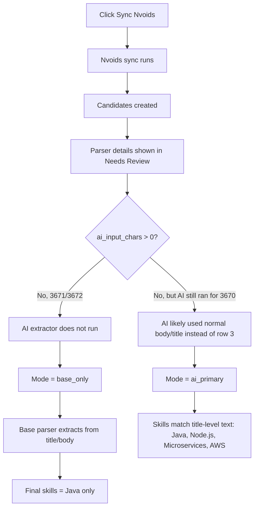
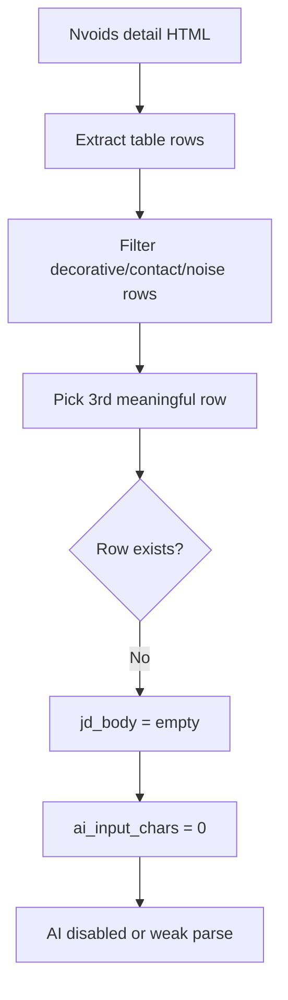

## 1. High-level overview of what is happening

Your Docker app is running and Nvoids sync completed successfully, but the **new row-3 AI input is not working correctly yet**.

The biggest clue is in all three screenshots:

```text
ai_input_chars: 0
```

That means the new Nvoids row-3 extraction path is producing **empty AI input**.

So for these new Nvoids cards:

```text
Email ID 3672 → base_only → Java only
Email ID 3671 → base_only → Java only
Email ID 3670 → ai_primary → Java, Node.js, Microservices, AWS
```

The intended new behavior was:

```text
Nvoids detail table → extract 3rd meaningful JD row → send only that row to DeepSeek
```

But the UI says the extracted row-3 AI body length is `0`.

## 2. What the screenshots prove

### Email ID 3672

```text
Parser Version: base_only_v2
Mode: base_only
Final Skills Text: Java
Source Hints: ai_input_chars: 0
```

This means AI did **not** run. The system used the base parser only.

### Email ID 3671

```text
Parser Version: base_only_v2
Mode: base_only
Final Skills Text: Java
Source Hints: ai_input_chars: 0
```

Same issue. AI did not run because the AI input body appears empty.

### Email ID 3670

```text
Parser Version: ai_primary_v2
Mode: ai_primary
Final Skills Text: Java, Node.js, Microservices, AWS
Source Hints: ai_input_chars: 0
```

This one is strange. It says AI ran, but `ai_input_chars` is still `0`.

That suggests one of these is happening:

```text
1. The metadata says row-3 input is empty, but AI still fell back to full body/title.
2. The AI override is only passed when non-empty, so AI parsed the normal body.
3. ai_input_chars metadata is being calculated incorrectly.
```

Either way, it is **not proving that DeepSeek studied row 3**.

## 3. Docker logs meaning

The logs show this:

```text
POST /external-feeds/nvoids/sync?batch_limit=10 HTTP/1.1" 200 OK
```

So the Nvoids sync completed.

The long delay here:

```text
Embedding latency provider=sbert ... latency_ms=179331.62
```

is the local SBERT model loading/cold start. That is for semantic scoring/resume comparison, not DeepSeek skill extraction.

After the first load, embeddings became much faster:

```text
655 ms
1234 ms
257 ms
527 ms
...
```

So Docker did not crash. The sync completed, but the parser quality is still weak.

## 4. Actual flow happening now



## 5. Why skills are still weak

The intended row-3 extraction is failing or returning empty.

Because `ai_input_chars: 0`, DeepSeek is not receiving the actual JD body row. That means the parser falls back to either:

```text
subject/title only
full cleaned body without row-3 isolation
base parser only
```

That is why you are seeing weak skills like:

```text
Java
```

or only title-level skills like:

```text
Java, Node.js, Microservices, AWS
```

Instead of the full JD skill set.

## 6. The most likely root cause

The new “third meaningful row” filter is probably too aggressive or selecting from the wrong table shape.

It may be filtering out rows like:

```text
Email row
From row
Job Description row
View All row
Footer row
```

and after filtering, there may not be a valid third row left.

So this part is failing:



## 7. Important distinction

Your **draft AI** and **parser AI** are separate.

In the settings screenshot, “Enable AI Features” was OFF earlier. That controls draft generation, which is why you see:

```text
Draft source: Rules fallback
Resume Context: Rules Only
```

But the parser uses:

```text
Enable AI Extractor
```

So `Rules fallback` does **not** necessarily mean parser AI is off.

The important parser field is:

```text
Mode: base_only / ai_primary / ai_fallback
```

## 8. Final diagnosis

The new implementation is **partially wired**, because the UI now shows:

```text
ai_input_chars
```

But it is **not working end to end yet**, because:

```text
ai_input_chars = 0
```

on these Nvoids cards.

That means the app is not successfully extracting the 3rd meaningful Nvoids detail row for AI input.

## What to check next

Run these inside the backend container:

```powershell
docker compose exec backend python -c "from app.external_feeds.types import ParsedNvoidsDetail; print(ParsedNvoidsDetail.__annotations__)"
```

Confirm `jd_body` exists.

Then:

```powershell
docker compose exec backend python -c "import inspect; from app.phase0 import parse_email_with_details; print(inspect.signature(parse_email_with_details))"
```

Confirm `ai_body_override` exists.

Then inspect one failed candidate’s stored parser details/raw HTML. The key thing to verify is:

```text
Does item.raw_html contain the real Nvoids detail table?
Does parse_nvoids_detail(item.raw_html, ...) return non-empty jd_body?
```

Right now, the UI already tells us the answer for these candidates:

```text
jd_body / AI input body is empty.
```

So the next Codex fix should focus specifically on **why row-3 extraction returns empty**, not on DeepSeek.
