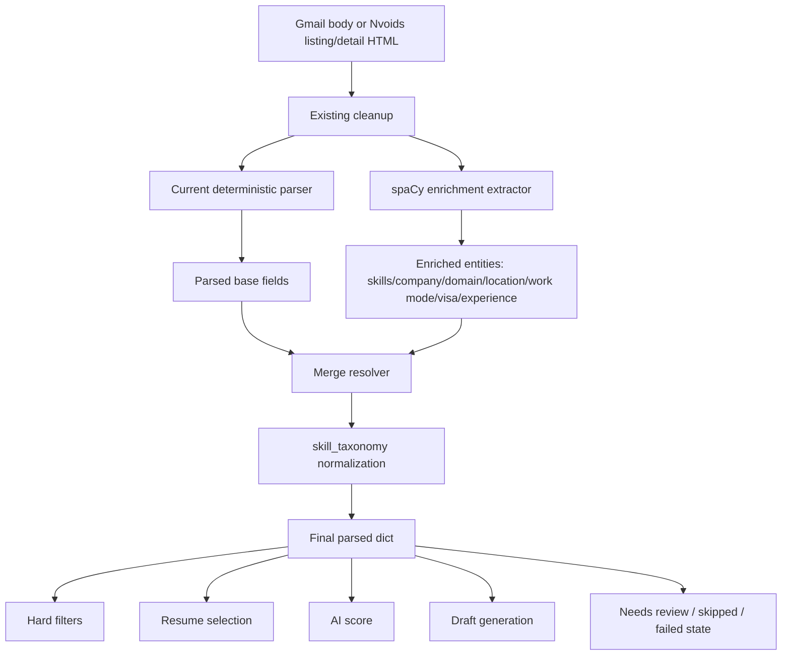

Yes. Here is the plan based on the current `semantic-embeddings` branch.

## 1. High-level overview of the application

CODEJOB currently has **one central parser contract**: `parse_email(subject, body)`. That parser extracts:

```python
role
location
job_location_text
salary_text
skills_text
f2f_mentioned
asks_contact_fields
is_texas_role
```

That same parsed object is then used for hard filters, F2F blocking, resume selection, AI score, draft creation, and UI state.

So spaCy should **not become a separate fallback parser**. It should become a **parallel enrichment step inside the parser pipeline**:

```text
Current parser extraction
        +
spaCy enrichment extraction
        +
skill taxonomy normalization
        ↓
one merged parsed dict
```

The important rule: **downstream code should still receive the same `parsed` dict shape**.

---

## 2. Repository structure involved

The spaCy enrichment plan touches these backend areas:

```text
backend/app/phase0.py
  Main Gmail parser and hard-filter fields

backend/app/external_feeds/parser.py
  Nvoids listing/detail parser

backend/app/external_feeds/service.py
  Nvoids sync + enqueue into RecruiterEmail

backend/app/automation/queue_preparation.py
  Shared queue preparation for Gmail/Nvoids

backend/app/services/orchestration_service.py
  Gmail sync flow

backend/app/services/scoring_runtime_service.py
  Resume matching + AI/semantic scoring

backend/app/skill_taxonomy.py
  Canonical skill normalization and JD skill extraction

backend/app/models.py
backend/app/external_feeds/models.py
  Stored fields for Gmail/Nvoids rows

backend/pyproject.toml
  Dependency list
```

Right now `spacy` is **not** in `backend/pyproject.toml`; current dependencies include BeautifulSoup, FastAPI, OpenAI SDK, Redis/RQ, sentence-transformers, SQLAlchemy, etc.

---

## 3. Main technologies used

Current relevant stack:

```text
FastAPI backend
SQLAlchemy models
SQLite/Postgres-compatible ORM layer
Gmail API ingestion
Nvoids external feed scraping
BeautifulSoup/lxml for Nvoids HTML parsing
DeepSeek/OpenAI-compatible draft generation
Semantic embeddings for JD ↔ resume matching
Skill taxonomy for canonical skill detection
```

The current skill system already has good infrastructure: it loads `skill_taxonomy.json`, creates normalized lookup forms, normalizes extracted skills, and returns canonical skill labels.

So spaCy should not replace `skill_taxonomy.py`. It should **feed better candidate text/entities into the taxonomy layer**.

---

## 4. Core features affected

The change affects these flows:

### Gmail sync

Gmail currently does:

```text
Gmail item
 → parse_email()
 → hard_filter_check()
 → select_best_resume_match()
 → AI score
 → F2F block
 → draft / reject
 → RecruiterEmail row
```

In `sync_gmail()`, the code calls `parse_email()` first, then hard filters and resume selection use that parsed output.

### Run-once automation

The batch orchestrator also parses first for resume selection, then queue preparation parses again through the same dependency.

### Nvoids sync

Nvoids currently parses the listing/detail page into an `ExternalOpportunity`, then later enqueues it as a `RecruiterEmail`. Nvoids stores fields like company, role, location, work mode, visa hints, rate, skills, raw body, raw HTML, and parse confidence.

The weak part is Nvoids skill extraction. Current Nvoids `parse_external_post()` only scans for this small hardcoded skill list:

```python
java, python, react, node, aws, sql, azure, sap, salesforce, ai, ml
```

Then it normalizes that short list.

That is exactly where spaCy enrichment should help.

---

## 5. Architecture and code flow plan

### Target architecture



### Important principle

spaCy should run **with** the parser, not **after parser failure**.

That means this is wrong:

```text
parse_email failed → run spaCy
```

This is correct:

```text
parse_email base extraction
spaCy enrichment extraction
merge both every time for Gmail/Nvoids
return one final parsed dict
```

---

## 6. Important files and folders: exact implementation plan

### Step 1 — Add a dedicated enrichment module

Add a new module conceptually like:

```text
backend/app/parsing/spacy_enrichment.py
```

Purpose:

```python
@dataclass
class SpacyJobEnrichment:
    role_candidates: list[str]
    company: str
    job_domain: list[str]
    primary_location: str
    mentioned_locations: list[str]
    work_mode: str
    visa_hints: list[str]
    experience_years_min: int | None
    skills_text: str
    confidence: float
    evidence: dict[str, list[str]]
```

This module should do **only extraction/enrichment**, not queue decisions.

It should expose:

```python
def enrich_job_text(subject: str, body: str, source: str = "gmail") -> SpacyJobEnrichment:
    ...
```

And for Nvoids:

```python
def enrich_nvoids_post(title: str, location: str, body: str, raw_html: str) -> SpacyJobEnrichment:
    ...
```

### Step 2 — Use spaCy as a rule/entity engine, not a generic black box

Use:

```text
spacy.blank("en")
EntityRuler
PhraseMatcher
Matcher
```

Do not depend only on generic spaCy NER for tech skills.

Reason: CODEJOB already has the real skill knowledge inside `skill_taxonomy.py`. It can normalize aliases, canonical names, and unknown skills. `normalize_skills_text()` already handles dedupe and canonicalization.

The spaCy layer should create patterns from:

```python
load_skill_taxonomy().entries
entry.canonical_name
entry.aliases
entry.normalized_forms
```

Then emit `skills_text`, which is finally passed through:

```python
normalize_skills_text(..., preserve_unknown=True)
```

### Step 3 — Add source-specific extraction rules

#### Gmail enrichment rules

For messy Gmail bodies, spaCy should extract:

```text
company/client
domain
all mentioned locations
primary job location
onsite/hybrid/remote
experience years
visa restrictions
skills/tools/platforms
interview mode
local-only signals
```

But it should **not override hard safety decisions blindly**.

Current parser already detects F2F using `F2F_RE` and `EXPLICIT_INTERVIEW_RE`.

So spaCy can add more evidence, but final F2F blocking should still be controlled by the existing `should_block_f2f()` logic, which blocks when F2F is mentioned and the role is non-Texas.

#### Nvoids enrichment rules

For Nvoids, spaCy should run after `parse_nvoids_detail()` builds the clean body.

Current Nvoids parser already extracts listing subject, recruiter email, recruiter phone, role, location, body, posted text, and parse confidence from the detail table.

So spaCy should enrich the `ParsedExternalPost` object with:

```text
better skills_text
company/client/domain
cleaner work_mode
visa_hints
experience years
additional locations
confidence evidence
```

The best insertion point is inside `parse_external_post()` after `body` is built and before returning `ParsedExternalPost`.

### Step 4 — Modify `parse_email()` into a two-pass parser

Current `parse_email()` does this:

```python
role = _extract_role(...)
location = _extract_location(...)
salary_text = _extract_salary(...)
cleaned_body = strip_recruiter_footer(strip_forward_headers(body))
sections = slice_jd_sections(cleaned_body)
skills_text = extract_jd_skills_text(...) or _extract_skills(...)
...
return parsed dict
```

The planned shape should become:

```python
def parse_email(subject: str, body: str) -> dict[str, str | int | bool]:
    base = _parse_email_rules_only(subject, body)

    enrichment = enrich_job_text(
        subject=subject,
        body=body,
        source="gmail",
    )

    merged = merge_parser_and_spacy(base, enrichment, subject, body)

    return merged
```

Keep the original logic by moving it into:

```python
def _parse_email_rules_only(subject: str, body: str) -> dict[str, str | int | bool]:
    ...
```

### Step 5 — Merge rules

The merge resolver is the most important part.

Use this priority:

```text
1. Explicit labeled values from existing parser
2. Nvoids structured table values
3. spaCy enrichment with evidence
4. Subject/body fallback
```

Field-by-field rules:

#### `role`

Keep current parser role unless:

```text
current role == "Unknown Role"
or current role looks like noisy HTML/body text
or current role is too long
or Nvoids canonical title is cleaner
```

For Nvoids, preserve `item.role` because `_enqueue_needs_review_candidate()` already passes `parsed_overrides={"role": item.role}` during queue preparation.

#### `location`

Current parser can extract basic location, remote, hybrid, onsite, or city/state.

spaCy should enrich:

```text
mentioned_locations
primary_location
onsite city
remote/hybrid/onsite evidence
```

But final `location` should only change when spaCy finds strong evidence from lines like:

```text
Location:
Job Location:
Need to Join Onsite in:
Onsite:
Hybrid:
```

#### `job_location_text`

This is critical for F2F blocking.

Current parser uses labeled `location` / `job location`, city-state, or Texas fallback.

spaCy can improve this, but only from high-confidence evidence. For example:

```text
Need to Join Onsite in Jersey City, NJ
Local to Illinois only
Hybrid in Austin, TX
```

#### `skills_text`

This is where spaCy should be most useful.

Current scoring uses `parsed["skills_text"]`; if it has one or fewer skills, scoring falls back to richer body text.

The goal is to reduce that fallback by merging:

```text
current parser taxonomy skills
+
spaCy skill/entity matches
+
Nvoids extracted skills
```

Then normalize:

```python
normalize_skills_text(merged_skills, preserve_unknown=True)
```

#### `f2f_mentioned`

Do **not** let spaCy weaken this.

Final value should be:

```python
base["f2f_mentioned"] OR enrichment.has_f2f_evidence
```

Never turn `True` into `False`.

#### `is_texas_role`

Do **not** let generic spaCy GPE detection decide this alone.

Use:

```text
job_location_text contains TX/Texas
or strong primary_location contains TX/Texas
```

Do not mark Texas just because recruiter address/signature mentions Texas.

#### Additional enrichment fields

The current `RecruiterEmail` table does not have `company` or `job_domain`; it stores role, location, salary, skills, score, semantic diagnostics, routing fields, resume info, and status.

So phase 1 should **not require a DB migration**. Store company/domain only in logs, scoring context, or future optional columns.

For Nvoids, `ExternalOpportunity` already has `company`, `work_mode`, `visa_hints`, `duration`, `rate`, and `skills_text`, so Nvoids enrichment can persist more immediately.

---

## 7. How the application likely runs after this change

### Gmail flow after spaCy enrichment

```text
Unread Gmail
 → existing Gmail candidate filter
 → parse_email()
      → current parser extracts base fields
      → spaCy extracts enrichment fields
      → merge resolver produces final parsed dict
 → hard_filter_check()
 → select_best_resume_match()
 → compute_blended_ai_score()
 → F2F policy check
 → draft generation
 → RecruiterEmail row
```

This matters because Gmail sync currently stores `role`, `location`, `salary_text`, and `skills_text` directly from parsed output.

### Nvoids flow after spaCy enrichment

```text
Nvoids search page
 → parse_listing_rows()
 → fetch detail page
 → parse_nvoids_detail()
 → parse_external_post()
      → current Nvoids parser extracts table/body/contact fields
      → spaCy enriches skills/company/domain/location/work mode
      → taxonomy normalizes skills
 → ExternalOpportunity row
 → _enqueue_needs_review_candidate()
 → parse_email() again on clean Nvoids body
      → same Gmail+spaCy enrichment path
 → scoring/resume selection
 → RecruiterEmail needs_review row
```

Nvoids already persists parsed external opportunity fields before enqueueing.

Then `_enqueue_needs_review_candidate()` reparses the Nvoids body and uses that result for resume matching and queue preparation.

So spaCy should be used in **both places**:

```text
1. parse_external_post() for ExternalOpportunity quality
2. parse_email() for final RecruiterEmail/scoring quality
```

---

## 8. Key observations for the human

### Observation 1: This is not a fallback design

The final design should be:

```text
rules parser + spaCy enrichment + taxonomy normalization
```

Not:

```text
rules parser failed → spaCy fallback
```

### Observation 2: The biggest current weakness is JD-side skill extraction

Resume matching already prioritizes manually stored `ResumeAsset.skills_text` before reading resume file content.

So the resume side is not the main problem.

The main problem is the JD side:

```text
messy Gmail/Nvoids body
 → weak skills_text
 → weak semantic input
 → wrong best-fit resume
 → wrong score/draft decision
```

### Observation 3: Nvoids needs the spaCy layer more than Gmail

Nvoids currently cleans HTML/table noise well, but its skill extraction is too narrow. It only looks for a tiny static skill set.

spaCy + taxonomy should replace that small token scan.

### Observation 4: Do not let spaCy control blocking decisions

F2F and Texas/non-Texas blocking should stay deterministic because those decisions can skip or reject opportunities. Existing F2F policy is simple and safe.

spaCy can add evidence, but should not override safety booleans downward.

### Observation 5: No DB migration needed for phase 1

Phase 1 can improve:

```text
skills_text
location
job_location_text
role cleanliness
Nvoids company/work_mode/visa_hints
scoring input
resume selection
draft quality
```

without adding columns.

Later, if the UI needs it, add:

```text
RecruiterEmail.company
RecruiterEmail.job_domain
RecruiterEmail.parser_confidence
RecruiterEmail.parser_evidence_json
```

### Final recommended implementation order

```text
Phase 1:
Create spaCy enrichment module with EntityRuler/PhraseMatcher seeded from skill_taxonomy.

Phase 2:
Refactor parse_email() into:
  _parse_email_rules_only()
  enrich_job_text()
  merge_parser_and_spacy()

Phase 3:
Integrate spaCy into parse_external_post() for Nvoids before ParsedExternalPost is returned.

Phase 4:
Update scoring input indirectly by improving parsed["skills_text"] before select_best_resume_match() runs.

Phase 5:
Add tests using messy Gmail and Nvoids examples:
  - Java FSD ReactJS Nvoids listing
  - Sr Full Stack Software Engineer banking/AI JD
  - Angular/Spring Boot/AI Gmail
  - F2F non-Texas block case
  - Texas onsite allowed case

Phase 6:
Add debug logs:
  parser_base_skills
  spacy_enriched_skills
  final_merged_skills
  parser_confidence
  merge_decisions
```

The final architecture should look like this:

```text
Current parser = control layer
spaCy = enrichment layer
skill_taxonomy = canonical normalization layer
scoring_runtime_service = decision/scoring layer
DeepSeek = draft generation, not parser
```

That gives you the best result: **deterministic safety + richer extraction from messy Gmail/Nvoids text**.

## 1. High-level overview of the application

Yes, this is very possible. In the current branch, the **Needs Review** page is already driven by the `/candidates?state=needs_review` API. The backend returns `EmailResponse` objects, and the frontend renders each one as an `emailItem` card under `activePage === 'needs_review'`.

Right now the card shows only basic extracted/runtime information: sender, subject, source listing, To/CC, routing, resume, attachments, draft source, resume context, and the draft. It does **not** show the complete parser output.

The plan should add a **View Details** button on the top-right of each Needs Review card. When clicked, it expands an inline details layer showing everything extracted by:

```text
current parser + spaCy enrichment + final merged parser result
```

---

## 2. Repository structure

Relevant files:

```text
backend/app/phase0.py
  Current parser: parse_email()

backend/app/models.py
  RecruiterEmail model where parsed Gmail/Nvoids candidates are stored

backend/app/schemas.py
  EmailResponse and CandidateListResponse API schemas

backend/app/main.py
  /candidates API endpoint

backend/app/automation/queue_preparation.py
  Shared queue preparation path

backend/app/automation/run_orchestrator.py
  Gmail run-once queue flow

backend/app/services/orchestration_service.py
  Gmail sync flow

backend/app/external_feeds/parser.py
  Nvoids parser

backend/app/external_feeds/service.py
  Nvoids sync + enqueue flow

dashboard/src/App.tsx
  Needs Review UI card rendering

dashboard/src/candidateBuckets.ts
  Candidate fetching hook

dashboard/src/App.css
  Card, routing panel, draft preview styling
```

The frontend already has an expandable UI pattern in the Resume Database section using `expandedResumeIds`, `toggleResumeExpanded`, and an `Expand/Collapse` button. That same pattern can be reused for candidate parser details.

---

## 3. Main technologies used

Current relevant technologies:

```text
React + TypeScript frontend
FastAPI backend
Pydantic schemas
SQLAlchemy models
Gmail API ingestion
Nvoids scraper/parser
SQLite/Postgres-compatible database layer
Existing rule parser in phase0.py
Semantic scoring and resume matching
```

The current backend parser returns only this final dict:

```text
role
location
job_location_text
salary_text
skills_text
f2f_mentioned
asks_contact_fields
is_texas_role
```

But the database currently stores only part of that information on `RecruiterEmail`: `role`, `location`, `salary_text`, `skills_text`, score, decision fields, semantic fields, routing fields, resume info, etc. It does **not** store `job_location_text`, `f2f_mentioned`, `is_texas_role`, `asks_contact_fields`, company, domain, parser confidence, or parser evidence.

So to show “all extracted information,” the backend needs to persist a parser-details JSON payload.

---

## 4. Core features

The new feature should add this to each Needs Review card:

```text
Top-right button: View Details / Hide Details

Expanded layer:
  - Final extracted fields
  - Base parser fields
  - spaCy enrichment fields
  - Nvoids source fields if source = nvoids
  - Routing details
  - Resume selection details
  - AI/semantic score details
  - Safety flags
  - Evidence snippets
```

Example UI layout:

```text
[Email ID: 3627]                            [View Details]

From:
Subject:
Source Listing:
To:
CC:
Routing:
Resume:
Draft:

[Expanded Details Layer]
  Final Parsed Result
  Parser + spaCy Comparison
  Job Details
  Skills Extracted
  Safety / Filters
  Scoring / Resume Match
  Evidence
```

---

## 5. Architecture and code flow

### Current flow

```mermaid
flowchart TD
    A[Gmail or Nvoids item] --> B[parse_email]
    B --> C[hard filters]
    B --> D[resume matching]
    B --> E[AI score]
    B --> F[draft generation]
    F --> G[RecruiterEmail row]
    G --> H[/candidates API]
    H --> I[Needs Review UI]
```

### Target flow

```mermaid
flowchart TD
    A[Gmail or Nvoids item] --> B[Current parser]
    A --> C[spaCy enrichment]
    B --> D[Merge resolver]
    C --> D
    D --> E[Final parsed result]
    D --> F[Parser details JSON]
    E --> G[Hard filters / scoring / resume matching]
    F --> H[RecruiterEmail.parser_details_json]
    G --> H
    H --> I[/candidates API]
    I --> J[Needs Review card]
    J --> K[View Details expanded layer]
```

The important point: the UI should show **what the system actually used**, not a newly parsed result generated only for display.

---

## 6. Important files and folders

### Backend plan

#### A. Add parser details payload

Add a new JSON-style payload concept:

```python
parser_details = {
    "source": "gmail" | "nvoids",
    "parser_version": "rules_spacy_v1",
    "final": {
        "role": "...",
        "location": "...",
        "job_location_text": "...",
        "salary_text": "...",
        "skills_text": "...",
        "f2f_mentioned": true,
        "asks_contact_fields": false,
        "is_texas_role": true
    },
    "base_parser": {
        "role": "...",
        "location": "...",
        "skills_text": "..."
    },
    "spacy_enrichment": {
        "company": "...",
        "job_domain": ["Banking", "Financial Services"],
        "primary_location": "...",
        "mentioned_locations": [],
        "work_mode": "Remote/Hybrid/Onsite",
        "visa_hints": [],
        "experience_years_min": 10,
        "skills_text": "...",
        "confidence": 0.86
    },
    "merge_decisions": [
        "skills_text merged from base parser + spaCy",
        "role kept from Nvoids canonical title"
    ],
    "scoring": {
        "ai_score": 0.82,
        "ai_score_source": "...",
        "ai_summary": "...",
        "semantic_input_source": "...",
        "keyword_source": "parsed_only"
    },
    "resume": {
        "resume_asset_id": 12,
        "resume_file_name": "..."
    },
    "routing": {
        "status": "safe",
        "confidence": 0.85,
        "reason": "..."
    }
}
```

#### B. Add DB field

Add to `RecruiterEmail`:

```python
parser_details_json: Mapped[str | None] = mapped_column(Text, nullable=True)
```

This is needed because current `RecruiterEmail` does not preserve the full parser result.

Optional but useful later:

```python
ExternalOpportunity.parser_details_json
```

Nvoids already stores richer fields like company, role, location, work mode, visa hints, duration, rate, skills, raw body, raw HTML, and parse confidence.

#### C. Add schema fields

In `backend/app/schemas.py`, extend `EmailResponse`:

```python
parser_details: dict[str, Any] | None = None
```

Add a validator similar to the existing routing JSON validator. The current schema already parses `routing_evidence` and `routing_candidates` from stored JSON strings.

#### D. Populate details during Gmail sync

In Gmail sync, `parse_email()` is called before hard filters and resume selection.

After the parser+spaCy merge is implemented, store the resulting details when creating `RecruiterEmail`.

#### E. Populate details during run-once queue

`RunOrchestrator.execute()` parses for selection and then calls `prepare_candidate_for_queue()`.

Add `parser_details_json` when the candidate becomes:

```text
needs_review
processed_skipped
failed
```

That way, even skipped/failed records can later explain what was extracted.

#### F. Populate details during Nvoids enqueue

Nvoids currently:

```text
ExternalOpportunity
 → _enqueue_needs_review_candidate()
 → parse_email(subject, body)
 → select_best_resume_match()
 → prepare_candidate_for_queue()
 → RecruiterEmail
```

The Nvoids card should show both:

```text
Nvoids extracted fields from ExternalOpportunity
+
final parser/spaCy merged fields used for scoring
```

---

### Frontend plan

#### A. Extend Candidate type

Current frontend `Candidate` type has sender, subject, body, routing, AI score, draft fields, resume file name, source, external IDs, etc. It does not type `role`, `location`, `salary_text`, `skills_text`, or parser details even though the backend schema already includes some of them.

Add:

```ts
type ParserDetails = {
  source: string
  parser_version: string
  final?: Record<string, unknown>
  base_parser?: Record<string, unknown>
  spacy_enrichment?: Record<string, unknown>
  merge_decisions?: string[]
  scoring?: Record<string, unknown>
  resume?: Record<string, unknown>
  routing?: Record<string, unknown>
}

type Candidate = {
  ...
  role: string
  location: string
  salary_text: string
  skills_text: string
  score: number
  decision_reason: string | null
  hard_filter_result: string | null
  auto_reject_reason: string | null
  ai_summary: string | null
  semantic_input_source: string | null
  semantic_fallback_reason: string | null
  keyword_source: string | null
  parser_details: ParserDetails | null
}
```

#### B. Add expanded state

Near existing state declarations in `App.tsx`, add:

```ts
const [expandedParserDetails, setExpandedParserDetails] = useState<Record<number, boolean>>({})
```

This mirrors the existing resume expansion pattern.

#### C. Add top-right button to Needs Review card

Current card starts like this:

```tsx
<article key={item.id} className="emailItem">
  <p><strong>Email ID:</strong> {item.id}</p>
  ...
</article>
```

Change the top of the card to:

```tsx
<div className="emailItemHeader">
  <div>
    <p><strong>Email ID:</strong> {item.id}</p>
    <p><strong>From:</strong> {item.sender}</p>
    <p><strong>Subject:</strong> {item.subject}</p>
  </div>

  <button
    type="button"
    className="detailsToggleBtn"
    onClick={() =>
      setExpandedParserDetails((prev) => ({
        ...prev,
        [item.id]: !prev[item.id],
      }))
    }
  >
    {expandedParserDetails[item.id] ? 'Hide Details' : 'View Details'}
  </button>
</div>
```

#### D. Add details renderer

Add a helper:

```tsx
const renderParserDetailsPanel = (item: Candidate) => {
  const details = item.parser_details

  return (
    <div className="parserDetailsPanel">
      <div className="parserDetailsGrid">
        <section>
          <h3>Final Extracted Result</h3>
          <p><strong>Role:</strong> {item.role || details?.final?.role || '-'}</p>
          <p><strong>Location:</strong> {item.location || details?.final?.location || '-'}</p>
          <p><strong>Salary:</strong> {item.salary_text || '-'}</p>
          <p><strong>Skills:</strong> {item.skills_text || '-'}</p>
        </section>

        <section>
          <h3>spaCy Enrichment</h3>
          <p><strong>Company:</strong> {String(details?.spacy_enrichment?.company ?? '-')}</p>
          <p><strong>Domain:</strong> {formatList(details?.spacy_enrichment?.job_domain)}</p>
          <p><strong>Work Mode:</strong> {String(details?.spacy_enrichment?.work_mode ?? '-')}</p>
          <p><strong>Experience:</strong> {String(details?.spacy_enrichment?.experience_years_min ?? '-')}</p>
        </section>

        <section>
          <h3>Safety / Filters</h3>
          <p><strong>F2F Mentioned:</strong> {String(details?.final?.f2f_mentioned ?? '-')}</p>
          <p><strong>Texas Role:</strong> {String(details?.final?.is_texas_role ?? '-')}</p>
          <p><strong>Hard Filter:</strong> {item.hard_filter_result ?? '-'}</p>
        </section>

        <section>
          <h3>Scoring / Resume</h3>
          <p><strong>AI Score:</strong> {item.ai_score != null ? `${Math.round(item.ai_score * 100)}%` : '-'}</p>
          <p><strong>AI Source:</strong> {item.ai_score_source ?? '-'}</p>
          <p><strong>Keyword Source:</strong> {item.keyword_source ?? '-'}</p>
          <p><strong>Selected Resume:</strong> {item.resume_file_name ?? '-'}</p>
        </section>
      </div>

      {details?.merge_decisions?.length ? (
        <section className="parserDecisionList">
          <h3>Merge Decisions</h3>
          {details.merge_decisions.map((decision, index) => (
            <p key={`${item.id}-merge-${index}`}>{decision}</p>
          ))}
        </section>
      ) : null}
    </div>
  )
}
```

#### E. Render below routing, above draft

Inside the Needs Review card, after routing/resume metadata and before draft:

```tsx
{expandedParserDetails[item.id] ? renderParserDetailsPanel(item) : null}
```

The best location is after:

```tsx
<p><strong>Resume Context:</strong> ...</p>
```

and before:

```tsx
<p><strong>Draft:</strong></p>
```

The card currently renders that area at lines 80–89.

#### F. Add CSS

Current `.emailItem`, `.routingPanel`, `.draftPreview`, etc. are already styled in `App.css`.

Add similar styles:

```css
.emailItemHeader {
  display: flex;
  justify-content: space-between;
  gap: 12px;
  align-items: flex-start;
}

.detailsToggleBtn {
  flex: 0 0 auto;
}

.parserDetailsPanel {
  border: 1px solid var(--line);
  border-radius: 8px;
  background: #fff;
  padding: 12px;
  margin: 10px 0;
}

.parserDetailsGrid {
  display: grid;
  grid-template-columns: repeat(2, minmax(0, 1fr));
  gap: 12px;
}

.parserDetailsGrid section {
  border: 1px solid var(--line);
  border-radius: 6px;
  padding: 10px;
  background: #f9fbff;
}

.parserDetailsGrid h3,
.parserDecisionList h3 {
  margin: 0 0 8px;
  font-size: 14px;
}

.parserDecisionList {
  margin-top: 12px;
}
```

---

## 7. How the application likely runs

After implementation:

```text
1. Gmail/Nvoids sync runs.
2. Current parser extracts base fields.
3. spaCy enrichment extracts additional entities.
4. Merge resolver creates final parser result.
5. Backend stores:
   - normal candidate fields
   - parser_details_json
6. /candidates returns parser_details.
7. Needs Review card displays normal compact view.
8. User clicks View Details.
9. UI expands parser details inline without another API call.
```

This avoids re-parsing on button click and keeps the displayed data consistent with the actual score/resume/draft decision.

---

## 8. Key observations for the human

The current UI already has the right place for this: each Needs Review item is an `emailItem` card, and adding a top-right button is straightforward.

The current API already returns a rich `EmailResponse`, but it does not include full parser diagnostics. It includes role/location/salary/skills and many runtime fields, but not all parser/spaCy details.

The most important backend change is not the UI. It is persisting this:

```text
parser_details_json
```

Without that, the UI can only show partial stored fields, not the complete parser+spaCy extraction.

The cleanest implementation is:

```text
Backend:
  add parser_details_json to RecruiterEmail
  add parser_details to EmailResponse
  populate it during Gmail/Nvoids queue creation

Frontend:
  extend Candidate type
  add expandedParserDetails state
  add View Details button
  render Parser Details panel inside each Needs Review card
```

This will let you open any Needs Review card and immediately see **why the system selected that resume, what skills were extracted, what location/F2F flags were detected, what spaCy added, and what final merged parser result was used for scoring and drafting**.
