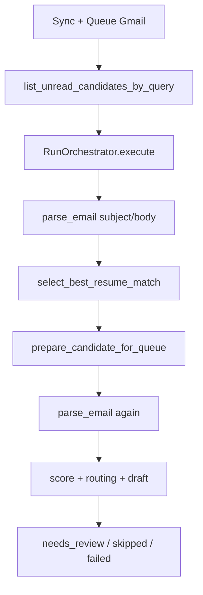
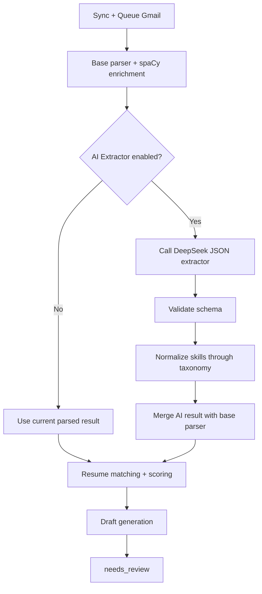
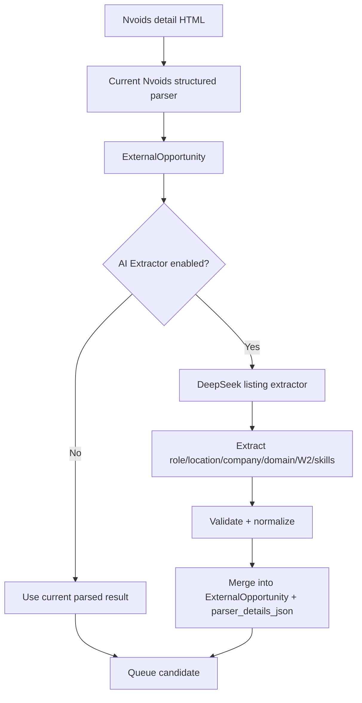
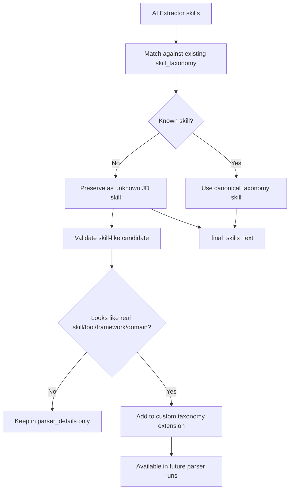

Yes, this is **feasible** in the current `origin/semantic-embeddings` branch.

The clean way is to add a new toggle called **AI Extractor** that controls only parsing/enrichment, separate from **Enable AI Features**, which currently controls AI draft generation. The same DeepSeek credentials/model can be reused, but the parser should use a separate JSON-mode extraction function, not the current free-text draft function.

## 1. High-level overview of the application

CODEJOB already has three relevant layers:

```text id="df2vfd"
1. Rule parser / spaCy enrichment
2. Resume matching + ATS scoring
3. DeepSeek draft generation
```

The current parser already has a `spacy_enrichment_v1` path. `phase0.py` imports `enrich_job_text()` and `enrichment_to_payload()` from `app.parsing.spacy_enrichment`, then merges base parser output with enrichment output inside `parse_email_with_details()`.

The current AI draft path already uses DeepSeek through `generate_reply_with_ai_or_fallback()` and `deepseek_chat_completion()`.

So the architecture already has enough foundation to add **AI Extractor** safely.

## 2. Repository structure involved

The feature would touch these areas conceptually:

```text id="d8nrxq"
Backend settings:
- backend/app/models.py
- backend/app/schemas.py
- backend/app/main.py
- backend/app/services/settings_bootstrap_service.py
- backend/app/db.py / SQLite column patching if used

Parser / extraction:
- backend/app/phase0.py
- backend/app/parsing/spacy_enrichment.py
- new backend/app/ai/jd_extractor_service.py

DeepSeek client:
- backend/app/ai/deepseek_client.py

Gmail queue flow:
- backend/app/services/orchestration_service.py
- backend/app/automation/run_orchestrator.py
- backend/app/automation/queue_preparation.py

Nvoids flow:
- backend/app/external_feeds/parser.py
- backend/app/external_feeds/service.py

Frontend:
- dashboard/src/App.tsx
- dashboard/src/features/ai/types.ts
- dashboard/src/features/ai/state.ts
```

## 3. Main technologies used

This is compatible with the current stack:

```text id="iul89d"
FastAPI backend
SQLAlchemy models
Pydantic schemas
React frontend
DeepSeek via OpenAI-compatible client
Existing spaCy enrichment
Existing taxonomy-based skill extraction
SQLite runtime patching / DB migration style
```

DeepSeek is already configured in backend settings with `deepseek_api_key`, `deepseek_base_url`, `deepseek_model_fast`, `deepseek_timeout_seconds`, and `feature_deepseek_enabled`.

## 4. Core feature proposal

Add a third toggle under **Automation Filters**:

```text id="rw1loj"
Enable AI Features          -> controls AI draft writing
Enable AI Extractor         -> controls DeepSeek structured JD/listing extraction
Enable Semantic Matching    -> controls embedding-based resume matching
```

This is important because **AI drafting and AI parsing are different risks**.

Right now, `feature_ai_enabled` is used inside `prepare_candidate_for_queue()` to decide whether DeepSeek should generate the reply draft.

So do **not** reuse `feature_ai_enabled` for extraction. Add a new setting:

```text id="ypplfa"
feature_ai_extractor_enabled
```

That way you can run:

```text id="z7fi8c"
AI Extractor ON, AI Drafting OFF
```

or:

```text id="fs1qdi"
AI Extractor OFF, AI Drafting ON
```

## 5. Architecture and code flow

### Current Gmail flow

Current Gmail flow is:



`RunOrchestrator` already receives `parse_email` as a dependency, so this is a good insertion point.

### Proposed Gmail flow



### Current Nvoids flow

Nvoids already has a separate parser path:

```text id="z58cds"
sync_nvoids()
→ parse_listing_rows()
→ fetch_detail_page()
→ parse_external_post()
→ save ExternalOpportunity
→ _enqueue_needs_review_candidate()
→ parse_email_with_details(source="nvoids")
→ prepare_candidate_for_queue()
```

This is visible in `ExternalFeedService.sync_nvoids()`, where it parses the listing, saves `ExternalOpportunity`, and then queues it.

Then `_enqueue_needs_review_candidate()` calls `parse_email_with_details()` with `source="nvoids"` and passes source hints like canonical title, canonical location, company, work mode, and visa hints.

### Proposed Nvoids flow



This is exactly where your current Nvoids issue should be fixed, because the PDF showed the system trusting the title location `Remote, Remote, USA` instead of body location `Jersey City New Jersey`.

## 6. Important files and folders

### Backend settings

`UserSettings` currently has `feature_ai_enabled` and `feature_semantic_enabled`, but no AI extractor flag.

`SettingsRequest` and `SettingsResponse` also currently expose `feature_ai_enabled` and `feature_semantic_enabled`, but not an extractor toggle.

`update_settings()` saves those existing toggles here:

```text id="wb5vq1"
s.feature_ai_enabled = payload.feature_ai_enabled
s.feature_semantic_enabled = payload.feature_semantic_enabled
```

So the new flag needs to be added consistently in all three places:

```text id="fof4gd"
UserSettings
SettingsRequest
SettingsResponse
_settings_response_from_model()
update_settings()
frontend SettingsPayload
```

### Frontend UI

The Automation Filters card currently renders:

```text id="7fzp76"
Enable AI Features
Enable Semantic Matching
Qualification Threshold
Must-have Skills
```

in `dashboard/src/App.tsx`.

So the AI Extractor toggle belongs between AI Features and Semantic Matching:

```text id="u1q8ps"
Enable AI Features
Enable AI Extractor
Enable Semantic Matching
```

### DeepSeek client

Current DeepSeek client is built for normal text completion:

```text id="9svaw5"
deepseek_chat_completion(system_prompt, user_prompt)
```

It does not currently enforce JSON mode.

So the AI extractor should use a new function conceptually like:

```text id="p3oeua"
deepseek_json_completion()
```

not reuse the draft function directly.

### Parser details storage

This branch already has:

```text id="okcbr4"
RecruiterEmail.parser_details_json
```

and the frontend already displays parser details, as shown in your screenshot. That is very useful. The AI extractor should write into the same parser details object:

```json id="jcvzke"
{
  "parser_version": "ai_extractor_v1",
  "base_parser_result": {},
  "spacy_enrichment_result": {},
  "ai_extractor_result": {},
  "merged_result": {},
  "merge_notes": []
}
```

## 7. How the application likely runs after this

When **AI Extractor OFF**:

```text id="r48fwl"
Same behavior as today.
Rule parser + spaCy enrichment + taxonomy extraction.
No DeepSeek call for parsing.
```

When **AI Extractor ON**:

```text id="t9npyx"
Parser runs current deterministic parser first.
If parser result is weak or source is Nvoids, DeepSeek extracts structured JSON.
AI result is validated.
Skills are normalized through skill_taxonomy.
Merged result goes into scoring/drafting.
parser_details_json records base/spaCy/AI/merge output.
```

Important: DeepSeek should not blindly overwrite everything. The merge priority should be controlled.

Recommended merge priority:

```text id="d7dfh9"
Role:
Nvoids canonical body role > AI role > current parser role > title fallback

Location:
explicit body Location field > AI canonical_location > source title location

Work mode:
explicit body remote/hybrid/onsite > source title only if no conflict

Skills:
current taxonomy skills + AI mandatory_skills + AI nice_to_have_skills
then normalize through skill_taxonomy.json

Company:
From block company > explicit company/client field > email domain-derived company

Domain:
explicit domain phrase > AI domain classification > empty
```

## 8. Key observations for the human

### Feasibility verdict

```text id="qx44pz"
Feasible: Yes.
Risk level: Medium.
Best approach: Add AI Extractor as optional enrichment, not as replacement parser.
```

### Why it is feasible

The codebase already has most of the plumbing:

```text id="ylv5tv"
DeepSeek client exists
AI draft generation exists
Settings toggle pattern exists
Parser details JSON exists
spaCy enrichment layer exists
Nvoids already passes source_hints
Queue preparation supports parsed_overrides
```

`QueuePreparationRequest` already has `parsed_overrides`, which is useful for merging enriched/AI parsed results without breaking the rest of the scoring pipeline.

### The biggest implementation risk

The current pipeline parses twice:

```text id="4y8h1h"
RunOrchestrator.execute() parses once for resume selection
prepare_candidate_for_queue() parses again for final queue preparation
```

If AI Extractor is added naively, it may call DeepSeek twice per email/listing. That would increase latency and cost.

The plan should avoid that by:

```text id="9433ld"
parse once
cache or pass parsed result forward
use parsed_overrides
store parser_details_json
```

### The best implementation plan

```text id="zvp6dc"
Phase 1: Add settings flag
- feature_ai_extractor_enabled in DB model
- schema request/response
- settings GET/PUT
- frontend SettingsPayload
- Automation Filters toggle

Phase 2: Add DeepSeek JSON extractor service
- New jd_extractor_service.py
- Strict JSON schema
- No draft language
- Low temperature
- Timeout-safe
- Return structured fields only

Phase 3: Add parser wrapper
- parse_email_with_ai_details()
- Current base parser first
- spaCy enrichment second
- AI extractor only if toggle enabled
- Validate and normalize output
- Merge with deterministic output

Phase 4: Wire Gmail flow
- Replace plain parse dependency with extractor-aware parser dependency
- Avoid duplicate DeepSeek calls between RunOrchestrator and QueuePreparation
- Preserve existing output keys

Phase 5: Wire Nvoids flow
- Use current Nvoids parser first
- AI extractor reads full detail body/table text
- Extract canonical_title, canonical_location, company, company_domain, domain, W2/C2C, experience, must-have, nice-to-have
- Store in ExternalOpportunity and parser_details_json

Phase 6: Add tests
- Gmail JD with “Please share resume” near top
- Nvoids listing with Remote title but Jersey City body location
- W2-only extraction
- company/domain extraction from From block
- Payments preferred domain extraction
- AI extractor OFF regression test
```

### Final recommendation

Build the toggle, but do not make it replace the current parser.

Best final architecture:

```text id="oo0mci"
Current parser = safety layer
spaCy enrichment = local deterministic improvement
AI Extractor = optional intelligent enrichment
Taxonomy normalization = final guardrail
Existing scoring/drafting = unchanged
```

This gives you better extraction from messy Nvoids listings and emails without breaking the current Sync + Queue pipeline.

Below is the comparison for the **same Nvoids listing from Job Details.pdf**.

The listing clearly contains more data than the current parser captured: role, Jersey City location, W2-only rule, 8+ years, backend/no UI, AWS services, Kafka, AI exposure, Temporal, Grafana, and Payments preferred.

## 1. Current enriched parser output

This is what your screenshot shows the current parser extracted:

```json id="current-parser-output"
{
  "parser_version": "spacy_enrichment_v1",
  "source": "nvoids",

  "final_extracted_result": {
    "role": "Urgent Hiring :- Senior Java Software Engineer at Remote, Remote, USA",
    "location": "remote",
    "job_location_text": "unknown",
    "salary_text": "not_specified",
    "skills_text": "Java",
    "f2f_mentioned": false,
    "asks_contact_fields": false,
    "is_texas_role": false
  },

  "base_parser_result": {
    "role": "Software Engineer",
    "location": "remote",
    "job_location_text": "unknown",
    "salary_text": "not_specified",
    "skills_text": "Java",
    "f2f_mentioned": false,
    "asks_contact_fields": false,
    "is_texas_role": false
  },

  "enrichment_result": {
    "role_candidates": [
      "Urgent Hiring :- Senior Java Software Engineer at Remote, Remote, USA",
      "Software Engineer"
    ],
    "company": "Remote, Remote, USA",
    "primary_location": "Remote, Remote, USA",
    "mentioned_locations": [
      "Remote, Remote, USA",
      "Remote, Remote"
    ],
    "work_mode": "Remote",
    "visa_hints": [],
    "experience_years_min": null,
    "skills_text": "Java",
    "confidence": 0.63,
    "evidence": {
      "skill_hits": ["Java"],
      "company": ["Remote, Remote, USA"],
      "work_mode": ["Remote"],
      "canonical_title": [
        "Urgent Hiring :- Senior Java Software Engineer at Remote, Remote, USA"
      ]
    }
  },

  "merge_notes": [
    "used enrichment role candidate because base role was weak or source-locked"
  ],

  "source_hints": {
    "canonical_title": "Urgent Hiring :- Senior Java Software Engineer at Remote, Remote, USA",
    "canonical_location": "Remote, Remote, USA",
    "work_mode": "Remote"
  }
}
```

Why this happened: the current Nvoids bridge passes source hints into `parse_email_with_details()`, including canonical title/location/work mode.  Then `parse_email_with_details()` merges base parser + spaCy enrichment, but only replaces location when the base location is weak; because base location became `remote`, it does not get corrected to Jersey City.

## 2. Expected AI parser output

This is what an **AI Extractor** should return from the same listing:

```json id="expected-ai-parser-output"
{
  "parser_version": "ai_extractor_v1",
  "source": "nvoids",

  "job_identity": {
    "job_id": "3463214",
    "uid": "1d20f6383fe345d9bf4a60de38e47ad2",
    "source_title": "Urgent Hiring :- Senior Java Software Engineer at Remote, Remote, USA",
    "canonical_title": "Senior Java Software Engineer",
    "role": "Senior Java Software Engineer"
  },

  "location": {
    "source_location": "Remote, Remote, USA",
    "job_detail_location": "Jersey City, New Jersey",
    "canonical_location": "Jersey City, New Jersey",
    "work_mode": "unclear",
    "location_conflict": true,
    "location_conflict_reason": "Nvoids title says Remote, Remote, USA, but the job body explicitly says Location :- Jersey City New Jersey."
  },

  "company_and_recruiter": {
    "recruiter_name": "Pankaj",
    "recruiter_email": "pankaj@heliogic.com",
    "reply_to": "pankaj@heliogic.com",
    "recruiter_company": "Heliogic",
    "company_domain": "heliogic.com",
    "client_company": "not_specified"
  },

  "employment_terms": {
    "employment_type": "W2",
    "visa_or_tax_terms": "W2 Candidates only",
    "c2c_allowed": false,
    "duration": "not_specified",
    "salary_text": "not_specified",
    "rate_text": "not_specified"
  },

  "experience": {
    "experience_years_min": 8,
    "experience_text": "8+ years"
  },

  "role_requirements": {
    "backend_frontend_split": {
      "backend": "100%",
      "frontend": "0%",
      "note": "All backend, no UI."
    },
    "hands_on_coding": "80% hands on code",
    "system_design_required": true
  },

  "must_have_skills": [
    "Java",
    "Spring Boot",
    "Microservices",
    "AWS",
    "ECS",
    "SQS",
    "EC2",
    "S3",
    "Kafka",
    "System Design",
    "Backend Development"
  ],

  "nice_to_have_skills": [
    "Temporal",
    "Java Tools",
    "Advanced AI",
    "Grafana",
    "Payments Experience"
  ],

  "ai_requirement": {
    "required": true,
    "required_level": "some exposure",
    "details": "Some exposure to using AI for software development",
    "advanced_ai": "nice_to_have"
  },

  "domain_details": {
    "primary_domain": "Backend Software Engineering",
    "preferred_domain": "Payments",
    "domain_requirement_strength": "preferred"
  },

  "normalized_skills_text": "Java, Spring Boot, Microservices, AWS, ECS, SQS, EC2, S3, Kafka, System Design, Backend Development, AI-Assisted Development, Temporal, Grafana, Payments",

  "links": {
    "short_url": "http://bit.ly/4ey8w48",
    "nvoids_url": "https://jobs.nvoids.com/job_details.jsp?id=3463214&uid=1d20f6383fe345d9bf4a60de38e47ad2"
  },

  "posted_at": "08:26 PM 19-Jun-26",

  "confidence": 0.92,

  "merge_recommendation": {
    "role": "overwrite_current",
    "location": "overwrite_current",
    "work_mode": "downgrade_from_remote_to_unclear",
    "skills_text": "overwrite_or_merge",
    "company": "overwrite_current",
    "visa_hints": "overwrite_current",
    "experience_years_min": "add_new_field"
  }
}
```

## 3. Main difference

| Field             | Current parser                                                          | Expected AI parser                                                                                                       |
| ----------------- | ----------------------------------------------------------------------- | ------------------------------------------------------------------------------------------------------------------------ |
| Role              | `Urgent Hiring :- Senior Java Software Engineer at Remote, Remote, USA` | `Senior Java Software Engineer`                                                                                          |
| Location          | `remote`                                                                | `Jersey City, New Jersey`                                                                                                |
| Work mode         | `Remote`                                                                | `unclear` because title and body conflict                                                                                |
| Company           | `Remote, Remote, USA`                                                   | `Heliogic`                                                                                                               |
| Company domain    | missing                                                                 | `heliogic.com`                                                                                                           |
| Employment type   | missing                                                                 | `W2`                                                                                                                     |
| Visa/tax rule     | missing                                                                 | `W2 Candidates only`                                                                                                     |
| Experience        | missing                                                                 | `8+ years`                                                                                                               |
| Skills            | `Java` only                                                             | Java, Spring Boot, Microservices, AWS, ECS, SQS, EC2, S3, Kafka, System Design, AI exposure, Temporal, Grafana, Payments |
| Domain            | missing                                                                 | Payments preferred                                                                                                       |
| Location conflict | missing                                                                 | `true`                                                                                                                   |

## 4. Exact gap

The current parser is not failing because there is no information. It is failing because it is treating the **Nvoids title** as the strongest source.

For this listing, the correct priority should be:

```text id="correct-priority"
body Location field > Nvoids title location
From block company > title-derived company
Must Have section > generic full-text skill scan
Nice to Have section > preferred skills
email domain > company_domain
```

The AI parser should not just extract more fields; it should also produce a **source-priority decision**, especially for conflicts like:

```text id="conflict-example"
Title says: Remote, Remote, USA
Body says: Location :- Jersey City New Jersey
```

That conflict is exactly why the AI Extractor toggle is useful here.

Yes — you are **100% right**.

If we implement “normalize skills through `skill_taxonomy`” in the strict way, then skills **not present in the hardcoded taxonomy can get dropped**. That would be a bad design.

In the current code, the spaCy enrichment path is already taxonomy-dependent: it calls `extract_taxonomy_skills(combined_text)` and then builds `skills_text` only from matched taxonomy entries.  Then `parse_email_with_details()` normalizes enriched skills with `preserve_unknown=False`, which means unknown extracted skills are not protected in that enrichment path.

So the Codex plan should be corrected.

## Correct rule

Do **not** make taxonomy the source of truth.

Use taxonomy only as a **canonicalization/helper layer**.

The source of truth should be:

```text
1. Explicit JD text
2. AI-extracted skills from the JD
3. Existing taxonomy canonical matches
```

The final skill output should preserve both:

```text
known/canonical skills + unknown/raw skills mentioned in the JD
```

## Better design

Instead of this:

```text
AI skills → normalize through taxonomy → final skills
```

Use this:

```text
AI skills
→ match known taxonomy aliases where possible
→ preserve unknown skills as raw extracted skills
→ combine known + unknown
→ final skills_text
```

## Updated expected output shape

AI Extractor should return:

```json
{
  "must_have_skills": [
    "Java",
    "Spring Boot",
    "Microservices",
    "AWS",
    "ECS",
    "SQS",
    "EC2",
    "S3",
    "Kafka",
    "System Design",
    "Backend Development"
  ],
  "nice_to_have_skills": [
    "Temporal Java tools",
    "Advanced AI",
    "Grafana",
    "Payments experience"
  ],
  "taxonomy_matched_skills": [
    "Java",
    "Spring Boot",
    "Microservices",
    "AWS",
    "Kafka"
  ],
  "unknown_or_non_taxonomy_skills": [
    "ECS",
    "SQS",
    "EC2",
    "S3",
    "Temporal Java tools",
    "Advanced AI",
    "Grafana",
    "Payments experience"
  ],
  "final_skills_text": "Java, Spring Boot, Microservices, AWS, ECS, SQS, EC2, S3, Kafka, System Design, Backend Development, Temporal Java tools, Advanced AI, Grafana, Payments experience"
}
```

## Change the Codex instruction

Replace this line:

```text
Normalize skills through skill_taxonomy.
```

with this:

```text
Use skill_taxonomy only to canonicalize known skills and aliases. Do not drop skills that are explicitly mentioned in the JD but missing from skill_taxonomy. Preserve those as unknown_or_non_taxonomy_skills and include them in final_skills_text.
```

## Add this to the implementation plan

````markdown
## Skill Taxonomy Guardrail

Important: `skill_taxonomy.json` is not the complete source of truth for all possible skills.

The AI Extractor must not discard skills simply because they are missing from `skill_taxonomy`.

Use taxonomy for:
- canonical naming
- alias resolution
- deduplication
- scoring hints
- grouping known skills

Do not use taxonomy for:
- filtering out explicitly mentioned JD skills
- deciding that an unknown skill is invalid
- removing new technologies, vendor tools, cloud services, frameworks, or domain skills

The final extractor should produce:

```json
{
  "taxonomy_matched_skills": [],
  "unknown_or_non_taxonomy_skills": [],
  "must_have_skills": [],
  "nice_to_have_skills": [],
  "final_skills_text": ""
}
````

Merge rule:

```text
final_skills_text =
taxonomy_matched_skills
+ unknown_or_non_taxonomy_skills explicitly mentioned in the JD
+ nice_to_have skills, marked as preferred when possible
```

Unknown skills should still be visible in:

* parser_details_json
* Needs Review “View Details”
* semantic matching input
* draft prompt context

Unknown skills may receive lower deterministic taxonomy score, but they should still help semantic matching and AI draft generation.

````

## Final answer

Yes, if coded carelessly, missing taxonomy skills would be disregarded.

The correct architecture is:

```text
AI Extractor = source of extracted JD skills
skill_taxonomy = canonicalization helper
final_skills_text = known taxonomy skills + preserved unknown JD skills
````

So Codex must be told clearly: **taxonomy should clean and standardize skills, not delete unknown skills.**

Yes — that is the right direction, but with one important guardrail:

```text id="7ydb3j"
Do not let AI blindly rewrite skill_taxonomy.json on every parse.
Instead:
AI extracts unknown skills
→ preserve them in final_skills_text immediately
→ add them to an extensible taxonomy layer
→ use them in future parses
```

The base `skill_taxonomy.json` should remain the **seed dictionary**, not the full source of truth. The taxonomy should become:

```text id="h4d763"
base taxonomy from skill_taxonomy.json
+ learned/custom taxonomy entries from AI-extracted unknown skills
```

## Why direct auto-append is risky

If DeepSeek extracts everything and appends directly, junk can enter the dictionary:

```text id="b2xuq2"
W2
8+ years
Jersey City
80% hands on code
Remote
Pankaj
Heliogic
```

Those are useful extracted fields, but they are **not skills**.

So Codex should implement **taxonomy expansion with validation**, not blind appending.

## Correct architecture



## Best implementation choice

Instead of editing `backend/app/data/skill_taxonomy.json` at runtime, add a **custom taxonomy extension**.

Preferred:

```text id="9l7s1g"
Database table: skill_taxonomy_extensions
```

or simpler:

```text id="vvc8gm"
backend/app/data/custom_skill_taxonomy.json
```

But database is better because the app can update it safely during runtime.

## Add this to the Codex plan

Paste this as an addendum to the implementation plan you already have. It updates the earlier “taxonomy normalization” rule from the uploaded plan.

````markdown id="taxonomy-extension-addendum"
## Taxonomy Extension Requirement

Important: `skill_taxonomy.json` is only the seed taxonomy. It is not the permanent source of truth for every possible skill.

The AI Extractor must support extensible taxonomy learning.

### Required behavior

When AI Extractor finds skills that are explicitly present in the JD but missing from `skill_taxonomy.json`:

1. Preserve them immediately in `final_skills_text`.
2. Store them in `unknown_or_non_taxonomy_skills`.
3. Validate whether they look like real skills/tools/frameworks/cloud services/domain skills.
4. Add valid new skills into a custom taxonomy extension layer.
5. Load base taxonomy + custom taxonomy extension during future extraction.

### Do not discard unknown skills

Do not do this:

```text
AI skills → taxonomy match only → drop unknown skills
````

Do this instead:

```text
AI skills
→ taxonomy match known aliases
→ preserve unknown explicit JD skills
→ validate skill-like unknowns
→ append valid new skills to custom taxonomy extension
→ final_skills_text = known canonical skills + valid unknown skills
```

### Suggested storage model

Create a new persistence layer for learned skills.

Preferred table:

```text
skill_taxonomy_extensions
```

Suggested fields:

```text
id
owner_id
canonical_name
normalized_name
aliases_json
category
cluster_id
source
source_type
first_seen_at
last_seen_at
seen_count
confidence
status
evidence_json
created_at
updated_at
```

Suggested `status` values:

```text
pending
approved
rejected
auto_approved
```

### Validation rules

Before adding a new skill candidate, reject obvious non-skills:

```text
locations
person names
company names
recruiter names
emails
employment types like W2/C2C/1099
years of experience
salary/rate text
generic phrases like "hands on code"
work modes like remote/hybrid/onsite
```

Accept likely skill candidates such as:

```text
cloud services: ECS, SQS, EC2, S3
tools: Grafana, AppDynamics, Splunk
frameworks: Temporal
technical concepts: System Design, Backend Development
domain skills: Payments, Capital Markets, Healthcare
AI skills: AI-Assisted Development, Advanced AI
```

### Runtime loading

Update taxonomy loading so the parser uses:

```text
base skill_taxonomy.json
+ approved custom taxonomy extensions
+ optional auto_approved high-confidence extensions
```

### Immediate current-run behavior

Even before a skill is approved into taxonomy, it must still appear in:

```text
parser_details_json
final_skills_text
Needs Review View Details
semantic matching input
draft prompt context
```

This prevents new skills from being lost.

### Example

For this Nvoids listing:

```text
Java Spring Boot Microservices
AWS ECS, SQS, EC2, S3
Kafka
Some exposure to using AI for software development
Nice to Have:
Temporal Java tools
Advanced AI
Graphana
Payments experience preferred
```

If current taxonomy only knows Java, Spring Boot, Microservices, AWS, Kafka, then AI Extractor should output:

```json
{
  "taxonomy_matched_skills": [
    "Java",
    "Spring Boot",
    "Microservices",
    "AWS",
    "Kafka"
  ],
  "unknown_or_non_taxonomy_skills": [
    "ECS",
    "SQS",
    "EC2",
    "S3",
    "Temporal",
    "Grafana",
    "Advanced AI",
    "Payments"
  ],
  "new_taxonomy_candidates": [
    {
      "canonical_name": "ECS",
      "category": "cloud",
      "source": "ai_extractor",
      "evidence": "AWS (cert needed, or willing to obtain CP cert) ECS, SQS, EC2, S3"
    },
    {
      "canonical_name": "SQS",
      "category": "cloud",
      "source": "ai_extractor",
      "evidence": "AWS (cert needed, or willing to obtain CP cert) ECS, SQS, EC2, S3"
    },
    {
      "canonical_name": "Temporal",
      "category": "backend",
      "source": "ai_extractor",
      "evidence": "Nice to Have: Temporal Java tools"
    },
    {
      "canonical_name": "Grafana",
      "category": "observability",
      "source": "ai_extractor",
      "evidence": "Nice to Have: Graphana"
    },
    {
      "canonical_name": "Payments",
      "category": "domain_payments",
      "source": "ai_extractor",
      "evidence": "Payments experience preferred"
    }
  ],
  "final_skills_text": "Java, Spring Boot, Microservices, AWS, ECS, SQS, EC2, S3, Kafka, System Design, Backend Development, AI-Assisted Development, Temporal, Grafana, Payments"
}
```

### Typo handling

AI Extractor should preserve evidence but canonicalize obvious typo variants:

```text
Graphana → Grafana
Springboot → Spring Boot
K8s → Kubernetes
RESTful APIs → REST APIs
```

Store the typo as an alias:

```json
{
  "canonical_name": "Grafana",
  "aliases": ["Graphana"]
}
```

### Guardrail

Never let the AI Extractor delete or overwrite the base taxonomy.

The extension layer should be additive only.

````

## Final corrected design

Your updated rule should be:

```text id="sf9kpc"
AI Extractor = discovers skills from JD
skill_taxonomy = canonicalizes known skills
custom taxonomy extension = learns new valid skills
final_skills_text = known canonical skills + newly discovered JD skills
````

That prevents the parser from becoming stale while still avoiding garbage getting permanently added as “skills.”

Yes — **Upgrade Skills** is the better design than silently appending unknown skills.

The safest UX should be:

```text id="x8ud01"
AI Extractor finds skills not in taxonomy
→ preserve them in candidate parser details immediately
→ show them in Upgrade Skills UI
→ user reviews/edits/removes them
→ user clicks Upgrade
→ approved skills are added to custom taxonomy extension
→ future parser runs use them
```

Do **not** let AI directly rewrite `skill_taxonomy.json`. The uploaded implementation plan already says the AI Extractor should be optional and should preserve parser details; this new layer becomes the manual approval gate for taxonomy growth.

## Recommended UI placement

Add this inside the same **Automation Filters** card:

```text id="hrc07o"
Enable AI Features
Enable AI Extractor
Enable Semantic Matching
Qualification Threshold
Must-have Skills
Upgrade Skills
```

The **Upgrade Skills** section can look like:

```text id="ypbtg0"
Upgrade Skills
[View Details]

When expanded:
Detected new skills not in taxonomy:
[ ECS        x ]
[ SQS        x ]
[ EC2        x ]
[ S3         x ]
[ Temporal   x ]
[ Grafana    x ]
[ Payments   x ]

[Add skill manually...]
[Upgrade Selected Skills]
```

## Codex-ready addendum

Paste this after the earlier AI Extractor plan:

````markdown id="codex-upgrade-skills-addendum"
# Addendum: Upgrade Skills UI + Manual Taxonomy Extension

## Goal

Add a new UI layer called **Upgrade Skills** inside the existing **Automation Filters** card.

This layer allows the user to review, edit, approve, and upgrade newly extracted skills that are not currently present in the taxonomy.

Do not let AI blindly modify `skill_taxonomy.json`.

The flow must be:

```text
AI Extractor finds unknown skills
→ preserve unknown skills in final_skills_text immediately
→ store unknown skills as taxonomy candidates
→ show them in Upgrade Skills UI
→ user edits/removes/approves candidates
→ user clicks Upgrade
→ approved skills are added to a custom taxonomy extension layer
→ future parser runs use base taxonomy + approved custom skills
````

---

## Why this is needed

`skill_taxonomy.json` is a hardcoded seed dictionary. It can miss tools, frameworks, cloud services, products, and domain terms.

Example Nvoids listing contains:

```text
AWS ECS, SQS, EC2, S3
Temporal Java tools
Graphana
Payments experience preferred
```

If these are missing from the current taxonomy, they must not be discarded.

They should be shown as candidate skills:

```text
ECS
SQS
EC2
S3
Temporal
Grafana
Payments
```

The user should be able to manually approve them into the taxonomy.

---

## UI Requirements

Update:

```text
dashboard/src/App.tsx
dashboard/src/features/ai/types.ts
dashboard/src/features/ai/state.ts
```

Inside the **Automation Filters** card, render:

```text
Enable AI Features
Enable AI Extractor
Enable Semantic Matching
Qualification Threshold
Must-have Skills
Upgrade Skills
```

The **Upgrade Skills** section should have:

```text
Upgrade Skills
[View Details]
```

When collapsed:

* Show only the label, candidate count, and View Details button.

Example:

```text
Upgrade Skills                    7 new
[View Details]
```

When expanded:

* Show editable chips or editable rows for unknown/new skills.
* Each skill should be removable.
* User should be able to edit skill text before approval.
* User should be able to add a skill manually.
* User should be able to select/deselect skills.
* Include button: `Upgrade Selected Skills`.

Example:

```text
Detected skills not in taxonomy

[x] ECS
[x] SQS
[x] EC2
[x] S3
[x] Temporal
[x] Grafana
[x] Payments

[Add skill...]
[Upgrade Selected Skills]
```

After successful upgrade:

* Remove upgraded skills from pending list.
* Show success message.
* Refresh pending candidates.
* Future parser runs should recognize the upgraded skills.

---

## Backend Persistence

Do not edit `backend/app/data/skill_taxonomy.json` at runtime.

Create a custom taxonomy extension layer.

Preferred DB table:

```text
skill_taxonomy_extensions
```

Suggested fields:

```text
id
owner_id
canonical_name
normalized_name
aliases_json
category
cluster_id
source
source_type
first_seen_at
last_seen_at
seen_count
confidence
status
evidence_json
created_at
updated_at
```

Allowed status values:

```text
pending
approved
rejected
auto_approved
```

Initial unknown AI-extracted skills should be inserted as:

```text
status = pending
source = ai_extractor
source_type = gmail or nvoids
```

When user clicks `Upgrade Selected Skills`, selected skills should become:

```text
status = approved
```

---

## Backend API Requirements

Add endpoints conceptually like:

```text
GET /settings/skill-taxonomy-candidates
POST /settings/skill-taxonomy-candidates
PATCH /settings/skill-taxonomy-candidates/{id}
POST /settings/skill-taxonomy-candidates/upgrade
DELETE /settings/skill-taxonomy-candidates/{id}
```

### GET `/settings/skill-taxonomy-candidates`

Returns pending unknown skills.

Response shape:

```json
[
  {
    "id": 1,
    "canonical_name": "ECS",
    "normalized_name": "ecs",
    "aliases": [],
    "category": "cloud",
    "source": "ai_extractor",
    "source_type": "nvoids",
    "seen_count": 3,
    "confidence": 0.88,
    "status": "pending",
    "evidence": [
      "AWS ECS, SQS, EC2, S3"
    ]
  }
]
```

### POST `/settings/skill-taxonomy-candidates`

Allows user to manually add a candidate from the UI.

### PATCH `/settings/skill-taxonomy-candidates/{id}`

Allows editing:

```json
{
  "canonical_name": "Grafana",
  "aliases": ["Graphana"],
  "category": "observability"
}
```

### POST `/settings/skill-taxonomy-candidates/upgrade`

Approves selected skills.

Request:

```json
{
  "ids": [1, 2, 3]
}
```

Expected behavior:

* Set selected candidates to `approved`.
* Approved skills become available to taxonomy loader.
* Do not duplicate existing taxonomy entries.

### DELETE `/settings/skill-taxonomy-candidates/{id}`

Removes or rejects a pending candidate.

Prefer marking as:

```text
status = rejected
```

instead of hard deleting, so the same junk skill does not keep coming back.

---

## Parser / Extractor Requirements

When AI Extractor finds unknown skills:

```json
{
  "taxonomy_matched_skills": ["Java", "Spring Boot", "AWS", "Kafka"],
  "unknown_or_non_taxonomy_skills": ["ECS", "SQS", "EC2", "S3", "Temporal", "Grafana", "Payments"],
  "new_taxonomy_candidates": [
    {
      "canonical_name": "ECS",
      "category": "cloud",
      "evidence": "AWS ECS, SQS, EC2, S3"
    }
  ],
  "final_skills_text": "Java, Spring Boot, AWS, ECS, SQS, EC2, S3, Kafka, Temporal, Grafana, Payments"
}
```

Rules:

* Unknown skills must remain in `final_skills_text`.
* Unknown skills must appear in `parser_details_json`.
* Unknown skills must be inserted/updated as pending taxonomy candidates.
* Unknown skills must be visible in the Upgrade Skills UI.
* AI must not directly approve skills.
* User approval is required before unknown skills become part of reusable taxonomy.

---

## Taxonomy Loading Requirement

Update taxonomy loading so future parser runs use:

```text
base skill_taxonomy.json
+ approved custom taxonomy extensions
+ optional auto_approved high-confidence extensions
```

Do not delete or overwrite the base taxonomy.

The extension layer is additive only.

---

## Validation Guardrails

Reject obvious non-skills before creating pending candidates:

```text
locations
person names
company names
recruiter names
emails
phone numbers
W2
C2C
1099
OPT
H1B
8+ years
salary/rate text
remote
hybrid
onsite
80% hands on code
```

Accept likely skill/tool/domain candidates:

```text
ECS
SQS
EC2
S3
Temporal
Grafana
AppDynamics
Splunk
System Design
Backend Development
Payments
Capital Markets
Healthcare
AI-Assisted Development
Advanced AI
```

Typo handling:

* If AI extracts `Graphana`, suggest canonical `Grafana`.
* Store typo as alias.

Example:

```json
{
  "canonical_name": "Grafana",
  "aliases": ["Graphana"],
  "category": "observability"
}
```

---

## Candidate Details UI Integration

The existing Needs Review card already has parser details.

Extend parser details to show:

```json
{
  "taxonomy_matched_skills": [],
  "unknown_or_non_taxonomy_skills": [],
  "new_taxonomy_candidates": [],
  "final_skills_text": ""
}
```

The user should be able to see which skills were:

* already known by taxonomy
* newly extracted by AI
* pending upgrade
* approved into taxonomy

---

## Acceptance Criteria

### 1. AI Extractor finds unknown skills

Given a JD with:

```text
AWS ECS, SQS, EC2, S3
Temporal Java tools
Graphana
Payments experience preferred
```

If those are missing from taxonomy, system should create pending candidates:

```text
ECS
SQS
EC2
S3
Temporal
Grafana
Payments
```

### 2. Unknown skills are not dropped

Even before approval, final candidate skills should include unknown skills.

Expected:

```text
Java, Spring Boot, Microservices, AWS, ECS, SQS, EC2, S3, Kafka, Temporal, Grafana, Payments
```

### 3. User can edit before upgrading

User can change:

```text
Graphana
```

to:

```text
Grafana
```

and add alias:

```text
Graphana
```

### 4. User can approve selected skills

When user clicks `Upgrade Selected Skills`, selected skills become `approved`.

### 5. Future parser runs use approved skills

After approval, the parser should treat approved custom skills like taxonomy skills.

### 6. Rejected junk does not reappear endlessly

If user rejects `W2` or `8+ years`, the system should not keep creating the same pending candidate repeatedly.

---

## Non-goals

Do not:

* Rewrite `skill_taxonomy.json` at runtime.
* Let AI auto-approve taxonomy changes.
* Drop unknown JD skills.
* Treat taxonomy as the only source of truth.
* Add locations, names, emails, visa terms, or years as skills.
* Break existing parser behavior when AI Extractor is OFF.

````

## Final recommendation

Yes, add **Upgrade Skills** inside **Automation Filters**.

The best final design becomes:

```text id="ktqfkr"
AI Extractor toggle = controls extraction
Upgrade Skills layer = controls taxonomy growth
skill_taxonomy.json = seed dictionary
custom taxonomy extensions = approved learned skills
final_skills_text = known skills + newly extracted skills
````

This gives you an extensible parser without letting AI pollute the taxonomy automatically.
