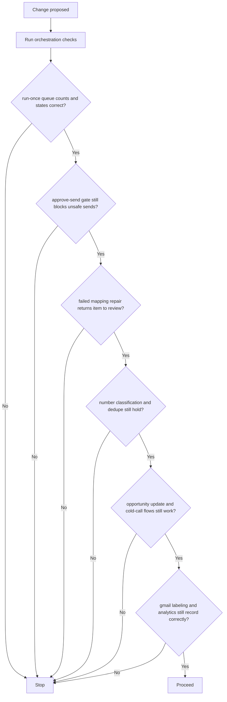

# CODEJOB Test and Validation Matrix (Current Branch)

## 1. Repository validation commands

### Backend

From `backend/`:

- `python -m pytest`

### Dashboard

From `dashboard/`:

- `npm run lint`
- `npm run build`
- `npm run test`

## 2. Validation status in this session

The repository exposes the commands above, but this shell session did not have the required dependencies installed.

Observed command results during this documentation audit:

- backend tests failed immediately because `pytest` was not installed in the shell environment,
- dashboard lint failed because `eslint` was not installed,
- dashboard test failed because `vitest` was not installed,
- dashboard build failed because the local environment was missing Node/Vite type packages (`vite/client`, `node` types).

These failures reflect environment setup, not documentation-file regressions.

## 3. Backend test coverage currently present

| Area | Current test modules |
|---|---|
| Routing / parsing | `test_phase0_routing.py`, `test_routing_policy.py`, `test_candidate_date_filtering.py` |
| Orchestration | `test_run_orchestrator.py`, `test_run_once_hotfix.py` |
| Draft / prompt quality | `test_prompting.py`, `test_draft_formatting.py`, `test_draft_quality.py`, `test_resume_context_attribution.py` |
| Semantic scoring | `test_semantic_ranking.py` |
| Premium numbers | `test_premium_numbers_extraction.py`, `test_premium_numbers_api.py`, `test_phone_attribution.py` |
| Gmail labeling | `test_gmail_labeling_rules.py`, `test_gmail_labeling_service.py`, `test_gmail_labeling_api.py` |
| Cold call | `test_cold_call_service.py`, `test_cold_call_api.py` |
| Productivity / analytics | `test_productivity_trend.py` |
| Telegram | `test_telegram_interactive.py` |
| API / schema regressions | `test_approve_cc_regression.py`, `test_sheets_tracking.py`, `test_schemas.py` |
| Query bucket | `test_query_bucket_service.py` |

## 4. Frontend test coverage currently present

| Area | Current test modules |
|---|---|
| Sidebar | `src/components/Sidebar.test.tsx` |
| Candidate bucket logic | `src/candidateBuckets.test.ts`, `src/useCandidateBuckets.test.tsx` |
| Employer domains | `src/employerDomains.test.ts` |
| App verdict / UI logic | `src/App.verdict.test.ts` |
| Query bucket | `src/features/query_bucket/QueryBucket.test.tsx`, `state.test.ts` |

## 5. High-priority regression scenarios for current architecture

Concrete scenarios worth preserving:

1. `POST /automation/run-once` correctly differentiates queued, skipped, and failed items.
2. `POST /candidates/{id}/approve-send` still enforces routing safety, recipients, draft, and resume checks.
3. `POST /candidates/{id}/resolve-recipients` still moves `failed` items back to `needs_review` with confirmed routing.
4. Unknown-number manual actions still preserve recruiter/employer separation and dedupe.
5. `PATCH /recruiter-opportunities/{id}` still enforces allowed statuses.
6. `POST /recruiter-opportunities/{id}/generate-cold-call-script` still returns sanitized scripts.
7. Gmail labeling preview and application logic still align with rules/AI fallback expectations.

## 6. Known test/code mismatches on the current branch

These inconsistencies still exist and should be treated as unresolved branch debt:

- `backend/tests/test_phone_attribution.py` imports `app.phone_attribution`, which is not present on the current branch.
- `backend/tests/test_run_orchestrator.py` appears to target older dependency naming/contracts than the live `RunOrchestratorDependencies` dataclass.

Until those mismatches are reconciled in code, a “green” suite claim on this branch should be treated cautiously.
