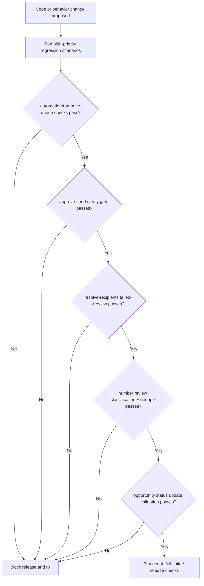

# CODEJOB Test and Validation Matrix (Current Branch)

## 1) Existing backend test modules

Located in `backend/tests/`:

- Routing and parsing: `test_phase0_routing.py`, `test_routing_policy.py`, `test_candidate_date_filtering.py`
- Run orchestration: `test_run_orchestrator.py`, `test_run_once_hotfix.py`
- Premium number intelligence: `test_premium_numbers_extraction.py`, `test_premium_numbers_api.py`
- Draft/prompt/quality: `test_prompting.py`, `test_draft_formatting.py`, `test_draft_quality.py`
- Resume/semantic: `test_resume_context_attribution.py`, `test_semantic_ranking.py`
- Productivity/analytics: `test_productivity_trend.py`
- Telegram interaction: `test_telegram_interactive.py`
- Gmail labeling: `test_gmail_labeling_rules.py`, `test_gmail_labeling_service.py`, `test_gmail_labeling_api.py`
- Query bucket: `test_query_bucket_service.py`
- Cold-call scripting: `test_cold_call_service.py`, `test_cold_call_api.py`
- API behavior regressions: `test_approve_cc_regression.py`, `test_sheets_tracking.py`, `test_schemas.py`

## 2) High-priority regression scenarios

1. `POST /automation/run-once` queue/skip/fail accounting
2. `POST /candidates/{id}/approve-send` safety gate (routing + draft + resume + metadata)
3. `POST /candidates/{id}/resolve-recipients` moves failed -> needs_review with confirmed routing
4. Number review manual classification (`mark-recruiter`, `mark-employer`) and duplicate suppression
5. Opportunity update API status validation (`PATCH /recruiter-opportunities/{id}`)

## 3) Known branch mismatch in tests

- `backend/tests/test_phone_attribution.py` imports `app.phone_attribution`, but that module is not present in current branch.
- `backend/tests/test_run_orchestrator.py` wires dependency names like `analyze_email_routing`/`apply_routing_result`, while current `RunOrchestratorDependencies` expects `evaluate_routing_policy`/`apply_routing_decision` and additional callbacks.

These indicate stale tests relative to current runtime code and should be reconciled before treating full test suite as green.

## 4) Frontend checks

From `dashboard/package.json`:
- `npm run lint`
- `npm run build`
- `npm run test`

## 5) Validation prerequisites

Validation outcomes are environment-dependent. Ensure Python and Node dependencies are installed before interpreting test/lint/build results.
